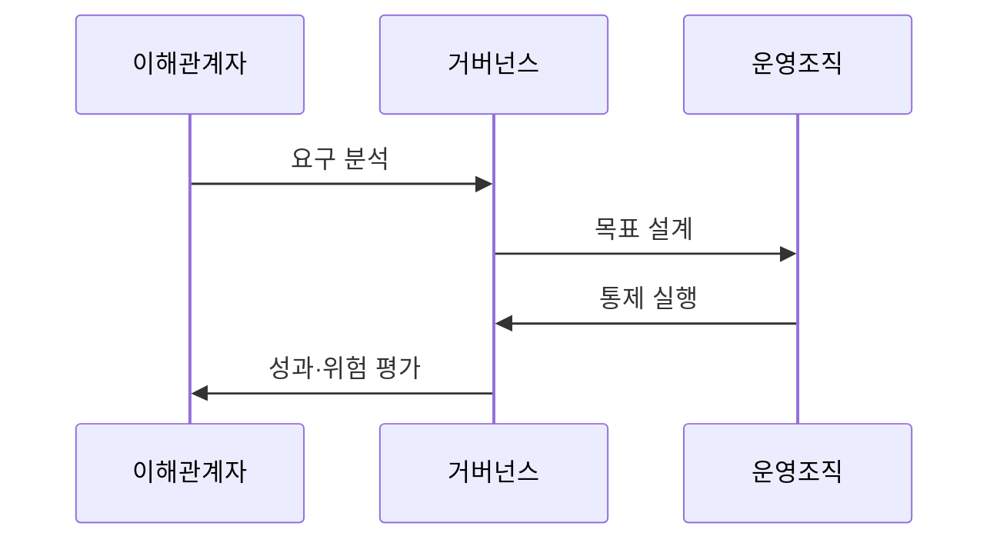

---
sidebar:
  order: 5
  label: "005. IT 거버넌스와 COBIT (IT Governance & COBIT)"
  badge:
    text: "미출제 · 50%"
    variant: note
title: "IT 거버넌스와 COBIT (IT Governance & COBIT)"
date: "2026-07-25T01:20:00+09:00"
tags:
  - "notes-law_policy"
weight: 5
extra:
  question_no: "005"
  source_status: "미출제"
  source_history: ""
  priority: 50
  priority_note: "의사결정권·통제·성과를 잇는 거버넌스 기본"
---

## 미리 알고가기

- **IT 거버넌스(Information Technology Governance)**: 조직의 전략적 목표 달성을 위해 정보기술 투자, 위험 관리, 의사결정 권한과 책임을 정의하고 통제하는 지배 구조
- **COBIT(Control Objectives for Information and Related Technology)**: 글로벌 정보시스템감사통제협회(ISACA)가 제정한 IT 거버넌스 및 관리를 위한 표준 통제 프레임워크
- **ISO/IEC 38500**: 기업의 IT 자원을 효과적이고 안전하게 활용하도록 이사회와 경영진에게 6대 원칙을 제시하는 국제 IT 거버넌스 표준
- **EDM 영역(Evaluate, Direct, Monitor)**: 이사회와 최고경영진이 비즈니스 요구에 부합하도록 평가하고, 지시하며, 성과와 준수 여부를 감독하는 거버넌스 영역
- **APO 영역(Align, Plan and Organize)**: 비즈니스 전략과 IT 목표를 정렬하고 계획 및 조직 체계를 설계하는 관리 영역
- **BAI 영역(Build, Acquire and Implement)**: 정의된 요구사항에 따라 정보화 자원과 솔루션을 개발, 획득 및 구축하는 관리 영역
- **DSS 영역(Deliver, Service and Support)**: 비즈니스 연속성과 보안 유지를 위해 실제 서비스를 운영하고 기술을 지원하는 관리 영역
- **MEA 영역(Monitor, Evaluate and Assess)**: 거버넌스 통제 목표와 프로세스 실행의 역량 수준을 모니터링하고 평가하는 관리 영역

## Ⅰ. 개요

- 정의/개념: **IT 가치·위험**을 평가·지시·감독하는 **거버넌스 체계**
- 기존 한계: 현업 중심 운영은 **IT 투자·위험·성과의 경영 통제** 부족

### 쉽게 이해하기 (학습용)
- 경영진이 IT 의사결정 권한을 명확히 하고 투자 성과와 위험을 감독하는 체계이다

## Ⅱ. 특징

- **목표 연계**로 이해관계자 요구를 IT 목표·통제로 전환
- **거버넌스·관리 분리**로 의사결정과 실행 책임 구분
- **설계요인**으로 조직 환경에 맞는 COBIT 목표 선택

### 쉽게 이해하기 (학습용)
- 경영진은 IT 목표와 통제 지표를 이용해 투자 성과·위험·규제 준수를 함께 감독한다

## Ⅲ. 아키텍처 및 구성요소

| 설계 요소 | 설명 |
|:---|:---|
| 거버넌스 목표 | 요구사항을 **성과·위험·자원 목표**로 전환 |
| EDM 영역 | 경영진의 **평가·지시·모니터링** |
| 관리 영역 | **계획·구축·운영·평가** 활동 |
| 성과 지표 | 목표 달성도·위험·**통제 효과** 측정 |
| 역할과 책임 | 의사결정·실행·검토의 **책임 분리** |

> 요약: **이해관계자 요구**를 거버넌스 목표와 통제로 전환

### 쉽게 이해하기 (학습용)
- 이사회가 방향을 결정하고 관리조직이 이를 실행하며 성과 지표로 이행 수준을 점검한다

## Ⅳ. 원리 및 절차 흐름도

| 절차 | 핵심 활동 |
|:---|:---|
| 요구 분석 | 사업 요구·우선순위 분석 |
| 목표 설계 | 조직별 거버넌스 목표 정의 |
| 통제 실행 | 사람·절차·기술 통제 구현 |
| 성과·위험 평가 | 지표 감시·개선 과제 도출 |

### 쉽게 이해하기 (학습용)
- 비즈니스 요구를 IT 목표로 전환해 통제를 실행하고 성과와 위험을 평가하여 개선한다

## Ⅴ. 종류 및 비교

| 판단 기준 | COBIT | ISO/IEC 38500 | ITIL |
|:---|:---|:---|:---|
| 핵심 초점 | 거버넌스·관리 목표와 통제 | 경영진의 I&T 지배 원칙 | 서비스 가치·운영 관리 |
| 주요 주체 | 경영진·감사·I&T 관리조직 | 이사회·최고경영진 | 서비스 관리·운영조직 |
| 적용 기준 | IT 통제 프로세스 설계 시 | 이사회 차원 지배원칙 수립 시 | IT 서비스 운영 표준화 필요 시 |

> 요약: **COBIT은 통제**, 38500은 원칙, ITIL은 운영 중심

### 쉽게 이해하기 (학습용)
- COBIT은 통제 목표 설계, ISO 38500은 경영 원칙 수립, ITIL은 서비스 운영 개선에 적용한다

## Ⅵ. 실무 사례

1. 금융기관이 **설계요인**으로 조직 맞춤형 COBIT 목표를 선정

### 쉽게 이해하기 (학습용)
- 금융기관은 규제·위험·기술 환경을 분석해 우선 적용할 COBIT 목표와 통제를 선정한다

## Ⅶ. 결론

- IT 가치·위험 통제를 위해 **설계요인**을 검토하여 **COBIT** 활용

### 쉽게 이해하기 (학습용)
- 조직의 전략과 위험 환경에 맞는 COBIT 목표를 선택하고 경영 의사결정과 실행 통제를 연결해야 한다
