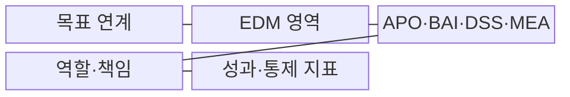
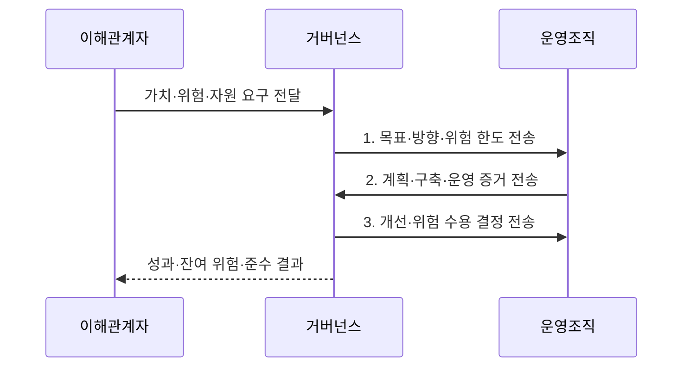

---
sidebar:
  order: 5
  label: "005. IT 거버넌스와 COBIT (IT Governance & COBIT)"
  badge:
    text: "미출 · 50%"
    variant: note
title: "IT 거버넌스와 COBIT (IT Governance & COBIT)"
date: "2026-08-02T12:00:00+09:00"
tags:
  - "notes-law_policy"
weight: 5
extra:
  question_no: "005"
  source_status: "미출"
  source_history: ""
  priority: 50
  priority_note: "의사결정권·통제·성과를 잇는 거버넌스 기본"
---

## Ⅰ. 개요

핵심 용어

- **IT 거버넌스**: IT 거버넌스는 기업 거버넌스의 하위 체계로서 IT 가치·위험·자원의 결정권과 책임을 정하고 성과를 감독한다.
- **정보 및 관련 기술 통제목표(Control Objectives for Information and Related Technologies, COBIT)**: IT 거버넌스와 관리 목표를 통제·성과 지표로 연결하는 프레임워크이다.

- 정의/개념: **IT 거버넌스** 는 조직의 전략 달성을 위해 경영진이 IT 가치·위험·자원의 결정권·책임·성과를 감독하는 **기업 거버넌스의 하위 지배 체계**
- 배경/필요성: 운영조직의 결정만으로는 **투자 가치와 위험 수용에 대한 경영 책임을 명확히 하기 어려움**

#### 한줄 요약
- 경영진이 IT 의사결정 권한을 명확히 하고 투자 성과와 위험을 감독하는 체계이다

## Ⅱ. 특징

핵심 용어

- **COBIT 목표 연계**: 이해관계자 요구를 전사 목표와 IT 정렬 목표를 거쳐 거버넌스·관리 목표로 변환하는 관계이다.
- **거버넌스·관리 책임 분리**: 경영진의 방향·위험 수용 결정과 관리조직의 계획·구축·운영 실행을 구분하는 원칙이다.
- **설계 축**: 설계 축은 조직의 전략·위험·규제·기술 환경에 맞춰 적용할 COBIT 목표와 통제 수준을 선택한다.

- **연계 축**: 이해관계자 요구를 전사·정렬·관리 목표로 전환
- **책임 축**: 방향·위험 수용과 계획·구축·운영 실행 분리
- **설계 축**: 전략·위험·규제·기술에 맞는 통제 수준 선택

#### 한줄 요약
- 경영진은 IT 목표와 통제 지표를 이용해 투자 성과·위험·규제 준수를 함께 감독한다

## Ⅲ. 구조 및 구성요소

핵심 용어

- **평가·지시·감독(Evaluate, Direct and Monitor, EDM)**: 경영진이 대안을 평가하고 방향·위험 한도를 지시하며 성과와 준수를 감독하는 거버넌스 영역이다.
- **APO·BAI·DSS·MEA**: 정렬·계획·조직화, 구축·획득·구현, 제공·서비스·지원, 모니터링·평가·진단을 담당하는 COBIT 관리 영역이다.

| 구성요소 | 책임 |
|:---|:---|
| 목표 연계 | **가치·위험·자원 목표** 와 관리 목표 연결 |
| EDM 영역 | **대안 평가·방향·위험 한도·성과 감독** 수행 |
| APO·BAI·DSS·MEA | **계획·구축·운영·성과 평가** 수행 |
| 역할·책임 | **결정·실행·검토 권한** 분리 |
| 성과·통제 지표 | **목표 달성·잔여 위험·자원·통제 효과** 보고 |

#### 한줄 요약
- 이사회가 방향을 결정하고 관리조직이 이를 실행하며 성과 지표로 이행 수준을 점검한다

## Ⅳ. 흐름도

핵심 용어

- **잔여 위험**: 통제를 적용한 뒤에도 남아 경영진이 추가 개선이나 수용 여부를 결정해야 하는 위험이다.
- **평가·지시·감독(Evaluate, Direct and Monitor, EDM)**: 관리 활동의 증거를 목표·위험 한도와 대조해 개선 또는 잔여 위험 수용을 결정하는 거버넌스 영역이다.

1. **목표·방향·위험 한도 전송**: 설계요인으로 우선 목표·지표 결정
2. **계획·구축·운영 증거 전송**: 관리영역의 통제 실행 결과 보고
3. **개선·위험 수용 결정 전송**: EDM이 목표·한도와 대조해 승인

#### 한줄 요약
- 비즈니스 요구를 IT 목표로 전환해 통제를 실행하고 성과와 위험을 평가하여 개선한다

## Ⅴ. 종류 및 비교

핵심 용어

- **COBIT 2019**: COBIT 2019는 정보·기술의 거버넌스와 관리를 목표·통제·성과로 연결하는 프레임워크다.
- **ISO/IEC 38500**: 조직의 지배기구가 정보기술 사용을 평가·지시·모니터링할 때 적용하는 국제 거버넌스 원칙이다.
- **정보기술 인프라 라이브러리(Information Technology Infrastructure Library, ITIL)**: 서비스 가치사슬과 관리 관행으로 IT 서비스 운영을 개선하는 프레임워크이다.

| IT 관리 체계 | COBIT | ISO/IEC 38500 | ITIL |
|:---|:---|:---|:---|
| 적용 기준 | **IT 통제 목표** 설계 | **지배기구 원칙** 수립 | **IT 서비스 운영** 표준화 |
| 핵심 특징 | **거버넌스·관리 목표·통제·성과** | **IT 지배 원칙** | **서비스 가치사슬·관리 관행** |
| 한계 | **목표·통제 선별 필요** | **세부 통제·절차 부족** | **전사 결정·감사 범위 부족** |

> 요약: **COBIT 2019** 는 통제, **38500·ITIL** 은 원칙·운영 중심

#### 한줄 요약
- COBIT은 통제 목표 설계, ISO 38500은 경영 원칙 수립, ITIL은 서비스 운영 개선에 적용한다

## Ⅵ. 실무 고려사항 및 대책

핵심 용어

- **위험 수용 주체 불명확**: 위험 수용 주체 불명확은 거버넌스의 결정 책임과 관리 영역의 실행 책임이 섞일 때 발생한다.
- **설계요인**: 조직의 전략·위험·규제·위협·기술 환경에 맞춰 우선 적용할 COBIT 목표와 통제 수준을 선택하는 조건이다.
- **평가·지시·감독(Evaluate, Direct and Monitor, EDM)**: 경영진이 위험 수용과 방향을 결정하고 관리영역의 실행을 감독하는 거버넌스 영역이다.

| 문제 | 대책 | 효과 |
|:---|:---|:---|
| 모든 목표를 적용해 생기는 **통제 비용 과다** | **전략·위험·규제·기술 설계요인**으로 목표 선별 | 조직별 **통제 집중도** 확보 |
| 결정과 실행이 섞여 생기는 **위험 수용 주체 불명확** | **EDM 결정권·관리영역 책임** 을 할당표로 분리 | 의사결정의 **책임성** 확보 |
| 활동 완료만 보고해 생기는 **성과 단절** | 지표를 **경영 성과·위험 한도·자원 목표** 와 연결 | 경영진의 **판단 가능성** 확보 |

#### 한줄 요약
- 금융기관은 규제·위험·위협·기술 환경의 설계요인을 분석해 우선 적용할 COBIT 목표와 통제 수준을 선정한다.

## Ⅶ. 결론

핵심 용어

- **설계요인**: 조직별 전략·위험·규제·기술 환경에 맞는 COBIT 목표를 선별하는 조건이다.
- **평가·지시·감독(Evaluate, Direct and Monitor, EDM)**: 경영진의 평가·지시·감독을 담당하고 관리 영역의 실행을 통제하는 거버넌스 영역이다.

- **설계요인** 으로 COBIT 2019 목표 선별, **EDM** 은 결정·관리영역은 실행

#### 한줄 요약
- 조직의 전략과 위험 환경에 맞는 COBIT 목표를 선택하고 경영 의사결정과 실행 통제를 연결해야 한다
