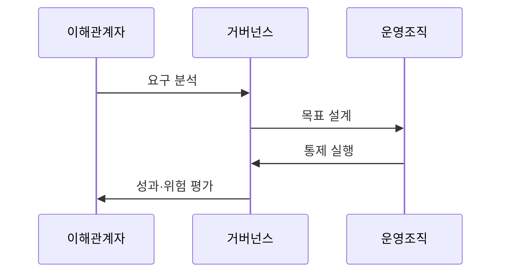

---
sidebar:
  order: 5
  label: "005. IT 거버넌스와 COBIT (IT Governance & COBIT)"
  badge:
    text: "미출제 · 50%"
    variant: note
title: "IT 거버넌스와 COBIT (IT Governance & COBIT)"
date: "2026-07-25T01:20:00+09:00"
tags:
  - "notes-law_policy"
weight: 5
extra:
  question_no: "005"
  source_status: "미출제"
  source_history: ""
  priority: 50
  priority_note: "의사결정권·통제·성과를 잇는 거버넌스 기본"
---

## 미리 알고가기

- **IT 거버넌스(Information Technology Governance)**: 조직의 전략적 목표 달성을 위해 정보기술 투자, 위험 관리, 의사결정 권한과 책임을 정의하고 통제하는 지배 구조
- **COBIT(Control Objectives for Information and Related Technology)**: 글로벌 정보시스템감사통제협회(ISACA)가 제정한 IT 거버넌스 및 관리를 위한 표준 통제 프레임워크
- **ISO/IEC 38500**: 기업의 IT 자원을 효과적이고 안전하게 활용하도록 이사회와 경영진에게 6대 원칙을 제시하는 국제 IT 거버넌스 표준
- **EDM 영역(Evaluate, Direct, Monitor)**: 이사회와 최고경영진이 비즈니스 요구에 부합하도록 평가하고, 지시하며, 성과와 준수 여부를 감독하는 거버넌스 영역
- **APO 영역(Align, Plan and Organize)**: 비즈니스 전략과 IT 목표를 정렬하고 계획 및 조직 체계를 설계하는 관리 영역
- **BAI 영역(Build, Acquire and Implement)**: 정의된 요구사항에 따라 정보화 자원과 솔루션을 개발, 획득 및 구축하는 관리 영역
- **DSS 영역(Deliver, Service and Support)**: 비즈니스 연속성과 보안 유지를 위해 실제 서비스를 운영하고 기술을 지원하는 관리 영역
- **MEA 영역(Monitor, Evaluate and Assess)**: 거버넌스 통제 목표와 프로세스 실행의 역량 수준을 모니터링하고 평가하는 관리 영역

## Ⅰ. 개요

- 정의/개념: IT 가치·위험을 평가·지시·감독하는 체계
- **배경/필요성**: 경영진의 IT 투자·위험·성과 의사결정 통제 필요

### 쉽게 이해하기 (학습용)
- 회사의 막대한 정보기술 투자가 돈 낭비가 되지 않도록, 경영진이 의사결정 권한을 명확히 하고 투자 대비 효과와 위험을 감독하는 체계임

## Ⅱ. 특징

- IT 투자·목표 연결이 예산 책임을 명확히 한다
- IT 위험을 경영 위험 수준에서 관리한다
- COBIT 설계요인이 조직별 통제를 구체화한다
- 타 체계 연계가 운영·구조·보안 경계를 세운다

### 쉽게 이해하기 (학습용)
- 단순한 기술 지원 수준을 넘어 경영 위험과 컴플라이언스 관점까지 최고 의사결정권자 수준에서 통제할 수 있는 정량 지표를 제공함

## Ⅲ. 아키텍처 및 구성요소

| 설계 요소 | 설명 |
|:---|:---|
| 거버넌스 목표 | 요구사항을 성과·위험·자원 목표로 전환 |
| EDM 영역 | 경영진 평가·지시·모니터링 통제 루프 |
| 관리 영역 | 계획·구축·운영·평가 관리 활동 |
| 성과 지표 | 목표 달성도·위험 수준·통제 효과 측정 |
| 역할과 책임 | 의사결정자·실행자·검토자 책임 분리 |

> 요약: 이해관계자 요구를 거버넌스 목표로 통제함

### 쉽게 이해하기 (학습용)
- 최고 결정을 내리는 이사회의 거버넌스 체계와 이를 실행하는 실무 관리 영역, 그리고 이행 수준을 점검하는 평가 지표들로 이루어짐

## Ⅳ. 원리 및 절차 흐름도

| 절차 | 핵심 활동 |
|:---|:---|
| 요구 분석 | 사업 요구·우선순위 분석 |
| 목표 설계 | 조직별 거버넌스 목표 정의 |
| 통제 실행 | 사람·절차·기술 통제 구현 |
| 성과·위험 평가 | 지표 감시·개선 과제 도출 |

### 쉽게 이해하기 (학습용)
- 조직의 비즈니스 목적을 식별하여 그에 맞는 IT 지배 구조를 설계하고, 실제 업무 규칙에 적용한 후 지표를 검증하여 지속 보완함

## Ⅴ. 종류 및 비교

| 판단 기준 | COBIT | ISO/IEC 38500 | ITIL |
|:---|:---|:---|:---|
| 핵심 초점 | 거버넌스·관리 목표와 통제 | 경영진의 I&T 지배 원칙 | 서비스 가치·운영 관리 |
| 주요 주체 | 경영진·감사·I&T 관리조직 | 이사회·최고경영진 | 서비스 관리·운영조직 |
| 적용 기준 | IT 통제 프로세스 설계 시 | 이사회 차원 지배원칙 수립 시 | IT 서비스 운영 표준화 필요 시 |

> 요약: COBIT 통제·38500 원칙·ITIL 운영

### 쉽게 이해하기 (학습용)
- COBIT은 구체적인 절차 통제와 내부 감사 기준을 설계할 때 쓰고, ISO 38500은 최상위 의사결정 원칙을 세울 때 쓰며, ITIL은 실무 서비스 품질을 올릴 때 씀

## Ⅵ. 실무 사례

1. 설계요인으로 조직 맞춤형 목표 모델 정의

### 쉽게 이해하기 (학습용)
- 회사의 규모, 업종, 기술 변화 수준을 분석하여 COBIT이 권장하는 40개 지배 목표 중 우리 기업에 우선 필요한 부분만 골라 적용함

## Ⅶ. 결론

- I&T 성과 및 위험을 경영 의사결정 체계와 연결

### 쉽게 이해하기 (학습용)
- IT 프로세스를 단순히 늘리기보다 기업의 가치 향상과 규제 준수를 보장하도록 비즈니스 의사결정 체계와 유기적으로 융합해야 함
