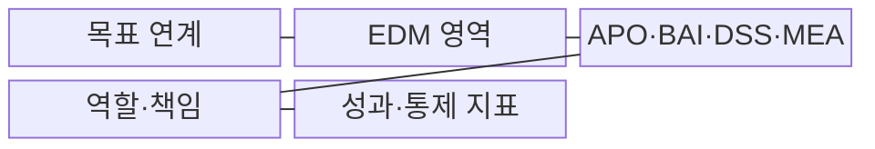
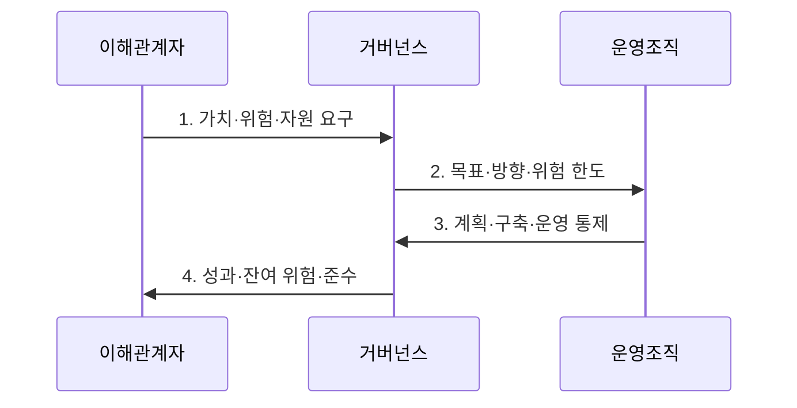

---
sidebar:
  order: 5
  label: "005. IT 거버넌스와 COBIT (IT Governance & COBIT)"
  badge:
    text: "미출 · 50%"
    variant: note
title: "IT 거버넌스와 COBIT (IT Governance & COBIT)"
date: "2026-07-30T10:13:00+09:00"
tags:
  - "notes-law_policy"
weight: 5
extra:
  question_no: "005"
  source_status: "미출"
  source_history: ""
  priority: 50
  priority_note: "의사결정권·통제·성과를 잇는 거버넌스 기본"
---

## 미리 알고가기

- **IT 거버넌스(Information Technology Governance)**: 조직의 전략 목표 달성을 위해 IT 투자·위험·자원의 의사결정 권한과 책임을 정의하고 성과를 감독하는 지배 체계다.
- **정보 및 관련 기술 통제 목표(Control Objectives for Information and Related Technology, COBIT)**: ISACA가 제정한 정보·기술 거버넌스와 관리의 목표·통제·성과 프레임워크다.
- **ISO/IEC 38500**: 조직의 IT를 효과적이고 책임 있게 사용하도록 이사회와 경영진에게 원칙을 제시하는 국제 거버넌스 표준이다.
- **평가·지시·모니터링(Evaluate, Direct and Monitor, EDM)**: 경영진이 이해관계자 요구와 선택 대안을 평가하고 방향을 지시하며 성과·위험·준수를 감독하는 거버넌스 영역이다.
- **정렬·계획·조직화(Align, Plan and Organize, APO)**: 사업 전략과 IT 목표를 정렬하고 계획·조직·자원을 설계하는 관리 영역이다.
- **구축·획득·구현(Build, Acquire and Implement, BAI)**: 요구사항에 따라 정보자원과 솔루션을 개발·획득·구현하는 관리 영역이다.
- **제공·서비스·지원(Deliver, Service and Support, DSS)**: 서비스를 제공하고 운영·보안·연속성을 지원하는 관리 영역이다.
- **모니터링·평가·진단(Monitor, Evaluate and Assess, MEA)**: 관리 활동의 성과·통제·준수 상태를 모니터링하고 평가하는 관리 영역이다.

## Ⅰ. 개요

- 정의/개념: 경영진이 이해관계자 요구를 IT 가치·위험·자원 목표로 전환해 **평가·지시·모니터링**하고 관리조직의 계획·구축·운영·평가를 통제하는 지배 체계
- 배경/필요성: IT 운영조직 중심 의사결정으로 부족해지는 **투자 가치·위험 수용·자원 우선순위의 경영 책임**과 성과·준수 감독 확보

### 쉽게 이해하기 (학습용)
- 경영진이 IT 의사결정 권한을 명확히 하고 투자 성과와 위험을 감독하는 체계이다

## Ⅱ. 특징

- **목표 연계**로 이해관계자 요구를 전사 목표·정렬 목표·거버넌스 및 관리 목표로 전환한다.
- **거버넌스와 관리의 책임 분리**로 방향·위험 수용과 계획·구축·운영 실행을 구분한다.
- **설계요인**으로 전략·위험·규제·기술 환경에 맞는 우선 목표와 통제 수준을 선택한다.

### 쉽게 이해하기 (학습용)
- 경영진은 IT 목표와 통제 지표를 이용해 투자 성과·위험·규제 준수를 함께 감독한다

## Ⅲ. 구조 및 구성요소

| 구성요소 | 책임 |
|:---|:---|
| 목표 연계 | 이해관계자 요구를 가치 제공·위험 최적화·자원 최적화와 관리 목표로 전환 |
| EDM 영역 | 경영진이 선택 대안을 평가하고 방향·위험 한도를 지시하며 성과·준수 감독 |
| APO·BAI·DSS·MEA | 전략 정렬·계획, 솔루션 구축, 서비스 운영, 성과·통제 평가 수행 |
| 역할·책임 | 이사회·경영진·사업부서·IT·감사의 결정·실행·검토 권한 분리 |
| 성과·통제 지표 | 목표 달성도·잔여 위험·자원 사용·통제 효과를 측정해 EDM에 보고 |

### 쉽게 이해하기 (학습용)
- 이사회가 방향을 결정하고 관리조직이 이를 실행하며 성과 지표로 이행 수준을 점검한다

## Ⅳ. 흐름도

1. **가치·위험·자원 요구**: 이해관계자 가치와 규제·위험·자원 제약을 전사 목표로 정리
2. **목표·방향·위험 한도**: 설계요인으로 우선 거버넌스·관리 목표와 의사결정권·지표·수용 한도 결정
3. **계획·구축·운영 통제**: 관리조직이 APO·BAI·DSS 활동에서 사람·절차·정보·기술 통제를 실행
4. **성과·잔여 위험·준수**: MEA 결과를 EDM이 목표·한도와 대조해 방향 수정·위험 수용·개선 투자 결정

### 쉽게 이해하기 (학습용)
- 비즈니스 요구를 IT 목표로 전환해 통제를 실행하고 성과와 위험을 평가하여 개선한다

## Ⅴ. 종류 및 비교

| IT 관리 체계 | COBIT | ISO/IEC 38500 | ITIL |
|:---|:---|:---|:---|
| 적용 기준 | IT 통제 프로세스 설계 시 | 이사회 차원 지배원칙 수립 시 | IT 서비스 운영 표준화 필요 시 |
| 핵심 특징 | 거버넌스·관리 목표와 통제·성과 | 경영진의 IT 지배 원칙 | 서비스 가치사슬·관리 관행 |
| 한계 | 조직별 목표·통제 선별 필요 | 세부 관리 통제·절차 부족 | 전사 의사결정·감사 통제 범위 부족 |

> 요약: **COBIT은 통제**, 38500은 원칙, ITIL은 운영 중심

### 쉽게 이해하기 (학습용)
- COBIT은 통제 목표 설계, ISO 38500은 경영 원칙 수립, ITIL은 서비스 운영 개선에 적용한다

## Ⅵ. 실무 고려사항 및 대책

| 고려사항 | 대책 | 효과 |
|:---|:---|:---|
| COBIT 목표를 전부 동일 강도로 적용해 **통제 비용 과다** | 전략·위험·규제·기술·위협의 설계요인으로 우선 목표와 수준 선별 | 조직 환경에 맞는 **통제 집중도 확보** |
| 경영진 방향과 IT 실행 책임이 섞여 **위험 수용 주체 불명확** | EDM의 결정권과 APO·BAI·DSS·MEA 실행·보고 책임을 RACI로 분리 | 의사결정의 **책임성 확보** |
| 활동 완료만 보고해 투자 가치·잔여 위험을 알 수 없는 **성과 단절** | 관리 지표를 경영 성과·위험 한도·자원 목표와 연결해 EDM에 보고 | 실행 결과의 **경영 판단 가능성 확보** |

### 쉽게 이해하기 (학습용)
- 금융기관은 규제·위험·위협·기술 환경의 설계요인을 분석해 우선 적용할 COBIT 목표와 통제 수준을 선정한다.

## Ⅶ. 결론

- 조직의 전략·위험·규제·기술 **설계요인**으로 COBIT 목표를 선별하고 EDM의 방향과 관리 활동·성과 증거를 연결해 IT 가치·위험·자원을 경영 통제하는 거버넌스

### 쉽게 이해하기 (학습용)
- 조직의 전략과 위험 환경에 맞는 COBIT 목표를 선택하고 경영 의사결정과 실행 통제를 연결해야 한다
