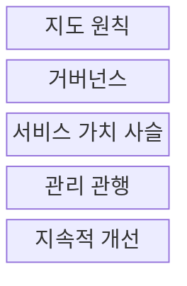
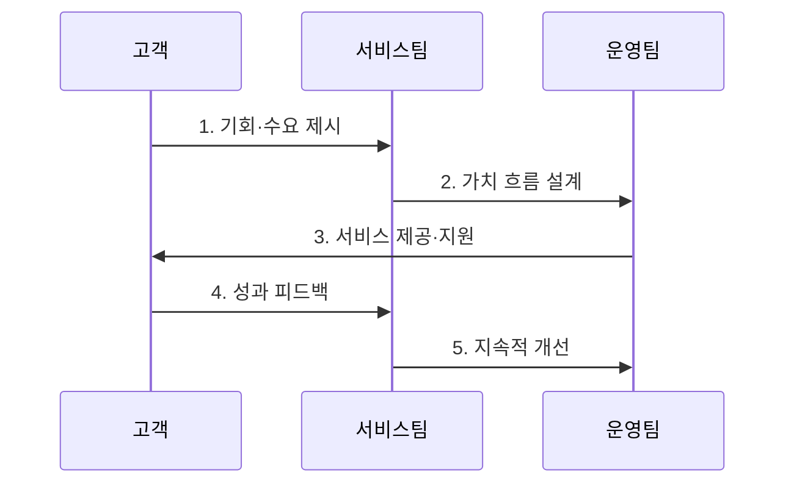

---
sidebar:
  order: 6
  label: "006. ITIL v4와 IT 서비스 관리 (ITIL v4 IT Service Management)"
  badge:
    text: "미출제 · 50%"
    variant: note
title: "ITIL v4와 IT 서비스 관리 (ITIL v4 IT Service Management)"
date: "2026-07-30T10:18:00+09:00"
tags:
  - "notes-law_policy"
weight: 6
extra:
  question_no: "006"
  source_status: "미출제"
  source_history: ""
  priority: 50
  priority_note: "가치사슬·관행으로 서비스 관리를 설계"
---

## 미리 알고가기

- **IT 서비스 관리(IT Service Management, ITSM)**: 고객 요구에 맞는 IT 서비스를 기획·설계·운영하고 지속적으로 개선하는 관리 체계이다.
- **정보기술 인프라 라이브러리 v4(Information Technology Infrastructure Library v4, ITIL v4)**: 서비스 가치 시스템과 관리 관행을 이용해 IT 서비스를 가치 중심으로 관리하는 지침이다.
- **서비스 가치 시스템(Service Value System, SVS)**: 조직의 구성요소와 활동을 결합해 기회와 수요를 가치로 전환하는 운영 체계이다.
- **서비스 가치 사슬(Service Value Chain, SVC)**: 계획·개선·참여·설계 및 전환·획득 및 구축·제공 및 지원 활동을 조합해 가치를 창출하는 운영 모델이다.
- **관리 관행(Management Practice)**: 특정 목적을 달성하도록 설계한 조직 자원의 집합이다.
- **서비스 수준 합의서(Service Level Agreement, SLA)**: 서비스 제공자와 고객이 서비스 목표와 책임을 합의한 문서이다.

## Ⅰ. 개요

- **ITIL v4**는 서비스 가치 시스템의 구성요소를 연계하여 기회와 수요를 공동 창출 가치로 전환하는 **IT 서비스 관리 지침**
- **배경/필요성**: 기능별로 분리된 개발·운영·공급 활동을 하나의 가치 흐름으로 연결할 관리 체계 필요

### 쉽게 이해하기 (학습용)
- 고객 요구를 서비스로 설계·구축·제공하고 성과를 개선하는 전체 활동을 하나의 가치 흐름으로 관리한다

## Ⅱ. 특징

- **가치 중심성**: 서비스 가치 시스템을 통해 기회·수요·활동·성과를 통합
- **조합 가능성**: 서비스 상황에 맞는 관리 관행과 가치 사슬 활동을 선택
- **전체적 관점**: 조직과 사람·정보와 기술·파트너와 공급자·가치 흐름과 프로세스의 4차원 검토

### 쉽게 이해하기 (학습용)
- 조직 역량과 기술 환경에 맞는 실무 관행을 조합해 서비스별 가치 흐름을 설계한다

## Ⅲ. 구조 및 구성요소

| 설계 요소 | 설명 |
|:---|:---|
| 지도 원칙 | 상황과 목표가 바뀌어도 의사결정을 안내하는 권고사항 |
| 거버넌스 | 조직을 평가·지시·감시하는 통제 수단 |
| 서비스 가치 사슬 | 수요를 가치로 전환하는 6개 핵심 활동의 운영 모델 |
| 관리 관행 | 일반·서비스·기술 관리 목적을 달성하는 조직 자원의 집합 |
| 지속적 개선 | 변화하는 이해관계자 기대에 맞춰 서비스 성과를 반복 향상 |

> 요약: **지도 원칙과 거버넌스** 아래 **가치 사슬·관리 관행·지속적 개선**을 연계한 구조

### 쉽게 이해하기 (학습용)
- 지도 원칙과 거버넌스 아래 4차원 모델을 검토하고 가치사슬 활동과 실무 관행을 조합한다

## Ⅳ. 흐름도

| 절차 | 핵심 활동 |
|:---|:---|
| 기회·수요 제시 | 이해관계자의 요구 가치와 기대 성과 식별 |
| 가치 흐름 설계 | 활동·서비스 자원 조합 |
| 서비스 제공·지원 | 설계·전환·구축·운영 관행을 연계하여 서비스 제공 |
| 성과 피드백 | 서비스 수준과 이용자 경험을 측정하여 개선 요구 도출 |
| 지속적 개선 | 측정 결과를 가치 흐름과 관리 관행에 반영 |

### 쉽게 이해하기 (학습용)
- 고객 요구를 분석해 가치 흐름을 구성하고 서비스를 제공한 뒤 운영 지표로 개선한다

## Ⅴ. 종류 및 비교

| 판단 기준 | ITIL v4 | ITIL v3 |
|:---|:---|:---|
| 적용 기준 | 애자일·DevOps와 연계한 가치 흐름 관리 | 서비스 생명주기 단계별 통제 |
| 핵심 특징 | 서비스 가치 시스템과 관리 관행의 유연한 조합 | 전략·설계·전환·운영·개선 단계 중심 |
| 한계 | 상황에 맞는 관행 조합과 조직 변화 역량 필요 | 기능과 프로세스 간 단절 및 변화 대응 지연 가능 |

> 요약: **v4는 가치 흐름**, v3는 서비스 생명주기 중심

### 쉽게 이해하기 (학습용)
- v3는 서비스 생명주기의 순차 통제에 집중하고, v4는 상황에 맞는 실무 관행을 가치 흐름으로 조합한다

## Ⅵ. 실무 고려사항 및 대책

| 고려사항 | 대책 | 효과 |
|:---|:---|:---|
| 관리 관행의 일괄 도입 부담 | 서비스 가치 흐름을 먼저 식별하고 병목 관행부터 단계적 적용 | 투자 우선순위 명확화와 도입 실패 위험 감소 |
| 서비스 성과와 사업 가치의 단절 | 서비스 수준·이용자 경험·사업 성과 지표를 연계 | 개선 활동의 가치 기여도 확인 |
| 개발·운영·공급자 간 책임 분산 | 가치 흐름별 책임자와 협업 규칙을 정의 | 인계 지연 감소와 문제 해결 속도 향상 |

### 쉽게 이해하기 (학습용)
- 전 관행을 한꺼번에 적용하지 않고 장애 처리 지연이 큰 서비스부터 인시던트 관리 절차를 개선한다

## Ⅶ. 결론

- 서비스의 반복 장애와 인계 지연이 핵심 문제라면 **4차원 영향도를 검토한 뒤 병목 관리 관행을 가치 흐름에 우선 결합하는 단계적 도입** 필요

### 쉽게 이해하기 (학습용)
- 비즈니스와 기술 변화에 맞게 가치 흐름과 실무 관행을 지속적으로 조정해야 한다
