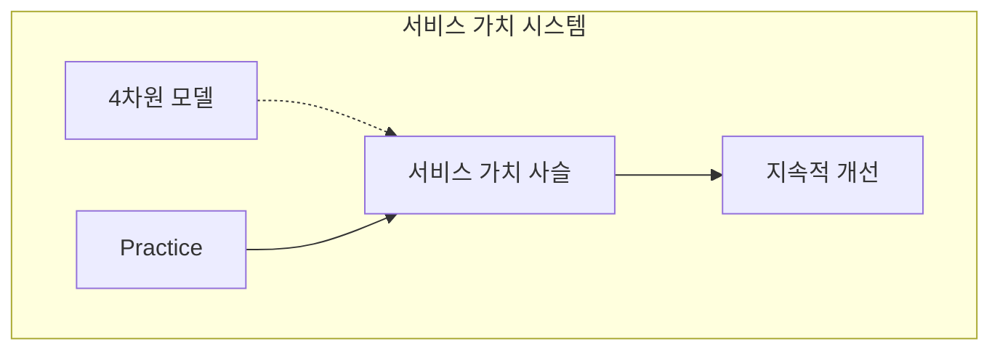
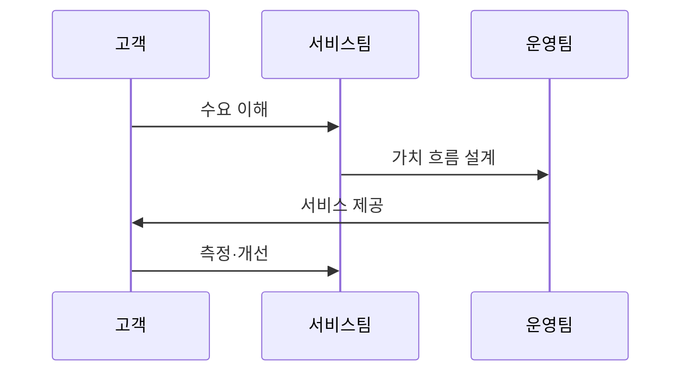

---
sidebar:
  order: 6
  label: "006. ITIL v4와 IT 서비스 관리 (ITIL v4 IT Service Management)"
  badge:
    text: "미출제 · 50%"
    variant: note
title: "ITIL v4와 IT 서비스 관리 (ITIL v4 IT Service Management)"
date: "2026-07-25T01:20:00+09:00"
tags:
  - "notes-law_policy"
weight: 6
extra:
  question_no: "006"
  source_status: "미출제"
  source_history: ""
  priority: 50
  priority_note: "가치사슬·관행으로 서비스 관리를 설계"
---

## 미리 알고가기

- **IT 서비스 관리(IT Service Management, ITSM)**: 고객 요구에 부합하는 IT 서비스를 기획, 설계, 운영, 통제 및 개선하기 위한 비즈니스 프로세스 관리 체계
- **정보기술 인프라 라이브러리 v4(Information Technology Infrastructure Library v4, ITIL v4)**: 정보화 시대의 가치 창출을 위해 서비스 가치 시스템(SVS)과 실무 관행(Practice)을 정의한 IT 서비스 관리 글로벌 표준 가이드라인
- **서비스 가치 시스템(Service Value System, SVS)**: 조직의 다양한 활동과 구성요소가 유기적으로 작동하여 비즈니스 수요를 실제 가치로 변환하도록 돕는 전체적 아키텍처 구조
- **서비스 가치 사슬(Service Value Chain, SVC)**: 계획, 참여, 설계, 구축, 전환, 제공, 지원 등 가치를 창출하고 개선하는 데 필수적인 핵심 운영 프로세스 체인
- **실무 관행(Practice)**: 특정 목적을 달성하기 위해 IT 서비스 조직이 실행하는 업무 지침, 규정 및 관리 도구 모음
- **서비스 수준 합의서(Service Level Agreement, SLA)**: 서비스 제공자와 고객 간에 서비스 품질, 성능 지표, 역할 및 위반 시 보상안 등을 정의한 공식 합의 문서

## Ⅰ. 개요

- 정의/개념: **수요를 서비스 가치로 전환**하는 **ITSM 체계**
- 기존 한계: 기능별 분리 운영은 개발·운영·공급자의 **가치 흐름 단절**

### 쉽게 이해하기 (학습용)
- 고객 요구를 서비스로 설계·구축·제공하고 성과를 개선하는 전체 활동을 하나의 가치 흐름으로 관리한다

## Ⅱ. 특징

- **서비스 가치 시스템**으로 수요·활동·성과 통합
- **실무 관행**을 가치 흐름에 맞게 조합
- **4차원 모델**로 조직·정보·파트너·가치 흐름 검토

### 쉽게 이해하기 (학습용)
- 조직 역량과 기술 환경에 맞는 실무 관행을 조합해 서비스별 가치 흐름을 설계한다

## Ⅲ. 아키텍처 및 구성요소

| 설계 요소 | 설명 |
|:---|:---|
| 서비스 가치 시스템 | 수요를 서비스 결과로 전환하는 전체 구조 |
| 서비스 가치 사슬 | 계획·참여·설계·구축·제공 등 가치 창출 활동 |
| 4차원 모델 | 조직·정보·파트너·가치 흐름 종합 검토 |
| Practice | 인시던트·문제·변경·자산 등 운영 실무 단위 |
| 지속적 개선 | 성과와 운영 데이터를 기반으로 반복 개선 수행 |

> 요약: **서비스 가치 시스템**을 **4차원 관점**으로 설계

### 쉽게 이해하기 (학습용)
- 지도 원칙과 거버넌스 아래 4차원 모델을 검토하고 가치사슬 활동과 실무 관행을 조합한다

## Ⅳ. 원리 및 절차 흐름도

| 절차 | 핵심 활동 |
|:---|:---|
| 수요 이해 | 요구 가치·기대 성과 규명 |
| 가치 흐름 설계 | 활동·서비스 자원 조합 |
| 서비스 제공 | 설계·구축·이행·지원 수행 |
| 측정·개선 | 운영 지표로 가치사슬 향상 |

### 쉽게 이해하기 (학습용)
- 고객 요구를 분석해 가치 흐름을 구성하고 서비스를 제공한 뒤 운영 지표로 개선한다

## Ⅴ. 종류 및 비교

| 판단 기준 | ITIL v4 | ITIL v3 |
|:---|:---|:---|
| 중심 체계 | 서비스 가치 시스템 | 서비스 생명주기 중심 |
| 운영 단위 | Practice·가치 흐름 | 프로세스·기능 중심 |
| 적용 기준 | 애자일·DevOps 협업 시 | 단계별 순차 통제 필요 시 |

> 요약: **v4는 가치 흐름**, v3는 서비스 생명주기 중심

### 쉽게 이해하기 (학습용)
- v3는 서비스 생명주기의 순차 통제에 집중하고, v4는 상황에 맞는 실무 관행을 가치 흐름으로 조합한다

## Ⅵ. 실무 사례

1. 장애 대응 병목부터 **인시던트 관리 관행**을 단계적으로 도입

### 쉽게 이해하기 (학습용)
- 전 관행을 한꺼번에 적용하지 않고 장애 처리 지연이 큰 서비스부터 인시던트 관리 절차를 개선한다

## Ⅶ. 결론

- 서비스 가치 향상을 위해 4차원을 검토하여 **ITIL v4 가치 흐름** 활용

### 쉽게 이해하기 (학습용)
- 비즈니스와 기술 변화에 맞게 가치 흐름과 실무 관행을 지속적으로 조정해야 한다
