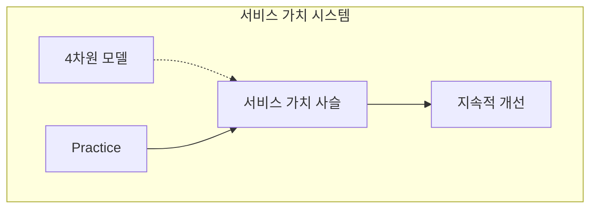
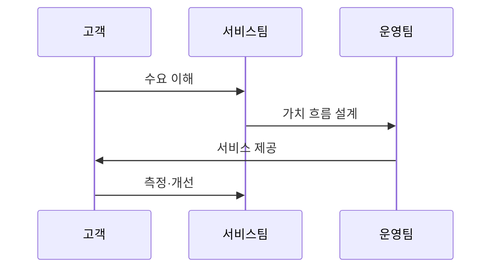

---
sidebar:
  order: 6
  label: "006. ITIL v4와 IT 서비스 관리 (ITIL v4 IT Service Management)"
  badge:
    text: "미출제 · 50%"
    variant: note
title: "ITIL v4와 IT 서비스 관리 (ITIL v4 IT Service Management)"
date: "2026-07-25T01:20:00+09:00"
tags:
  - "notes-law_policy"
weight: 6
extra:
  question_no: "006"
  source_status: "미출제"
  source_history: ""
  priority: 50
  priority_note: "가치사슬·관행으로 서비스 관리를 설계"
---

## 미리 알고가기

- **IT 서비스 관리(IT Service Management, ITSM)**: 고객 요구에 부합하는 IT 서비스를 기획, 설계, 운영, 통제 및 개선하기 위한 비즈니스 프로세스 관리 체계
- **정보기술 인프라 라이브러리 v4(Information Technology Infrastructure Library v4, ITIL v4)**: 정보화 시대의 가치 창출을 위해 서비스 가치 시스템(SVS)과 실무 관행(Practice)을 정의한 IT 서비스 관리 글로벌 표준 가이드라인
- **서비스 가치 시스템(Service Value System, SVS)**: 조직의 다양한 활동과 구성요소가 유기적으로 작동하여 비즈니스 수요를 실제 가치로 변환하도록 돕는 전체적 아키텍처 구조
- **서비스 가치 사슬(Service Value Chain, SVC)**: 계획, 참여, 설계, 구축, 전환, 제공, 지원 등 가치를 창출하고 개선하는 데 필수적인 핵심 운영 프로세스 체인
- **실무 관행(Practice)**: 특정 목적을 달성하기 위해 IT 서비스 조직이 실행하는 업무 지침, 규정 및 관리 도구 모음
- **서비스 수준 합의서(Service Level Agreement, SLA)**: 서비스 제공자와 고객 간에 서비스 품질, 성능 지표, 역할 및 위반 시 보상안 등을 정의한 공식 합의 문서
- **약어 읽기·표기**: ITSM은 ‘아이티에스엠’, ITIL은 ‘아이틸’, SVS·SVC·SLA는 영문 정식명의 머리글자로 읽으며 관리 체계·가치 흐름·서비스 약속을 구분함
- **버전 표기(v4)**: ‘버전 포’로 읽고 v는 version의 관용 축약이며 ITIL의 네 번째 주요 판을 가리킴
- **도식 기호(→·-.->)**: ‘연결·참조’로 읽고 실선은 가치 흐름, 점선은 4차원 모델의 검토 관점을 나타냄
- **시퀀스 기호(->>)**: ‘요청 전달’로 읽고 이중 화살촉은 ITIL 가치 흐름의 단계별 인계를 나타냄

## Ⅰ. 개요

- 정의/개념: 수요를 서비스 가치로 전환하는 ITSM 체계
- **배경/필요성**: 개발·운영·공급자를 가치 흐름으로 연결

### 쉽게 이해하기 (학습용)
- 고객의 요구를 확인하는 시점부터 실제로 도움이 되는 IT 서비스를 만들어 전달하기까지의 전체 운영 과정을 하나의 사슬처럼 연결해 관리하는 지침서임

## Ⅱ. 특징

- 서비스 가치 시스템이 수요·결과를 통합한다
- 34개 실무 관행이 서비스 운영을 제어한다
- 4차원 모델이 서비스 영향 요소를 함께 본다
- 상황별 활동 조합이 지속적 개선을 지원한다

### 쉽게 이해하기 (학습용)
- 단순한 절차 규칙에 얽매이지 않고, 조직 역량이나 기술 트렌드를 고려하여 서비스별 가치 창출을 위한 유연한 운영 흐름을 설계함

## Ⅲ. 아키텍처 및 구성요소

| 설계 요소 | 설명 |
|:---|:---|
| 서비스 가치 시스템 | 수요를 서비스 결과로 전환하는 전체 구조 |
| 서비스 가치 사슬 | 계획·참여·설계·구축·제공 등 가치 창출 활동 |
| 4차원 모델 | 조직·정보·파트너·가치 흐름 종합 검토 |
| Practice | 인시던트·문제·변경·자산 등 운영 실무 단위 |
| 지속적 개선 | 성과와 운영 데이터를 기반으로 반복 개선 수행 |

> 요약: 서비스 가치 시스템을 4차원 관점으로 최적화

### 쉽게 이해하기 (학습용)
- 지도 원칙과 거버넌스 아래 4대 비즈니스 차원을 고려하며, 가치사슬 활동과 실무 관행(Practice)을 조합해 최적의 IT 서비스를 도출함

## Ⅳ. 원리 및 절차 흐름도

| 절차 | 핵심 활동 |
|:---|:---|
| 수요 이해 | 요구 가치·기대 성과 규명 |
| 가치 흐름 설계 | 활동·서비스 자원 조합 |
| 서비스 제공 | 설계·구축·이행·지원 수행 |
| 측정·개선 | 운영 지표로 가치사슬 향상 |

### 쉽게 이해하기 (학습용)
- 고객의 요건을 분석하여 필요한 운영 프로세스를 맞춤형으로 조합하고, 실제 서비스를 제공한 후에 운영 데이터를 평가해 품질을 개선함

## Ⅴ. 종류 및 비교

| 판단 기준 | ITIL v4 | ITIL v3 |
|:---|:---|:---|
| 중심 체계 | 서비스 가치 시스템 | 서비스 생명주기 중심 |
| 운영 단위 | Practice·가치 흐름 | 프로세스·기능 중심 |
| 적용 기준 | 애자일·DevOps 협업 시 | 단계별 순차 통제 필요 시 |

> 요약: v4는 가치 흐름, v3는 생명주기에 초점을 둠

### 쉽게 이해하기 (학습용)
- v3는 시스템 구축과 이관 등 순차적인 단계를 통제하는 데 집중한 반면, v4는 빠른 시장 변화에 맞추어 실무 관행을 유기적으로 엮는 가치 흐름을 중시함

## Ⅵ. 실무 사례

1. 병목·위험 순서로 Practice를 단계 도입
2. DevOps 통합: 자동 검증 및 관측 기능을 가치 흐름에 결합

### 쉽게 이해하기 (학습용)
- 34개 가이드를 한꺼번에 적용하지 않고, 장애 발생률이 높거나 처리가 지연되는 부서의 인시던트 처리 절차부터 우선 개선함
- 개발팀의 자동 빌드 및 배포 시스템을 운영팀의 변경 관리 시스템과 직접 연동하여 승인 대기 시간을 실시간 수준으로 낮춤

## Ⅶ. 결론

- 비즈니스 가치 극대화를 위한 가치사슬의 지속 개선

### 쉽게 이해하기 (학습용)
- 고객과 서비스 제공자가 함께 가치를 만들어 낼 수 있도록 비즈니스 변화와 기술 혁신 속도에 맞추어 운영 가치사슬을 상시 보완해야 함
