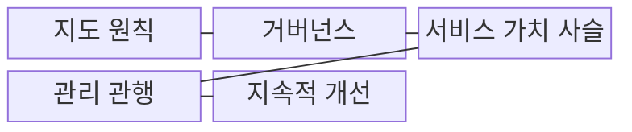
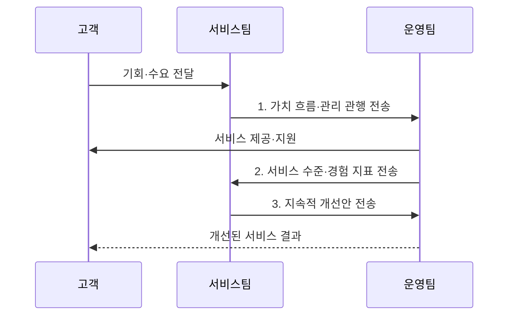

---
sidebar:
  order: 6
  label: "006. ITIL v4와 IT 서비스 관리 (ITIL v4 IT Service Management)"
  badge:
    text: "미출 · 50%"
    variant: note
title: "ITIL v4와 IT 서비스 관리 (ITIL v4 IT Service Management)"
date: "2026-08-02T12:00:00+09:00"
tags:
  - "notes-law_policy"
weight: 6
extra:
  question_no: "006"
  source_status: "미출"
  source_history: ""
  priority: 50
  priority_note: "가치사슬·관행으로 서비스 관리를 설계"
---

## Ⅰ. 개요

핵심 용어

- **ITIL v4**: ITIL v4는 기회와 수요를 가치로 전환하도록 서비스 가치 시스템과 관리 관행을 제시하는 ITSM 실무 프레임워크다.

- 정의/개념: **ITIL v4**는 기회·수요를 가치로 전환하는 서비스 가치 시스템과 관행을 제시하는 **ITSM 실무 프레임워크**
- 배경/필요성: 기능별 분리 운영만으로는 **종단 가치·책임과 인계 병목을 추적하기 어려움**

### 쉽게 이해하기 (학습용)
- 고객 요구를 서비스로 설계·구축·제공하고 성과를 개선하는 전체 활동을 하나의 가치 흐름으로 관리한다

## Ⅱ. 특징

핵심 용어

- **4차원 검토**: 4차원 검토는 조직과 사람·정보와 기술·파트너와 공급자·가치 흐름과 프로세스를 함께 살핀다.

- **가치 중심성**: 서비스 가치 시스템을 통해 기회·수요·활동·성과를 통합
- **조합 가능성**: 서비스 상황에 맞는 관리 관행과 가치 사슬 활동을 선택
- **전체적 관점**: 조직과 사람·정보와 기술·파트너와 공급자·가치 흐름과 프로세스의 4차원 검토

### 쉽게 이해하기 (학습용)
- 조직 역량과 기술 환경에 맞는 실무 관행을 조합해 서비스별 가치 흐름을 설계한다

## Ⅲ. 구조 및 구성요소

핵심 용어

- **서비스 가치 사슬**: 서비스 가치 사슬은 계획·개선·참여·설계 및 전환·획득 및 구축·제공 및 지원 활동을 조합한다.

| 구성요소 | 책임 |
|:---|:---|
| 지도 원칙 | 상황 변화에도 **의사결정을 안내하는 권고** 제공 |
| 거버넌스 | 조직의 **평가·지시·감시 수단** 제공 |
| 서비스 가치 사슬 | 수요를 가치로 전환하는 **6개 핵심 활동** 구성 |
| 관리 관행 | **일반·서비스·기술 관리 자원** 조합 |
| 지속적 개선 | 이해관계자 기대에 맞춰 **서비스 성과** 반복 향상 |

### 쉽게 이해하기 (학습용)
- 지도 원칙과 거버넌스 아래 4차원 모델을 검토하고 가치사슬 활동과 실무 관행을 조합한다

## Ⅳ. 흐름도

핵심 용어

- **2. 서비스 수준·경험 지표 전송**: 운영팀은 SLA와 이용자 경험 지표를 서비스팀에 전달해 가치 흐름의 병목과 개선 대상을 식별하게 한다.

1. **가치 흐름·관리 관행 전송**: 활동·서비스 자원 조합
2. **서비스 수준·경험 지표 전송**: SLA·이용자 경험 측정
3. **지속적 개선안 전송**: 측정값을 가치 흐름과 관행에 반영

### 쉽게 이해하기 (학습용)
- 고객 요구를 분석해 가치 흐름을 구성하고 서비스를 제공한 뒤 운영 지표로 개선한다

## Ⅴ. 종류 및 비교

핵심 용어

- **ITIL v4**: ITIL v4는 고정된 생명주기보다 상황에 맞는 가치 사슬 활동과 관리 관행의 유연한 조합을 강조한다.

| 판단 기준 | ITIL v4 | ITIL v3 |
|:---|:---|:---|
| 적용 기준 | 변화가 빠른 **가치 흐름 관리** | **서비스 생명주기** 단계별 통제 |
| 핵심 특징 | **SVS·SVC·관리 관행**의 유연한 조합 | **전략·설계·전환·운영·개선** 단계 |
| 한계 | **관행 조합·조직 변화 역량** 필요 | **기능 단절·변화 대응 지연** |

> 요약: **ITIL v4**는 가치 흐름, **v3**는 생명주기 중심

### 쉽게 이해하기 (학습용)
- v3는 서비스 생명주기의 순차 통제에 집중하고, v4는 상황에 맞는 실무 관행을 가치 흐름으로 조합한다

## Ⅵ. 실무 고려사항 및 대책

핵심 용어

- **도입 부담**: 도입 부담은 서비스 가치와 무관하게 모든 관리 관행을 한꺼번에 적용할 때 비용과 조직 저항이 커지는 문제다.

| 문제 | 대책 | 효과 |
|:---|:---|:---|
| 전 관행을 적용해 생기는 **도입 부담** | **가치 흐름 병목 관행**부터 단계 적용 | 투자 우선순위와 **도입 성공률** 향상 |
| 서비스 지표와 가치가 끊기는 **성과 단절** | **SLA·이용자 경험·사업 성과** 연계 | 개선의 **가치 기여도** 확인 |
| 개발·운영·공급자 사이의 **책임 분산** | 가치 흐름별 **책임자·협업 규칙** 정의 | 인계 지연과 **해결 시간** 감소 |

### 쉽게 이해하기 (학습용)
- 전 관행을 한꺼번에 적용하지 않고 장애 처리 지연이 큰 서비스부터 인시던트 관리 절차를 개선한다

## Ⅶ. 결론

핵심 용어

- **SVC**: SVC에는 4차원 관점으로 확인한 병목을 해소하는 관리 관행부터 우선 결합해야 한다.

- **4차원 모델**로 병목을 진단해 관련 관행을 **SVC**에 우선 결합

### 쉽게 이해하기 (학습용)
- 비즈니스와 기술 변화에 맞게 가치 흐름과 실무 관행을 지속적으로 조정해야 한다
