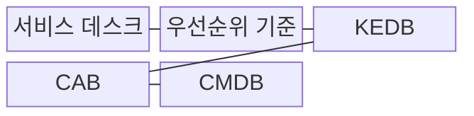
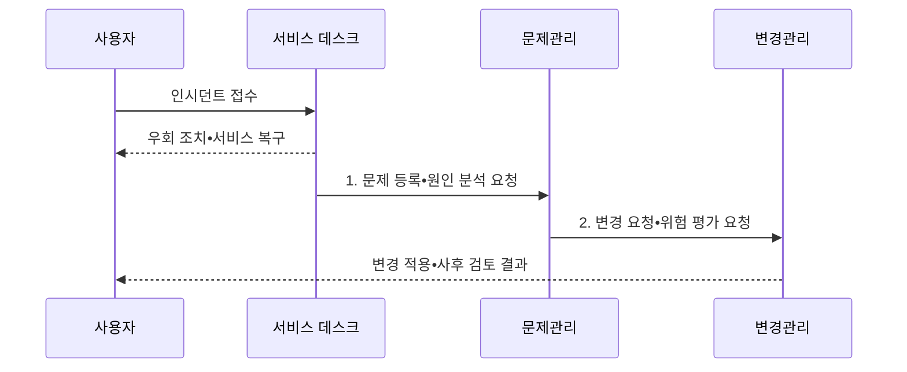

---
sidebar:
  order: 7
  label: "007. 인시던트•문제•변경 관리 (Incident, Problem, Change Management)"
  badge:
    text: "미출 • 50%"
    variant: note
title: "인시던트•문제•변경 관리 (Incident, Problem, Change Management)"
date: "2026-08-03T08:48:47+09:00"
tags:
  - "notes-law_policy"
weight: 7
extra:
  question_no: "007"
  source_status: "미출"
  source_history: ""
  priority: 50
  priority_note: "인시던트•문제•변경 흐름을 비교하는 독립축"
---

## Ⅰ. 개요

핵심 용어

- **인시던트•문제•변경 관리**: 인시던트•문제•변경 관리는 ITSM의 운영 관행으로서 서비스 복구•근본 원인 제거•변경 위험 통제를 연계한다.
- **IT 서비스 관리(IT Service Management, ITSM)**: IT 서비스를 기획•제공•지원•개선해 고객 가치와 합의된 서비스 수준을 달성하는 관리 활동이다.

- 정의/개념: **인시던트•문제•변경 관리** 는 서비스 복구•근본 원인 제거•변경 위험 통제를 연계하는 **ITSM 운영 관행**
- 배경/필요성: 복구•원인 분석•변경 승인을 한 과정으로 처리하면 **복구 지연•장애 재발** 통제 곤란

#### 한줄 요약
- 장애 발생 시 서비스 복구는 인시던트 관리, 근본 원인 제거는 문제 관리, 수정 배포의 위험 통제는 변경 관리가 담당한다

## Ⅱ. 특징

핵심 용어

- **평균 복구 시간(Mean Time to Repair, MTTR)**: 장애 발생부터 서비스를 정상 상태로 복구할 때까지 걸린 평균 시간이다.
- **알려진 오류**: 근본 원인과 임시 우회 조치가 확인돼 반복 인시던트 대응에 재사용할 수 있는 문제 기록이다.
- **롤백 계획**: 변경 실패 시 시스템과 데이터를 변경 전 정상 상태로 되돌리는 절차와 책임을 정한 계획이다.
- **재발 방지**: 재발 방지는 문제 관리가 반복 인시던트의 근본 원인과 알려진 오류를 기록하고 제거해 달성한다.

- **복구 우선•MTTR 단축**: 인시던트 관리의 우회 조치를 통한 신속한 회복
- **재발 방지**: 문제 관리가 근본 원인과 알려진 오류를 관리하여 반복 장애 제거
- **위험 통제**: 변경 관리가 영향 평가•승인•롤백 계획으로 변경 실패 억제

#### 한줄 요약
- 복구와 원인 분석을 분리하면 서비스를 먼저 정상화하면서도 이후 근본 원인을 제거해 재발을 막을 수 있다

## Ⅲ. 구조 및 구성요소

핵심 용어

- **알려진 오류 데이터베이스(Known Error Database, KEDB)**: 반복 장애의 근본 원인과 검증된 우회 조치를 저장해 복구에 재사용하는 저장소이다.
- **변경자문위원회(Change Advisory Board, CAB)**: 변경의 위험•영향•일정•롤백 계획을 검토하고 승인 여부를 자문하는 조직이다.
- **구성관리 데이터베이스(Configuration Management Database, CMDB)**: 서비스 구성항목과 관계를 저장해 장애•변경의 영향 범위를 추적하는 저장소이다.
- **인시던트 관리**: 서비스 중단이나 품질 저하를 가능한 빨리 정상화해 업무 영향을 줄이는 활동이다.
- **문제 관리**: 반복 인시던트의 근본 원인과 알려진 오류를 식별하고 우회•영구 해결책을 관리하는 활동이다.
- **변경 활성화**: 변경의 가치•위험•영향•일정•롤백을 평가하고 승인된 변경을 안전하게 실행하는 활동이다.
- **서비스 데스크•우선순위**: 단일 접점에서 요청을 접수하고 영향도와 긴급도로 처리 순서를 정하는 운영 기반이다.

| 구성요소 | 책임 |
|:---|:---|
| 서비스 데스크 | 인시던트 접수와 **우선순위 분류** |
| 우선순위 기준 | 영향도•긴급도에 따른 **처리 순서** |
| KEDB | 반복 장애의 **오류•우회 조치** 저장 |
| CAB | 변경 위험•일정•**영향 범위** 검토 |
| CMDB | 구성항목 관계와 **영향도 분석** |

#### 한줄 요약
- 서비스 데스크와 CAB는 CMDB의 구성 관계와 KEDB의 오류•우회 조치를 공유해 복구와 변경을 통제한다

## Ⅳ. 흐름도

핵심 용어

- **근본 원인**: 반복 인시던트를 유발하는 기저 결함으로 문제 관리가 분석•제거해야 하는 대상이다.
- **롤백 계획**: 변경 실패 시 구성항목과 서비스를 이전 정상 상태로 되돌리는 절차이다.
- **변경 위험 평가**: 변경 대상과 연계 구성항목의 영향•실패 가능성•복구 방법을 검토하는 절차이다.

1. **문제 등록•원인 분석 요청**: 반복 인시던트의 **근본 원인** 규명
2. **변경 요청•위험 평가 요청**: 구성항목 영향과 **롤백 계획** 검토

#### 한줄 요약
- 장애를 분류해 우회 조치로 서비스를 복구한 뒤 근본 원인을 분석하고, 변경 승인을 거쳐 수정 사항을 적용한다

## Ⅴ. 종류 및 비교

핵심 용어

- **인시던트 관리**: 서비스 장애를 분류하고 우회 조치로 정상 운영을 신속히 복구하는 관리 활동이다.
- **문제 관리**: 반복 인시던트의 근본 원인과 알려진 오류를 관리해 재발을 방지하는 활동이다.
- **변경 관리**: 변경 관리는 시스템 구성 변경의 영향•위험•일정•롤백을 검토해 변경 실패를 통제한다.
- **알려진 오류**: 근본 원인과 우회 조치가 확인돼 반복 장애 대응에 활용하는 문제 기록이다.

| 판단 기준 | 인시던트 관리 | 문제 관리 | 변경 관리 |
|:---|:---|:---|:---|
| 적용 기준 | **서비스 장애** 복구 시 | **반복 장애** 원인 규명 시 | **시스템 구성** 변경 시 |
| 핵심 특징 | 분류•**우회 조치** 를 통한 신속 복구 | **근본 원인•알려진 오류** 관리로 재발 방지 | **영향 평가•롤백** 을 통한 변경 위험 통제 |
| 한계 | 신속 복구만 반복하면 **근본 원인** 미해결 | 원인 분석 중 **즉시 복구** 에는 부적합 | 승인 절차가 과도하면 **변경 지연** 가능 |

> 요약: 인시던트는 **복구**, 문제는 **재발 방지**, 변경은 **위험 통제**

#### 한줄 요약
- 세 관리는 하나의 장애 흐름에서 연결되지만 각각 복구 시간, 재발 감소, 변경 성공률로 성과를 평가한다

## Ⅵ. 실무 고려사항 및 대책

핵심 용어

- **영향 범위**: 영향 범위 누락은 변경 대상과 연결된 구성항목•서비스를 CMDB에서 확인하지 않을 때 발생한다.
- **구성관리 데이터베이스(Configuration Management Database, CMDB)**: 구성항목 관계를 조회해 장애와 변경이 확산될 서비스를 확인하는 저장소이다.
- **변경자문위원회(Change Advisory Board, CAB)**: 고위험 변경의 영향과 롤백 계획을 심사하는 조직이다.
- **표준 변경**: 반복 수행해 절차•위험•복구 방법이 검증돼 사전 승인할 수 있는 변경 유형이다.

| 문제 | 대책 | 효과 |
|:---|:---|:---|
| 복구와 **원인 분석** 의 혼선 | 복구 후 반복 장애를 **문제 기록** 으로 분리•연계 | **복구 시간•재발** 동시 감소 |
| 변경 **영향 범위** 누락 | **CMDB** 에서 연관 구성항목과 서비스 확인 | 변경 장애의 **확산 위험** 감소 |
| 모든 변경에 **동일 승인** 적용 | 표준 변경은 사전 승인하고 고위험 변경은 **CAB** 심사 | 처리 속도와 **통제 수준** 의 균형 확보 |

#### 한줄 요약
- 반복 검증된 표준 변경은 자동 승인하고 핵심 데이터베이스 변경은 CAB가 영향도와 롤백 계획을 심사한다

## Ⅶ. 결론

핵심 용어

- **위험 기반 변경**: 위험 기반 변경은 반복 검증된 표준 변경은 신속 처리하고 고위험 변경은 CAB 심사를 적용한다.
- **근본 원인 분석(Root Cause Analysis, RCA)**: 반복 장애를 일으킨 기저 원인을 증거로 규명해 재발 방지 변경으로 연결하는 분석이다.
- **변경자문위원회(Change Advisory Board, CAB)**: 고위험 변경의 영향•일정•롤백 계획을 검토하는 조직이다.

- 장애는 **우회 조치로 우선 복구**, 반복 원인은 **RCA 후 위험 기반 변경** 적용

#### 한줄 요약
- 서비스 복구를 우선하되 근본 원인 분석과 변경 통제를 연계해 장애 재발과 변경 실패를 함께 줄여야 한다
