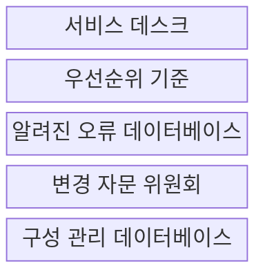
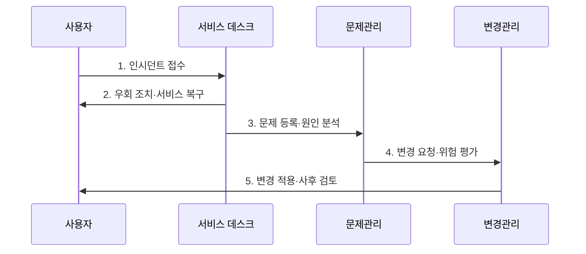

---
sidebar:
  order: 7
  label: "007. 인시던트·문제·변경 관리 (Incident, Problem, Change Management)"
  badge:
    text: "미출제 · 50%"
    variant: note
title: "인시던트·문제·변경 관리 (Incident, Problem, Change Management)"
date: "2026-07-30T10:24:00+09:00"
tags:
  - "notes-law_policy"
weight: 7
extra:
  question_no: "007"
  source_status: "미출제"
  source_history: ""
  priority: 50
  priority_note: "인시던트·문제·변경 흐름을 비교하는 독립축"
---

## 미리 알고가기

- **인시던트(Incident)**: 정보기술 서비스의 정상적인 운영을 중단시키거나 서비스 품질을 저하시키는 계획되지 않은 돌발 사건
- **문제(Problem)**: 하나 또는 그 이상의 인시던트를 유발했으나 명확히 밝혀지지 않은 근본적인 하드웨어 및 소프트웨어적 원인
- **변경(Change)**: 기존 정보기술 인프라 및 시스템 구성 정보에 물리적 혹은 논리적인 변동을 가하는 추가, 수정 또는 삭제 활동
- **구성항목(Configuration Item, CI)**: 서비스 제공을 위해 형상 관리 대상이 되는 서버, 소프트웨어, 네트워크 장비 및 문서 자원
- **우회 조치(Workaround)**: 시스템의 근본적 결함이 해결되기 전에 사용자의 업무 중단을 최소화하기 위해 신속히 적용하는 임시 복구 조치
- **알려진 오류 데이터베이스(Known Error Database, KEDB)**: 이미 근본 원인이나 우회 조치가 규명된 과거 오류 정보들을 저장해 둔 공유 시스템
- **변경 자문 위원회(Change Advisory Board, CAB)**: 제안된 변경 사안의 비즈니스 영향도와 시스템 위험 수준을 심사하여 승인 여부와 적용 일정을 조정하는 전문 의결 기구
- **구성 관리 데이터베이스(Configuration Management Database, CMDB)**: IT 서비스 구성항목들 간의 물리적 배치가 기록되어 관계와 영향도를 추적할 수 있도록 돕는 중앙 저장소
- **근본 원인 분석(Root Cause Analysis, RCA)**: 장애나 문제의 근본적인 기저 원인을 파악하기 위해 로그와 현상을 정밀 분석하는 기법
- **평균 복구 시간(Mean Time To Resolution, MTTR)**: 장애 접수 시점부터 정상 서비스 수준으로 완벽하게 복구될 때까지 소요된 평균 시간

## Ⅰ. 개요

- **인시던트·문제·변경 관리**는 서비스 복구, 근본 원인 제거, 변경 위험 통제를 분리하되 상호 연계하는 **IT 서비스 관리 관행**
- **배경/필요성**: 복구·원인 분석·변경 승인을 한 과정으로 처리할 때 발생하는 복구 지연과 장애 재발 방지

### 쉽게 이해하기 (학습용)
- 장애 발생 시 서비스 복구는 인시던트 관리, 근본 원인 제거는 문제 관리, 수정 배포의 위험 통제는 변경 관리가 담당한다

## Ⅱ. 특징

- **복구 우선**: 인시던트 관리가 우회 조치로 정상 서비스의 신속한 회복 추진
- **재발 방지**: 문제 관리가 근본 원인과 알려진 오류를 관리하여 반복 장애 제거
- **위험 통제**: 변경 관리가 영향 평가·승인·롤백 계획으로 변경 실패 억제

### 쉽게 이해하기 (학습용)
- 복구와 원인 분석을 분리하면 서비스를 먼저 정상화하면서도 이후 근본 원인을 제거해 재발을 막을 수 있다

## Ⅲ. 구조 및 구성요소

| 설계 요소 | 설명 |
|:---|:---|
| 서비스 데스크 | 인시던트 및 요청 접수와 우선순위 분류 |
| 우선순위 기준 | 영향도와 긴급도에 따른 처리 순서 식별 |
| KEDB | 반복 장애 대응을 위한 오류 및 조치 정보 저장 |
| CAB | 변경 위험·일정·영향 범위 검토 |
| CMDB | 구성항목 관계 관리 및 영향도 분석 |

> 요약: **CMDB·KEDB**로 복구·원인·변경의 영향정보 연계

### 쉽게 이해하기 (학습용)
- 서비스 데스크와 CAB는 CMDB의 구성 관계와 KEDB의 오류·우회 조치를 공유해 복구와 변경을 통제한다

## Ⅳ. 흐름도

| 절차 | 핵심 활동 |
|:---|:---|
| 인시던트 접수 | 영향도와 긴급도로 우선순위 분류 |
| 우회 조치·서비스 복구 | 알려진 오류 정보를 활용하여 가용성 우선 확보 |
| 문제 등록·원인 분석 | 반복 인시던트의 근본 원인 규명 |
| 변경 요청·위험 평가 | 구성항목 영향과 롤백 계획을 검토하여 승인 |
| 변경 적용·사후 검토 | 정상 반영 여부와 부작용 확인 |

### 쉽게 이해하기 (학습용)
- 장애를 분류해 우회 조치로 서비스를 복구한 뒤 근본 원인을 분석하고, 변경 승인을 거쳐 수정 사항을 적용한다

## Ⅴ. 종류 및 비교

| 판단 기준 | 인시던트 관리 | 문제 관리 | 변경 관리 |
|:---|:---|:---|:---|
| 적용 기준 | 상시 장애 복구 시 | 반복 장애 원인 규명 시 | 시스템 구성 변경 시 |
| 핵심 특징 | 분류·우회 조치를 통한 서비스 신속 복구 | 근본 원인 분석과 알려진 오류 관리를 통한 재발 방지 | 영향 평가·승인·롤백을 통한 변경 위험 통제 |
| 한계 | 신속 복구만 반복하면 근본 원인 미해결 | 원인 분석에 시간이 필요하여 즉시 복구에는 부적합 | 승인 절차가 과도하면 변경 지연 가능 |

> 요약: 인시던트는 **복구**, 문제는 **재발 방지**, 변경은 **위험 통제**

### 쉽게 이해하기 (학습용)
- 세 관리는 하나의 장애 흐름에서 연결되지만 각각 복구 시간, 재발 감소, 변경 성공률로 성과를 평가한다

## Ⅵ. 실무 고려사항 및 대책

| 고려사항 | 대책 | 효과 |
|:---|:---|:---|
| 복구와 원인 분석의 혼선 | 인시던트 복구 후 반복 장애를 문제 기록으로 분리·연계 | 복구 시간 단축과 재발 방지 병행 |
| 변경 영향 범위 누락 | 구성 관리 데이터베이스에서 연관 구성항목과 서비스 확인 | 변경 장애의 확산 위험 감소 |
| 모든 변경의 동일 승인 | 표준 변경은 사전 승인하고 고위험 변경은 변경 자문 위원회가 심사 | 처리 속도와 통제 수준의 균형 확보 |

### 쉽게 이해하기 (학습용)
- 반복 검증된 표준 변경은 자동 승인하고 핵심 데이터베이스 변경은 CAB가 영향도와 롤백 계획을 심사한다

## Ⅶ. 결론

- 반복 장애와 변경 실패를 함께 줄여야 한다면 **서비스 복구를 우선한 뒤 근본 원인 분석 결과를 위험 기반 변경 승인으로 연결하는 통합 운영** 필요

### 쉽게 이해하기 (학습용)
- 서비스 복구를 우선하되 근본 원인 분석과 변경 통제를 연계해 장애 재발과 변경 실패를 함께 줄여야 한다
