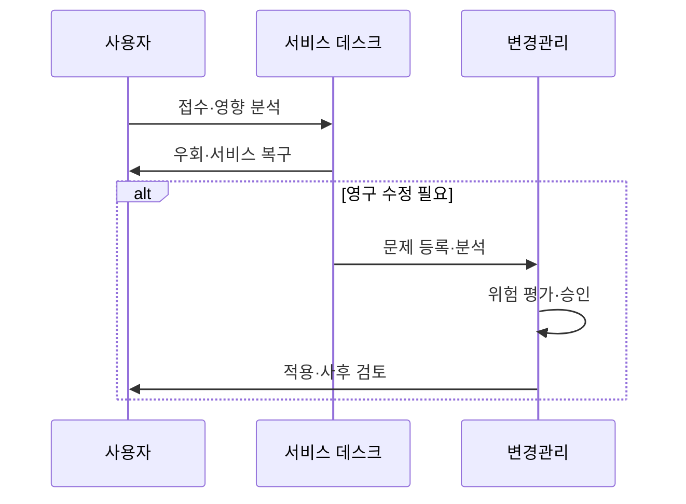

---
sidebar:
  order: 7
  label: "007. 인시던트·문제·변경 관리 (Incident, Problem, Change Management)"
  badge:
    text: "미출제 · 50%"
    variant: note
title: "인시던트·문제·변경 관리 (Incident, Problem, Change Management)"
date: "2026-07-25T01:20:00+09:00"
tags:
  - "notes-law_policy"
weight: 7
extra:
  question_no: "007"
  source_status: "미출제"
  source_history: ""
  priority: 50
  priority_note: "인시던트·문제·변경 흐름을 비교하는 독립축"
---

## 미리 알고가기

- **인시던트(Incident)**: 정보기술 서비스의 정상적인 운영을 중단시키거나 서비스 품질을 저하시키는 계획되지 않은 돌발 사건
- **문제(Problem)**: 하나 또는 그 이상의 인시던트를 유발했으나 명확히 밝혀지지 않은 근본적인 하드웨어 및 소프트웨어적 원인
- **변경(Change)**: 기존 정보기술 인프라 및 시스템 구성 정보에 물리적 혹은 논리적인 변동을 가하는 추가, 수정 또는 삭제 활동
- **구성항목(Configuration Item, CI)**: 서비스 제공을 위해 형상 관리 대상이 되는 서버, 소프트웨어, 네트워크 장비 및 문서 자원
- **우회 조치(Workaround)**: 시스템의 근본적 결함이 해결되기 전에 사용자의 업무 중단을 최소화하기 위해 신속히 적용하는 임시 복구 조치
- **알려진 오류 데이터베이스(Known Error Database, KEDB)**: 이미 근본 원인이나 우회 조치가 규명된 과거 오류 정보들을 저장해 둔 공유 시스템
- **변경 자문 위원회(Change Advisory Board, CAB)**: 제안된 변경 사안의 비즈니스 영향도와 시스템 위험 수준을 심사하여 승인 여부와 적용 일정을 조정하는 전문 의결 기구
- **구성 관리 데이터베이스(Configuration Management Database, CMDB)**: IT 서비스 구성항목들 간의 물리적 배치가 기록되어 관계와 영향도를 추적할 수 있도록 돕는 중앙 저장소
- **근본 원인 분석(Root Cause Analysis, RCA)**: 장애나 문제의 근본적인 기저 원인을 파악하기 위해 로그와 현상을 정밀 분석하는 기법
- **평균 복구 시간(Mean Time To Resolution, MTTR)**: 장애 접수 시점부터 정상 서비스 수준으로 완벽하게 복구될 때까지 소요된 평균 시간
- **약어 읽기·표기**: CI는 ‘씨아이’, KEDB는 ‘케이이디비’, CAB는 ‘캐브’, CMDB는 ‘씨엠디비’, RCA·MTTR은 영문 정식명의 머리글자로 읽으며 구성·오류·승인·원인·복구 지표를 구분함
- **시퀀스 기호(->>·alt/end)**: ‘요청 전달·조건 분기’로 읽고 장애 복구 뒤 영구 수정 필요 여부에 따른 흐름을 나타냄

## Ⅰ. 개요

- 정의/개념: 복구·원인 제거·변경 통제를 분리·연계
- **배경/필요성**: 역할 분리로 복구 지연과 재발 방지

### 쉽게 이해하기 (학습용)
- 컴퓨터 시스템에 에러가 났을 때, 임시로 재부팅하여 살리는 활동(인시던트), 왜 꺼졌는지 백그라운드 코드를 분석하는 활동(문제), 소스코드를 고쳐 배포하는 활동(변경)을 구분하여 관리함

## Ⅱ. 특징

- 인시던트 관리는 서비스 복구 시간을 줄인다
- 문제 관리는 근본 원인을 제거해 재발을 막는다
- 변경 관리는 평가·승인으로 배포 사고를 막는다
- 목표 분리가 복구·원인·변경 책임을 명확히 한다

### 쉽게 이해하기 (학습용)
- 장애 복구와 원인 분석의 책임을 분리하여, 원인을 찾느라 복구가 늦어지는 일을 막고 복구 완료 이후에도 끝까지 원인을 규명해 오류를 방지함

## Ⅲ. 아키텍처 및 구성요소

| 설계 요소 | 설명 |
|:---|:---|
| 서비스 데스크 | 인시던트 및 요청 접수와 우선순위 분류 |
| 우선순위 기준 | 영향도와 긴급도에 따른 처리 순서 식별 |
| KEDB | 반복 장애 대응을 위한 오류 및 조치 정보 저장 |
| CAB | 변경 위험·일정·영향 범위 검토 |
| CMDB | 구성항목 관계 관리 및 영향도 분석 |

> 요약: 각 구성요소를 통합 연계하여 변경 및 오류 관리

### 쉽게 이해하기 (학습용)
- 장애 접수를 담당하는 서비스 데스크와 승인을 검토하는 변경 위원회(CAB)가 구성 관리 데이터베이스(CMDB)와 오류 대장(KEDB)을 기반으로 서로 협력함

## Ⅳ. 원리 및 절차 흐름도

| 절차 | 핵심 활동 |
|:---|:---|
| 접수·영향 분석 | 인시던트 등급 분류 |
| 우회·서비스 복구 | 가용성 우선 확보 |
| 문제 등록·분석 | 근본 원인 규명 |
| 위험 평가·승인 | 구성항목 변경 통제 |
| 적용·사후 검토 | 정상 반영 확인 |

### 쉽게 이해하기 (학습용)
- 장애 전화를 받자마자 우회 경로로 화면을 임시 복구하고, 이후 시스템 원인을 찾아 소스코드를 고치겠다는 승인 신청을 거쳐 실제 서버에 안전하게 적용함

## Ⅴ. 종류 및 비교

| 판단 기준 | 인시던트 관리 | 문제 관리 | 변경 관리 |
|:---|:---|:---|:---|
| 핵심 목적 | 서비스 신속 복구 | 원인 및 재발 방지 | 변경 위험 통제 |
| 핵심 기법 | 분류·우회·복구 | 근본 원인 분석(RCA) | 위험 평가·승인·롤백 |
| 대표 지표 | MTTR·SLA 준수율 | Known Error 추이 | 성공률·실패율 |
| 적용 기준 | 상시 장애 복구 시 | 반복 장애 원인 규명 시 | 시스템 구성 변경 시 |

> 요약: 세 실무는 복구·재발방지·통제로 구분됨

### 쉽게 이해하기 (학습용)
- 세 업무는 하나의 서버 장애 과정에서 차례로 연결되지만, 신속성(인시던트), 근본성(문제), 안정성(변경)으로 평가 기준이 서로 다름

## Ⅵ. 실무 사례

1. 표준 변경은 자동화하고 고위험은 CAB 검토

### 쉽게 이해하기 (학습용)
- 오타 수정 같은 가벼운 소스 수정은 수동 승인 없이 자동으로 배포하고, 핵심 데이터베이스 이중화 작업에 의결 역량을 모아 정밀하게 심사함

## Ⅶ. 결론

- 복구·분석·통제의 책임 분리와 CMDB 연계성 확보

### 쉽게 이해하기 (학습용)
- IT 서비스 가용성을 최대로 높이기 위해 신속한 초기 대응과 정밀한 원인 분석, 안전한 인프라 변경 체계의 역할 분리를 철저히 고수해야 함
