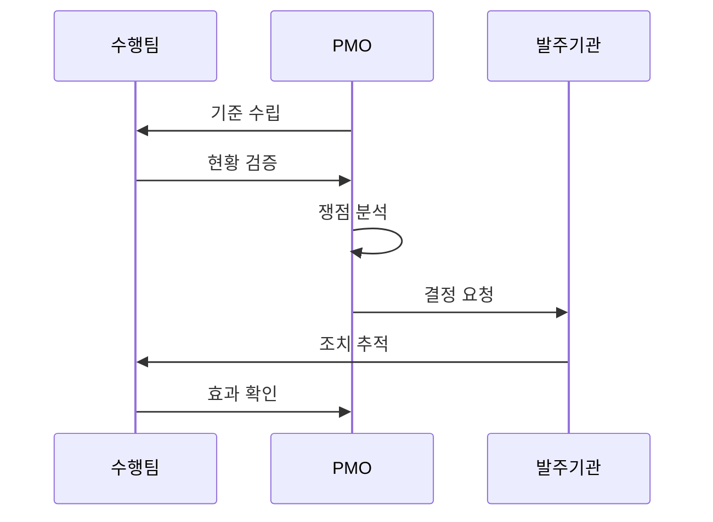

---
sidebar:
  order: 8
  label: "008. PMO (Project Management Office)"
  badge:
    text: "기출 · 50%"
    variant: note
title: "PMO (Project Management Office)"
date: "2026-07-25T01:20:00+09:00"
tags:
  - "notes-law_policy"
weight: 8
extra:
  question_no: "008"
  source_status: "기출"
  source_history: "132회"
  priority: 50
  priority_note: "132회 기출, 발주자 PMO 역할·통제 범위"
---

## 미리 알고가기

- **프로젝트 관리 조직(Project Management Office, PMO)**: 조직 내 프로젝트들의 표준을 정하고, 일정, 범위, 품질 및 위험 요소를 관리·통제하는 전문 지원 조직
- **프로젝트 관리자(Project Manager, PM)**: 개별 프로젝트의 실행을 책임지며 인력과 산출물 납기를 총괄 조율하는 수행 조직의 이행 책임자
- **공공 프로젝트 관리 조직(Public PMO)**: 전자정부법에 의거하여 예산과 기술 역량이 부족한 국가기관의 발주 사업 관리를 지원하는 대행 조직
- **약어 읽기·표기**: PMO는 ‘피엠오’, PM은 ‘피엠’으로 읽으며 Project Management 관련 영문 정식명의 머리글자로 관리 조직과 개별 책임자를 구분함
- **시퀀스 기호(->>)**: ‘요청 전달’로 읽고 이중 화살촉은 수행팀·PMO·발주기관 간 책임 인계를 나타냄

## Ⅰ. 개요

- **정의/개념**: 사업 기준과 일정·품질·위험을 통제하는 조직
- **배경/필요성**: 복합 사업 위험과 발주자 결정을 지원

### 쉽게 이해하기 (학습용)
- 여러 개의 하위 프로젝트가 섞인 대형 IT 사업이 산으로 가지 않도록, 전체 진척 상황을 감시하고 위험을 정리해 주는 관리 비서 조직임

## Ⅱ. 특징

- 관리 방법론·산출물 양식을 표준화한다
- 일정·비용·위험을 점검해 결정을 지원한다
- 공공 PMO가 발주처의 관리 역량을 보완한다
- 권한·책임 경계가 수행팀과의 충돌을 줄인다

### 쉽게 이해하기 (학습용)
- 개발 부서의 진척 현황과 버그 발생률을 제3자 관점에서 투명하게 측정하여 경영진이 제때 인력 보강이나 범위 조정을 결정하도록 지원함

## Ⅲ. 아키텍처 및 구성요소

| 설계 요소 | 설명 |
|:---|:---|
| 관리 기준 | 일정·범위·비용 등 절차 정의 |
| 통합 보고 | 사업 현황 및 쟁점 발주기관 전달 |
| 위험 관리 | 위험 식별 및 대응 추적 |
| 품질 관리 | 산출물 및 기준 준수 확인 |
| 의사결정 지원 | 쟁점·대안·영향 평가 보고 |

> 요약: PMO가 수행 현황을 통합하여 의사결정을 지원함

### 쉽게 이해하기 (학습용)
- 관리 기준서에 기초하여 여러 개발팀의 현황 보고서를 수집하고, 일정 위험과 소프트웨어 품질을 검토하여 발주처에 전달하는 구조임

## Ⅳ. 원리 및 절차 흐름도

| 절차 | 핵심 활동 |
|:---|:---|
| 기준 수립 | 표준 양식·관리 지침 배포 |
| 현황 검증 | 진척률·품질 적합성 분석 |
| 쟁점 분석 | 위험·영향도 평가 |
| 결정 요청 | 발주기관에 결정안 보고 |
| 조치 추적 | 승인 사항 이행 점검 |
| 효과 확인 | 조치 성과 유효성 검증 |

### 쉽게 이해하기 (학습용)
- 프로젝트 시작 시 보고 형식을 배포한 후 매주 진행 상황을 감시하고, 위험 쟁점이 발생하면 해결안을 발주처에 보고해 조치를 강제함

## Ⅴ. 종류 및 비교

| 판단 기준 | 지원형 PMO | 통제형 PMO | 지시형 PMO |
|:---|:---|:---|:---|
| 권한 수준 | 낮음 | 중간 | 높음 |
| 핵심 역할 | 자문·교육 제공 | 표준·산출물 통제 | PM 및 자원 통제 |
| 적용 기준 | 자체 역량이 우수한 조직 지원 시 | 부서 간 표준 절차 준수가 강제될 시 | 외부 인력 지시 및 직접 수행 시 |

> 요약: 권한 수준에 따라 지원형, 통제형, 지시형으로 분류

### 쉽게 이해하기 (학습용)
- PMO는 자문만 주는 '지원형', 표준 템플릿 준수를 요구하는 '통제형', PM을 직접 파견해 지휘하는 '지시형'으로 나뉨

## Ⅵ. 실무 사례

1. 공공 PMO 계약에 독립성과 권한 명시
2. PMO·감리·수행사의 책임 경계 구분

### 쉽게 이해하기 (학습용)
- 전자정부 사업 진행 시 공공 발주기관의 전문성 강화를 위해 법령에 맞춰 민간 전문 PMO 업체를 별도로 발주함
- 개발팀의 계약 불이행 책임이나 최종 사업 검수 결정은 법적으로 발주기관과 수행사에 있으므로, PMO가 대리 서명하는 오류를 차단함

## Ⅶ. 결론

- 위험 조기 식별을 위한 통합 거버넌스 및 독립성 확보

### 쉽게 이해하기 (학습용)
- 대형 정보화 사업의 성공을 위해서는 보고서 형식 맞추기에 치우치지 않고, 사업의 독립된 조정 권한과 실질적 위험 감시 통제권을 부여해야 함
