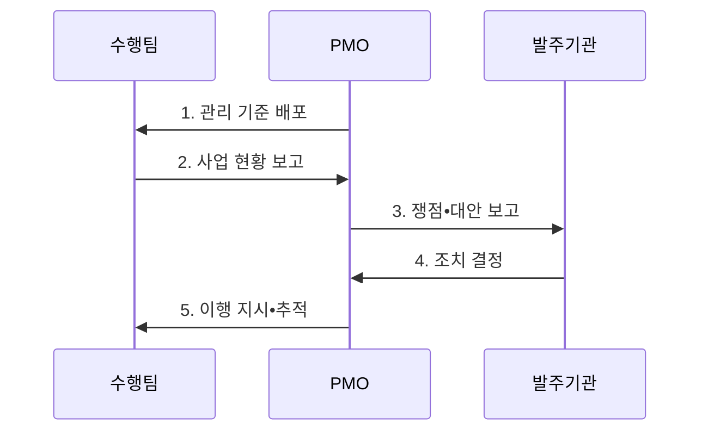

---
sidebar:
  order: 8
  label: "008. PMO (Project Management Office)"
  badge:
    text: "기출 • 50%"
    variant: note
title: "PMO (Project Management Office)"
date: "2026-08-03T08:48:47+09:00"
tags:
  - "notes-law_policy"
weight: 8
extra:
  question_no: "008"
  source_status: "기출"
  source_history: "132회"
  priority: 50
  priority_note: "132회 기출, 발주자 PMO 역할•통제 범위"
---

## Ⅰ. 개요

핵심 용어

- **프로젝트 관리 조직(Project Management Office, PMO)**: 여러 프로젝트에 공통 관리 표준을 적용하고 성과•위험을 통합 감독하는 전담 조직이다.
- **거버넌스 조직**: PMO는 공통 관리 표준으로 여러 프로젝트의 일정•비용•품질•위험을 통합 감독하는 거버넌스 조직이다.

- 정의/개념: **PMO** 는 공통 표준으로 여러 프로젝트의 성과•위험을 통합 관리하는 **거버넌스 조직**
- 배경/필요성: 사업별 분산 관리로는 **일정 지연•위험 누락•의사결정 지연** 의 통합 통제 곤란

#### 한줄 요약
- 여러 프로젝트가 얽힌 대형 IT 사업의 진척•비용•품질•위험을 통합 점검하는 전담 조직이다

## Ⅱ. 특징

핵심 용어

- **프로젝트 관리 조직(Project Management Office, PMO)**: 방법론 표준화•통합 통제와 권한 수준을 사업 위험에 맞춰 제공하는 조직이다.
- **지원형•통제형•지시형 PMO**: 자문 제공, 표준 준수 감독, 프로젝트 직접 지휘로 권한 수준을 구분한 PMO 유형이다.
- **권한 차등화**: 권한 차등화는 사업 위험과 조직 역량에 따라 PMO를 지원형•통제형•지시형으로 선택한다.

- **표준화**: 방법론•절차•산출물 기준의 조직 차원 통일
- **통합 통제**: 일정•비용•품질•위험 정보를 결합한 성과 판단
- **권한 차등화**: 조직의 통제 필요성에 따른 지원형•통제형•지시형 적용

#### 한줄 요약
- PMO는 프로젝트의 진척•품질•위험을 통합 분석해 경영진의 자원 배치와 범위 조정을 지원한다

## Ⅲ. 구조 및 구성요소

핵심 용어

- **프로젝트 관리 조직(Project Management Office, PMO)**: 관리 기준•위험•품질•통합 보고로 발주기관의 의사결정을 지원하는 조직이다.
- **통합 보고**: 통합 보고는 여러 수행팀의 진척•비용•품질•위험을 공통 기준으로 묶어 발주기관에 전달한다.
- **관리 기준**: 범위•일정•비용•품질•변경•산출물의 계획과 통제 방식을 프로젝트 전반에 통일한 기준이다.
- **위험•품질 관리**: 위험의 책임자와 대응을 추적하고 산출물•프로세스가 합의된 품질 기준을 충족하는지 독립 확인한다.
- **의사결정 지원**: 통합된 성과•쟁점•대안을 발주기관의 승인권자에게 제공하고 결정 사항의 이행을 추적한다.

| 구성요소 | 책임 |
|:---|:---|
| 관리 기준 | 일정•범위•비용의 **관리 절차** 정의 |
| 통합 보고 | 사업 현황•쟁점의 **발주기관 전달** |
| 위험 관리 | 위험 식별과 **대응 추적** |
| 품질 관리 | 산출물과 **기준 준수** 확인 |
| 의사결정 지원 | 쟁점•대안•**영향 평가** 보고 |

#### 한줄 요약
- PMO는 여러 수행팀의 현황을 공통 기준으로 수집하고 일정•품질•위험을 분석해 발주기관에 보고한다

## Ⅳ. 흐름도

핵심 용어

- **프로젝트 관리 조직(Project Management Office, PMO)**: 수행팀의 현황을 분석해 주요 쟁점•대안과 결정 필요 사항을 발주기관에 보고하는 조직이다.
- **잔여 위험**: 승인된 조치를 이행한 뒤에도 남아 추가 대응이나 수용 판단이 필요한 위험이다.

1. **관리 기준 배포**: 표준 양식•관리 지침과 보고 주기 정의
2. **사업 현황 보고**: 진척•비용•품질•위험 자료 수집
3. **쟁점•대안 보고**: 영향도와 대응 대안을 분석하여 의사결정 요청
4. **조치 결정**: 발주기관이 범위•자원•일정 변경 여부 승인
5. **이행 지시•추적**: 결정 사항의 수행 결과와 잔여 위험 점검

#### 한줄 요약
- 프로젝트 관리 기준을 배포하고 현황을 주기적으로 분석하며, 주요 쟁점은 대안과 영향을 정리해 발주기관의 결정을 받는다

## Ⅴ. 종류 및 비교

핵심 용어

- **프로젝트 관리 조직(Project Management Office, PMO)**: 사업 위험과 조직 역량에 따라 지원형•통제형•지시형으로 권한을 달리하는 조직이다.
- **프로젝트 관리자(Project Manager, PM)**: 개별 프로젝트의 범위•일정•비용•품질과 수행팀 실행을 책임지는 관리자이다.
- **통제형 PMO**: 통제형 PMO는 프로젝트의 표준•절차 준수를 감독해 일관성을 높이지만 행정 부담을 증가시킬 수 있다.

| 비교 기준 | 지원형 PMO | 통제형 PMO | 지시형 PMO |
|:---|:---|:---|:---|
| 적용 기준 | 자율성이 높은 **조직** | 표준 준수가 필요한 **조직** | 직접 지휘가 필요한 **조직** |
| 핵심 특징 | **자문•교육•템플릿** 제공 | **표준•절차 준수** 감독 | **PM•자원 직접 통제** |
| 한계 | **통제력 부족** | **행정 부담 증가** | **현업 자율성 저하** |

> 요약: **권한 수준** 에 따라 지원형•통제형•지시형 선택

#### 한줄 요약
- 지원형은 자문과 도구를 제공하고, 통제형은 표준 준수를 감독하며, 지시형은 프로젝트를 직접 관리한다

## Ⅵ. 실무 고려사항 및 대책

핵심 용어

- **역할 충돌**: 역할 충돌은 PMO의 감독•지원 권한과 프로젝트 관리자의 실행 책임이 구분되지 않을 때 발생한다.
- **프로젝트 관리 조직(Project Management Office, PMO)**: 프로젝트 간 표준•통합 보고•감독을 담당하고 개별 실행 책임과 분리해야 하는 조직이다.
- **프로젝트 관리자(Project Manager, PM)**: 개별 프로젝트의 실행•조정과 성과 달성을 책임지는 관리자이다.
- **책임 할당표**: 의사결정•실행•검토•보고 역할을 업무별 담당자에게 배정해 책임 충돌을 방지하는 표이다.

| 문제 | 대책 | 효과 |
|:---|:---|:---|
| PMO와 PM의 **역할 충돌** | 의사결정•보고•실행 책임을 **책임 할당표** 로 구분 | 중복 지시 방지와 **책임 명확화** |
| **형식적 보고** 중심 운영 | **성과•위험 지표** 와 의사결정 안건 연계 | 경영진의 **신속한 조치** 지원 |
| 사업 특성과 맞지 않는 **통제 수준** | 복잡도•위험•조직 역량에 따라 **PMO 유형** 선택 | 관리 비용과 **통제 효과** 의 균형 확보 |

#### 한줄 요약
- 공공기관은 대형 전자정부 사업에서 전문 PMO를 도입해 수행사의 진척•품질•위험을 독립적으로 점검한다

## Ⅶ. 결론

핵심 용어

- **프로젝트 관리 조직(Project Management Office, PMO)**: 사업 위험과 발주기관 역량에 맞춰 지원•통제•지시 권한을 선택하는 조직이다.
- **지시형**: 고위험 사업이나 관리 역량이 낮은 조직은 프로젝트와 자원을 직접 통제하는 지시형 PMO가 적합하다.
- **통제형**: 프로젝트 자율성은 유지하면서 공통 표준•절차 준수를 감독하는 PMO 유형이다.

- 고위험•낮은 역량은 **지시형**, 표준 준수는 **통제형**, 자율 조직은 지원형

#### 한줄 요약
- 사업 복잡도와 발주기관 역량에 맞춰 PMO의 지원•통제•지시 권한을 명확히 부여해야 한다
