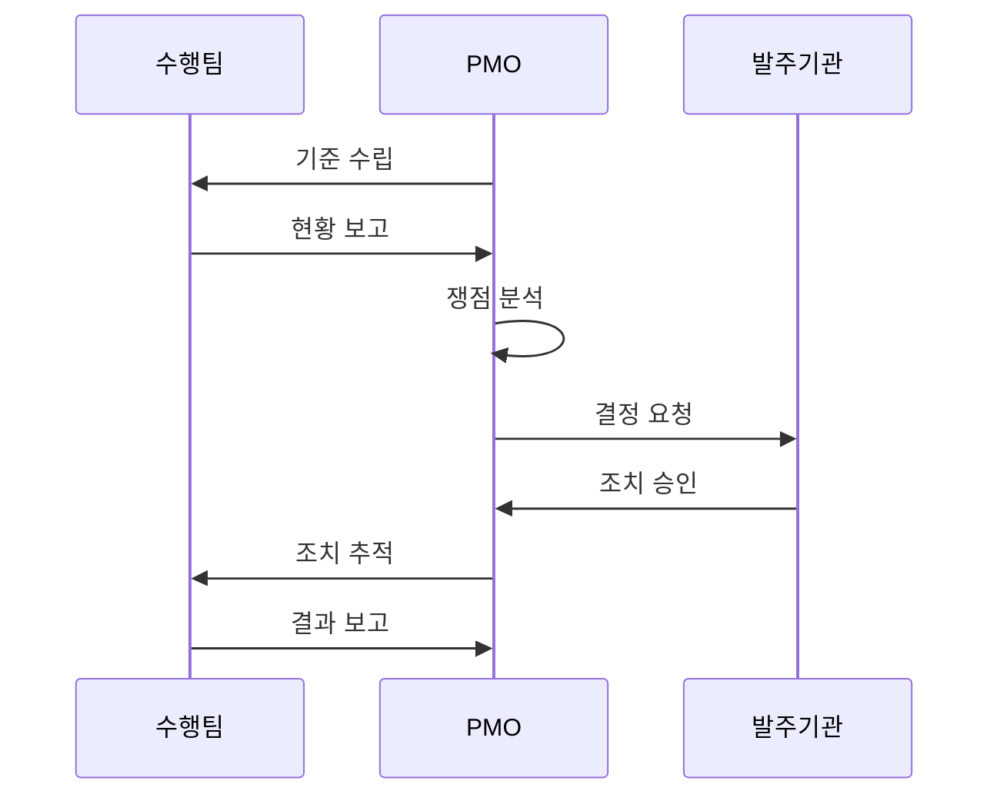

---
sidebar:
  order: 8
  label: "008. PMO (Project Management Office)"
  badge:
    text: "기출 · 50%"
    variant: note
title: "PMO (Project Management Office)"
date: "2026-07-27T23:59:59+09:00"
tags:
  - "notes-law_policy"
weight: 8
extra:
  question_no: "008"
  source_status: "기출"
  source_history: "132회"
  priority: 50
  priority_note: "132회 기출, 발주자 PMO 역할·통제 범위"
---

## 미리 알고가기

- **프로젝트 관리 조직(Project Management Office, PMO)**: 조직 내 프로젝트들의 표준을 정하고, 일정, 범위, 품질 및 위험 요소를 관리·통제하는 전문 지원 조직
- **프로젝트 관리자(Project Manager, PM)**: 개별 프로젝트의 실행을 책임지며 인력과 산출물 납기를 총괄 조율하는 수행 조직의 이행 책임자
- **공공 프로젝트 관리 조직(Public PMO)**: 전자정부법에 의거하여 예산과 기술 역량이 부족한 국가기관의 발주 사업 관리를 지원하는 대행 조직

## Ⅰ. 개요

- 정의/개념: 프로젝트 **표준·성과·위험**을 통합 관리하는 **전담 조직**
- 기존 한계: 분산 관리로 **일정 지연·위험 누락·의사결정 지연**

### 쉽게 이해하기 (학습용)
- 여러 프로젝트가 얽힌 대형 IT 사업의 진척·비용·품질·위험을 통합 점검하는 전담 조직이다

## Ⅱ. 특징

- **표준화**: 방법론·절차·산출물 기준을 통일한다
- **통합 통제**: 일정·비용·품질·위험을 종합한다
- **권한 유형**: 지원형·통제형·지시형으로 구분한다

### 쉽게 이해하기 (학습용)
- PMO는 프로젝트의 진척·품질·위험을 통합 분석해 경영진의 자원 배치와 범위 조정을 지원한다

## Ⅲ. 아키텍처 및 구성요소

| 설계 요소 | 설명 |
|:---|:---|
| 관리 기준 | 일정·범위·비용 등 절차 정의 |
| 통합 보고 | 사업 현황 및 쟁점 발주기관 전달 |
| 위험 관리 | 위험 식별 및 대응 추적 |
| 품질 관리 | 산출물 및 기준 준수 확인 |
| 의사결정 지원 | 쟁점·대안·영향 평가 보고 |

> 요약: **PMO**가 수행 현황과 위험을 통합해 **의사결정 지원**

### 쉽게 이해하기 (학습용)
- PMO는 여러 수행팀의 현황을 공통 기준으로 수집하고 일정·품질·위험을 분석해 발주기관에 보고한다

## Ⅳ. 원리 및 절차 흐름도

| 절차 | 핵심 활동 |
|:---|:---|
| 기준 수립 | 표준 양식·관리 지침 배포 |
| 현황 보고 | 진척·비용·품질 자료 수집 |
| 쟁점 분석 | 위험·영향도 평가 |
| 결정 요청 | 발주기관에 결정안 보고 |
| 조치 승인 | 범위·자원·일정 변경 결정 |
| 조치 추적 | 승인 사항 이행 점검 |
| 결과 보고 | 조치 성과·잔여 위험 보고 |

### 쉽게 이해하기 (학습용)
- 프로젝트 관리 기준을 배포하고 현황을 주기적으로 분석하며, 주요 쟁점은 대안과 영향을 정리해 발주기관의 결정을 받는다

## Ⅴ. PMO 권한 유형 비교

| 비교 기준 | 지원형 PMO | 통제형 PMO | 지시형 PMO |
|:---|:---|:---|:---|
| 적용 기준 | 자율성이 높은 조직 | 표준 준수가 필요한 조직 | 직접 지휘가 필요한 조직 |
| 핵심 특징 | 자문·교육·템플릿 제공 | 표준·절차 준수 감독 | PM·자원 직접 통제 |
| 한계 | 통제력 부족 | 행정 부담 증가 | 현업 자율성 저하 |

> 요약: **권한 수준**에 따라 지원형·통제형·지시형 선택

### 쉽게 이해하기 (학습용)
- 지원형은 자문과 도구를 제공하고, 통제형은 표준 준수를 감독하며, 지시형은 프로젝트를 직접 관리한다

## Ⅵ. 실무 사례

1. 공공 정보화: **PMO**로 발주기관 관리 보완

### 쉽게 이해하기 (학습용)
- 공공기관은 대형 전자정부 사업에서 전문 PMO를 도입해 수행사의 진척·품질·위험을 독립적으로 점검한다

## Ⅶ. 결론

- 사업 통제를 위해 복잡도·책임을 검토하여 **PMO** 활용

### 쉽게 이해하기 (학습용)
- 사업 복잡도와 발주기관 역량에 맞춰 PMO의 지원·통제·지시 권한을 명확히 부여해야 한다
