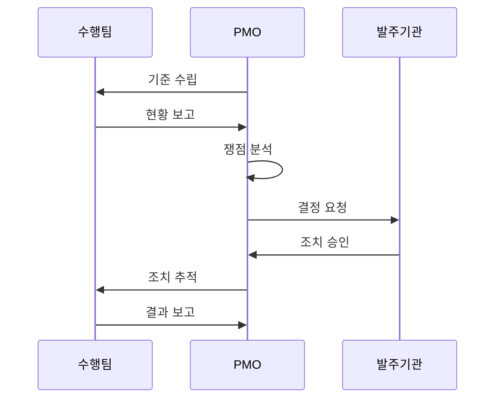

---
sidebar:
  order: 8
  label: "008. PMO (Project Management Office)"
  badge:
    text: "기출 · 50%"
    variant: note
title: "PMO (Project Management Office)"
date: "2026-07-27T23:59:59+09:00"
tags:
  - "notes-law_policy"
weight: 8
extra:
  question_no: "008"
  source_status: "기출"
  source_history: "132회"
  priority: 50
  priority_note: "132회 기출, 발주자 PMO 역할·통제 범위"
---

## 미리 알고가기

- **프로젝트 관리 조직(Project Management Office, PMO)**: 조직 내 프로젝트들의 표준을 정하고, 일정, 범위, 품질 및 위험 요소를 관리·통제하는 전문 지원 조직
- **프로젝트 관리자(Project Manager, PM)**: 개별 프로젝트의 실행을 책임지며 인력과 산출물 납기를 총괄 조율하는 수행 조직의 이행 책임자
- **공공 프로젝트 관리 조직(Public PMO)**: 전자정부법에 의거하여 예산과 기술 역량이 부족한 국가기관의 발주 사업 관리를 지원하는 대행 조직
- **약어 읽기·표기**: PMO는 ‘피엠오’, PM은 ‘피엠’으로 읽으며 Project Management 관련 영문 정식명의 머리글자로 관리 조직과 개별 책임자를 구분함
- **시퀀스 기호(->>)**: ‘요청 전달’로 읽고 이중 화살촉은 수행팀·PMO·발주기관 간 책임 인계를 나타냄

## Ⅰ. 개요

- 정의/개념: 프로젝트 표준·성과·위험을 통합 관리하는 조직
- 기존 한계: 분산 관리로 일정 지연·위험 누락·판단 지연

### 쉽게 이해하기 (학습용)
- 여러 하위 프로젝트가 얽힌 대형 IT 사업의 진척·비용·위험을 통합 점검하는 관제 조직임

## Ⅱ. 특징

- **표준화**: 방법론·절차·산출물 기준을 통일한다
- **통합 통제**: 일정·비용·품질·위험을 종합한다
- **권한 유형**: 지원형·통제형·지시형으로 구분한다

### 쉽게 이해하기 (학습용)
- 개발 부서의 진척 현황과 버그 발생률을 제3자 관점에서 투명하게 측정하여 경영진이 제때 인력 보강이나 범위 조정을 결정하도록 지원함

## Ⅲ. 아키텍처 및 구성요소

| 설계 요소 | 설명 |
|:---|:---|
| 관리 기준 | 일정·범위·비용 등 절차 정의 |
| 통합 보고 | 사업 현황 및 쟁점 발주기관 전달 |
| 위험 관리 | 위험 식별 및 대응 추적 |
| 품질 관리 | 산출물 및 기준 준수 확인 |
| 의사결정 지원 | 쟁점·대안·영향 평가 보고 |

> 요약: PMO가 수행 현황을 통합하여 의사결정을 지원함

### 쉽게 이해하기 (학습용)
- 관리 기준서에 기초하여 여러 개발팀의 현황 보고서를 수집하고, 일정 위험과 소프트웨어 품질을 검토하여 발주처에 전달하는 구조임

## Ⅳ. 원리 및 절차 흐름도

| 절차 | 핵심 활동 |
|:---|:---|
| 기준 수립 | 표준 양식·관리 지침 배포 |
| 현황 보고 | 진척·비용·품질 자료 수집 |
| 쟁점 분석 | 위험·영향도 평가 |
| 결정 요청 | 발주기관에 결정안 보고 |
| 조치 승인 | 범위·자원·일정 변경 결정 |
| 조치 추적 | 승인 사항 이행 점검 |
| 결과 보고 | 조치 성과·잔여 위험 보고 |

### 쉽게 이해하기 (학습용)
- 프로젝트 시작 시 보고 형식을 배포한 후 매주 진행 상황을 감시하고, 위험 쟁점이 발생하면 해결안을 발주처에 보고해 조치를 강제함

## Ⅴ. PMO 권한 유형 비교

| 비교 기준 | 지원형 PMO | 통제형 PMO | 지시형 PMO |
|:---|:---|:---|:---|
| 적용 기준 | 자율성이 높은 조직 | 표준 준수가 필요한 조직 | 직접 지휘가 필요한 조직 |
| 핵심 특징 | 자문·교육·템플릿 제공 | 표준·절차 준수 감독 | PM·자원 직접 통제 |
| 한계 | 통제력 부족 | 행정 부담 증가 | 현업 자율성 저하 |

> 요약: 권한 수준에 따라 지원형, 통제형, 지시형으로 분류

### 쉽게 이해하기 (학습용)
- PMO는 자문만 주는 '지원형', 표준 템플릿 준수를 요구하는 '통제형', PM을 직접 파견해 지휘하는 '지시형'으로 나뉨

## Ⅵ. 실무 사례

1. 공공 정보화: **PMO**로 발주기관 관리 보완

### 쉽게 이해하기 (학습용)
- 전자정부 사업 진행 시 공공 발주기관의 전문성 강화를 위해 법령에 맞춰 민간 전문 PMO 업체를 별도로 발주함

## Ⅶ. 결론

- 사업 복잡도가 높으면 **PMO 권한·책임**을 명확화

### 쉽게 이해하기 (학습용)
- 대형 정보화 사업의 성공을 위해서는 보고서 형식 맞추기에 치우치지 않고, 사업의 독립된 조정 권한과 실질적 위험 감시 통제권을 부여해야 함
