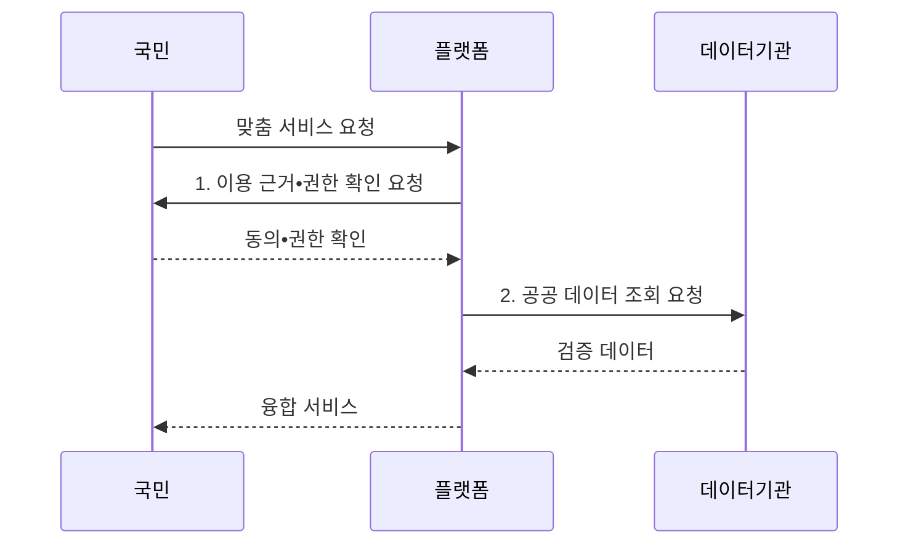

---
sidebar:
  order: 9
  label: "009. 디지털 플랫폼 정부 (Digital Platform Government)"
  badge:
    text: "기출 • 50%"
    variant: note
title: "디지털 플랫폼 정부 (Digital Platform Government)"
date: "2026-08-05T14:20:09+09:00"
tags:
  - "notes-law_policy"
weight: 9
extra:
  question_no: "009"
  source_status: "기출"
  source_history: "129회"
  priority: 50
  priority_note: "129회 기출, 공공 데이터•서비스 통합 정책"
---

## Ⅰ. 개요

<details>
<summary>핵심 용어</summary>

- **디지털 플랫폼 정부(Digital Platform Government, DPG)**: 공공 데이터•행정 기능과 민간 역량을 표준 접점으로 연결해 국민 맞춤 서비스를 제공하는 정부 모델이다.
- **응용 프로그래밍 인터페이스(Application Programming Interface, API)**: 기관의 데이터와 행정 기능을 정해진 요청•응답 규칙으로 외부 서비스에 제공하는 접점이다.
- **정부 운영 모델**: 디지털 플랫폼 정부는 공공 데이터•행정 서비스•민간 역량을 표준으로 연결해 맞춤 행정을 제공하는 정부 운영 모델이다.

</details>

- 정의/개념: **디지털 플랫폼 정부** 는 공공 데이터•서비스와 민간 역량을 연결하는 **정부 운영 모델**
- 배경/필요성: 기관별 칸막이로는 **정보 반복 제출•생애주기 서비스 단절** 해소 곤란

#### 한줄 요약
- 부처별 데이터와 행정 기능을 표준 API로 연결해 국민과 민간 서비스가 공동 활용하도록 전환하는 정책이다

## Ⅱ. 특징

<details>
<summary>핵심 용어</summary>

- **마이데이터(MyData)**: 정보주체가 자신의 데이터를 조회•전송하고 활용처를 통제하게 하는 데이터 관리 방식이다.
- **민관 협력**: 민관 협력은 민간의 기술과 창의성을 공공 서비스에 활용하되 보안•개인정보 책임을 함께 통제한다.

</details>

- **데이터 연계**: 공통 API를 통한 기관 간 데이터 공유
- **국민 중심**: 생애주기 맞춤 서비스와 **MyData** 기반 정보 통제
- **민관 협력**: 민간 기술과 창의성을 활용하되 보안•개인정보 통제를 병행

#### 한줄 요약
- 홈페이지 통합을 넘어 기관 간 데이터를 연계하고 민간 기술을 결합해 맞춤형 행정 서비스를 제공한다

## Ⅲ. 구조 및 구성요소

<details>
<summary>핵심 용어</summary>

- **API 플랫폼**: 기관별 데이터와 행정 기능을 표준 접점으로 연결해 공동 활용하게 한다.
- **디지털 신원**: 온라인 이용자의 신원을 검증하고 서비스별 접근 권한을 부여하는 전자적 신원 정보이다.
- **정부기술(Government Technology, GovTech)**: 민간의 디지털 기술과 혁신 역량을 활용해 공공 서비스를 개발•개선하는 분야이다.
- **공공 데이터**: 기관 간 재사용과 국민 맞춤 서비스를 위해 표준•품질•권한•책임이 관리되는 행정 데이터이다.
- **민간 참여**: 공개된 데이터와 기능을 민간 기업•시민•전문가가 활용해 공공 서비스를 공동 혁신하는 구조이다.
- **보안**: 최소 권한과 접근 기록으로 데이터•기능의 오용을 차단하는 통제이다.
- **개인정보 보호**: 목적 제한과 정보주체 권리로 개인정보 처리를 통제하는 활동이다.

</details>

```text
                       [API 플랫폼]
                      /      |      \
          [공공 데이터] [디지털 신원] [민간 참여]
                      \      |      /
                    [보안•개인정보]
```

선의 의미: API 플랫폼은 공공 데이터, 디지털 신원, 민간 참여를 연결하며, 보안•개인정보 통제는 세 영역의 이용 경계를 함께 보호한다.

| 구성요소 | 책임 |
|:---|:---|
| 공공 데이터 | 기관 데이터의 **표준화•품질 관리** |
| API 플랫폼 | 데이터•행정 기능의 **표준 연결** |
| 디지털 신원 | 사용자 **신원•권한 관리** |
| 민간 참여 | 민간 활용과 **GovTech 연계** |
| 보안•개인정보 | 목적 외 이용 차단과 **접근 기록** |

#### 한줄 요약
- API 플랫폼이 기관 데이터를 연결하고 디지털 신원과 접근 통제로 국민•민간 서비스의 이용 권한을 관리한다

## Ⅳ. 흐름도

<details>
<summary>핵심 용어</summary>

- **최소 권한**: 서비스 수행에 필요한 범위만 데이터 접근 권한으로 부여하는 보안 원칙이다.

</details>



**동작 원리**

1. **이용 근거•권한 확인 요청**: 법적 근거•동의•**접근 권한** 검증
2. **공공 데이터 조회 요청**: 공통 **API** 로 기관 자료 요청

#### 한줄 요약
- 국민의 서비스 요청에 대해 법적 근거와 동의를 확인하고 기관 데이터를 조회•검증해 원스톱 서비스를 제공한다

## Ⅴ. 종류 및 비교

<details>
<summary>핵심 용어</summary>

- **전자정부**: 기관별 행정 절차를 정보시스템과 온라인 채널로 제공하는 정부 운영 모델이다.

</details>

| 비교 기준 | 디지털 플랫폼 정부 | 전자정부 |
|:---|:---|:---|
| 적용 기준 | 부처 융합 **맞춤형 행정** | 개별 기관의 **업무 전산화** |
| 핵심 특징 | **데이터•API•민관 연결** | 기관별 **절차 온라인화** |
| 한계 | 데이터 **권한•책임 조정** | 기관 간 **서비스 단절** |

> 요약: 전자정부는 **업무 온라인화**, DPG는 **데이터•기능 연결**

#### 한줄 요약
- 전자정부가 기관별 절차를 온라인화했다면 디지털 플랫폼 정부는 기관 간 데이터와 기능을 연결해 맞춤형 서비스를 제공한다

## Ⅵ. 실무 고려사항 및 대책

<details>
<summary>핵심 용어</summary>

- **책임 경계**: 책임 경계가 불명확하면 민관 연계 서비스의 장애•침해 사고에서 데이터와 운영 주체의 대응이 지연된다.
- **접근 이력 감사**: 개인정보를 누가 언제 어떤 목적으로 조회•이용했는지 기록과 승인 근거를 대조하는 활동이다.

</details>

| 문제 | 대책 | 효과 |
|:---|:---|:---|
| 기관별 **데이터 형식•품질** 차이 | 공통 표준•메타데이터와 **품질 책임자** 지정 | 기관 간 **연계 정확도** 향상 |
| 개인정보의 **목적 외 이용** 위험 | 법적 근거•동의•**최소 권한** 확인과 접근 이력 감사 | 정보주체 **권리•책임 추적** 확보 |
| 민관 서비스의 **책임 경계** 불명확 | 데이터•운영•사고 대응 책임을 **협약**으로 명시 | 장애•침해 사고의 **대응 속도** 향상 |

#### 한줄 요약
- 전입신고 정보를 관련 기관과 연계해 주소 변경에 필요한 서류의 반복 제출과 개별 처리를 줄인다

## Ⅶ. 결론

<details>
<summary>핵심 용어</summary>

- **한 번만 제출 원칙(Once Only Principle)**: 국민이 이미 행정기관에 제공한 정보를 다른 공공 서비스에서 다시 요구하지 않는 원칙이다.
- **표준 API**: 민관 서비스가 동일한 요청•응답•보안 규칙으로 데이터와 기능을 연계하는 접점이다.

</details>

- 반복 제출은 **Once Only**, 민관 연계는 **표준 API**, 개인정보는 근거•최소권한 우선

#### 한줄 요약
- 데이터 이용의 법적 근거•동의•책임을 명확히 하면서 기관 간 연계와 민간 활용을 확대해야 한다
