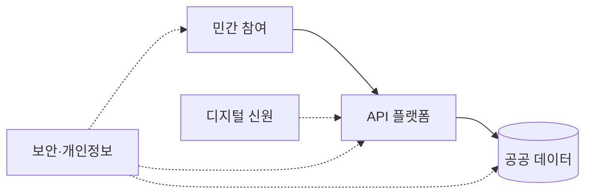
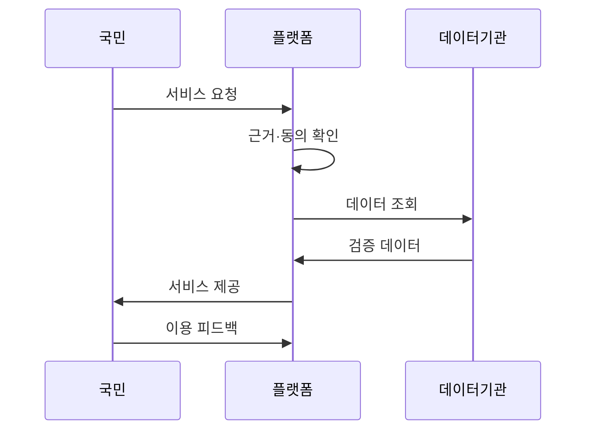

---
sidebar:
  order: 9
  label: "009. 디지털 플랫폼 정부 (Digital Platform Government)"
  badge:
    text: "기출 · 50%"
    variant: note
title: "디지털 플랫폼 정부 (Digital Platform Government)"
date: "2026-07-27T23:59:59+09:00"
tags:
  - "notes-law_policy"
weight: 9
extra:
  question_no: "009"
  source_status: "기출"
  source_history: "129회"
  priority: 50
  priority_note: "129회 기출, 공공 데이터·서비스 통합 정책"
---

## 미리 알고가기

- **디지털 플랫폼 정부(Digital Platform Government, DPG)**: 부처별로 흩어진 공공 데이터와 서비스를 표준 연계하고 민간 역량과 결합하여 맞춤형 행정을 지원하는 새로운 국가 행정 프레임워크
- **신청 단계 생략 원칙(Once Only)**: 행정 처리에 필요한 개인 데이터를 정부가 한 번만 요구하고, 타 행정망과 연동하여 반복 제출하지 않도록 조율하는 정책적 가이드라인
- **응용 프로그래밍 인터페이스(Application Programming Interface, API)**: 공공기관의 데이터베이스 기능과 행정 모듈을 외부 응용 프로그램이 표준 형식으로 호출하여 개발할 수 있도록 설계한 접점 규격
- **정보주체 자율 활용(MyData)**: 정보주체인 국민이 자신의 행정 데이터를 적극적으로 유통하고 제3자에게 직접 제공하도록 자율 통제하는 데이터 권리 체계
- **민간 기술 연계 정부(Government Technology, GovTech)**: 혁신적인 민간의 소프트웨어 및 정보기술 솔루션을 공공 서비스와 행정 프로세스 문제 해결에 적극 도입하는 연계 기술
- **약어 읽기·표기**: DPG는 ‘디피지’, API는 ‘에이피아이’, GovTech는 ‘거브테크’로 읽으며 영문 정식명 축약으로 정부 모델·연계 규격·민간 기술을 구분함
- **도식 기호(→·-.->)**: ‘연결·통제’로 읽고 실선은 데이터 활용 흐름, 점선은 보안·개인정보 통제 적용을 나타냄
- **시퀀스 기호(->>)**: ‘요청 전달’로 읽고 이중 화살촉은 데이터 검증부터 서비스 제공까지의 인계를 나타냄

## Ⅰ. 개요

- 정의/개념: 공공 데이터를 연결해 국민·기업·정부가 공동 활용하는 플랫폼
- 기존 한계: 기관별 칸막이로 반복 제출·서비스 단절 발생

### 쉽게 이해하기 (학습용)
- 정부 부처마다 따로 노는 컴퓨터 시스템과 서류 양식을 표준 API로 통일하고, 민간 앱에서도 쉽게 공공 서류를 떼거나 결제할 수 있게 정부 포털 체계를 플랫폼화하는 정책임

## Ⅱ. 특징

- **데이터 연계**: 공통 API로 기관 간 데이터를 공유한다
- **국민 중심**: 생애주기 기반 맞춤 서비스를 제공한다
- **민관 협력**: GovTech와 보안 통제를 함께 적용한다

### 쉽게 이해하기 (학습용)
- 단순한 홈페이지 통합을 넘어, 법령과 부처 간 데이터 장벽을 부수고 민간 클라우드와 오픈 API를 이용해 더 빠른 민관 융합 서비스를 구현함

## Ⅲ. 아키텍처 및 구성요소

| 설계 요소 | 설명 |
|:---|:---|
| 공공 데이터 | 기관 데이터 표준화 및 품질 관리 |
| API 플랫폼 | 데이터·행정 기능 표준 연결 |
| 디지털 신원 | 사용자 신원 및 권한 관리 |
| 민간 참여 | 민간 활용 지원 및 GovTech 연계 |
| 보안·개인정보 | 목적 외 이용 차단 및 접근 기록 |

> 요약: 데이터와 API를 개인정보 통제하에 연결함

### 쉽게 이해하기 (학습용)
- 부처별 핵심 데이터베이스를 공통 연계망과 API 플랫폼으로 이어 주고, 개인정보 보호와 보안 검증을 통과한 민간 포털 앱에 연결하는 아키텍처임

## Ⅳ. 원리 및 절차 흐름도

| 절차 | 핵심 활동 |
|:---|:---|
| 서비스 요청 | 국민 여정 기반 요구 접수 |
| 근거·동의 확인 | 법적 근거·접근 권한 검증 |
| 데이터 조회 | 공통 API로 기관 자료 요청 |
| 검증 데이터 | 품질·정합성 확인 후 전달 |
| 서비스 제공 | 민관 융합·원스톱 기능 전달 |
| 이용 피드백 | 만족도·오류를 개선에 반영 |

### 쉽게 이해하기 (학습용)
- 국민의 일상 시나리오를 설계하고 법적 개인정보 동의를 거친 뒤 데이터를 정밀 대조하여, 공통 인터페이스로 배포한 후 실시간 이용 실태를 개선함

## Ⅴ. 디지털 플랫폼 정부·전자정부 비교

| 비교 기준 | 디지털 플랫폼 정부 | 전자정부 |
|:---|:---|:---|
| 적용 기준 | 부처 융합 맞춤형 행정 구현 시 | 개별 기관 업무 전산화 시 |
| 핵심 특징 | 데이터·API·민관 서비스 연결 | 기관별 절차 온라인화 |
| 한계 | 데이터 권한·책임 조정 복잡 | 기관 간 서비스 단절 |

> 요약: 전자정부는 온라인화, DPG는 데이터·기능을 연결함

### 쉽게 이해하기 (학습용)
- 이전 전자정부는 부서마다 오프라인 업무를 웹사이트로 바꾸는 전산화였다면, 디지털 플랫폼 정부는 부처 간 경계 없이 정보를 연계하여 맞춤형으로 챙겨 줌

## Ⅵ. 실무 사례

1. 전입 행정: **공공 데이터 연계**로 반복 제출 제거

### 쉽게 이해하기 (학습용)
- 전입신고 시 주민등록 데이터와 세무, 아파트 관리비 고지서 데이터까지 공공 연계망을 통해 자동으로 주소를 묶어 세입자의 행정 낭비를 방지함

## Ⅶ. 결론

- 기관 간 연계 시 **동의·권한·책임**을 함께 통제

### 쉽게 이해하기 (학습용)
- 데이터 중심의 행정 개혁과 클라우드 공통 인프라의 확산을 보장하여, 행정 칸막이로 인한 낭비를 막고 국가 디지털 역량을 동반 성장시켜야 함
