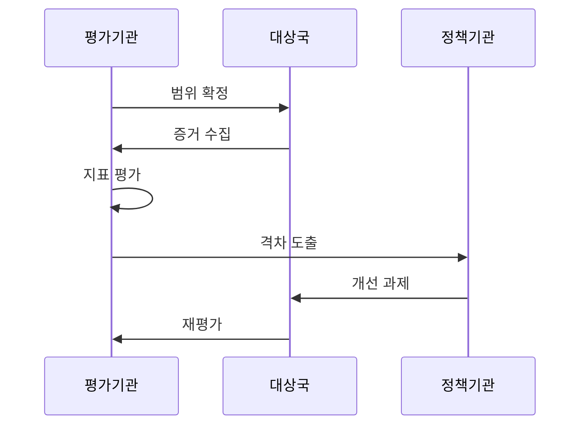

---
sidebar:
  order: 10
  label: "010. 전자정부 성숙도 모형 (E-Government Maturity Model)"
  badge:
    text: "기출 · 50%"
    variant: note
title: "전자정부 성숙도 모형 (E-Government Maturity Model)"
date: "2026-07-25T01:20:00+09:00"
tags:
  - "notes-law_policy"
weight: 10
extra:
  question_no: "010"
  source_status: "기출"
  source_history: "138회"
  priority: 50
  priority_note: "138회 기출, 전자정부 발전 단계를 평가"
---

## 미리 알고가기

- **국제연합(United Nations, UN)**: 국제 평화 유지와 전 세계 사회·경제적 발전을 지원하기 위해 각국 정부로 구성된 국제기구
- **전자정부 발전 지수(E-Government Development Index, EGDI)**: UN이 국가별 전자정부 구축 수준을 측정하기 위해 온라인 서비스, 통신 인프라, 인적 역량을 종합 산출하는 평가 지표
- **전자참여 지수(E-Participation Index, EPI)**: 정책 정보 공개, 온라인 의견 수렴 및 공동 결정 등 국민의 행정 참여 품질을 평가하는 UN의 보조 지표
- **디지털 플랫폼 정부(Digital Platform Government, DPG)**: 각 부처의 데이터를 표준 API로 연계하고 민관이 공동 활용하도록 혁신하는 신행정 플랫폼 체계
- **신청 단계 생략 원칙(Once Only)**: 행정 처리에 필요한 개인 데이터를 정부가 한 번만 수집하고, 타 망과 유기적으로 연동하여 재사용함으로써 국민의 반복 제출 부담을 방지하는 원칙
- **약어 읽기·표기**: UN은 ‘유엔’, EGDI는 ‘이지디아이’, EPI는 ‘이피아이’, DPG는 ‘디피지’로 읽으며 영문 정식명의 머리글자로 기관·평가지표·정부 모델을 구분함
- **시퀀스 기호(->>)**: ‘요청 전달’로 읽고 이중 화살촉은 성숙도 평가 결과와 개선 과제의 인계를 나타냄

## Ⅰ. 개요

- **정의/개념**: 정보 제공부터 통합까지 성숙도 평가
- **배경/필요성**: 처리 완결성과 데이터 연계 수준 진단

### 쉽게 이해하기 (학습용)
- 정부의 IT 서비스 수준을 단순히 '홈페이지가 있는가'부터 '부서 간 데이터가 자동 연동되어 원스톱으로 처리되는가'까지 단계별로 매겨 평가하는 잣대임

## Ⅱ. 특징

- 정보 제공에서 맞춤형 통합 서비스로 발전한다
- EGDI가 서비스·통신·인적자본을 종합 평가한다
- EPI가 정책 정보·온라인 참여 수준을 측정한다
- 데이터 연계·처리 완결성이 성숙도를 높인다

### 쉽게 이해하기 (학습용)
- 기술 장비의 개수를 세기만 하는 1차원적 평가를 벗어나, 실제 온라인에서 인허가 결제까지 완결되고 정책 결정에 국민이 얼마나 소통하는지를 점검함

## Ⅲ. 아키텍처 및 구성요소

| 설계 요소 | 설명 |
|:---|:---|
| 온라인 서비스 지수 | 온라인 서비스 범위와 품질 평가 |
| 통신 인프라 지수 | 인터넷·모바일 접근 기반 평가 |
| 인적 자본 지수 | 디지털 활용 및 교육 역량 평가 |
| 전자참여 지수 | 정책 정보·참여·결정 수준 평가 |
| 데이터 연계 수준 | 데이터 공유 및 반복 제출 감소 평가 |

> 요약: 서비스·기반·역량·참여·연계를 종합 평가함

### 쉽게 이해하기 (학습용)
- 정보 제공에서 연결 단계로 향하는 발전 아키텍처 아래 통신 속도, 교육 수준, 온라인 접점 및 다기관 데이터 연동 수준을 세부 지표로 평가함

## Ⅳ. 원리 및 절차 흐름도

| 절차 | 핵심 활동 |
|:---|:---|
| 범위 확정 | 대상국·성숙도 모형 결정 |
| 증거 수집 | 행정 포털·서비스 실사 |
| 지표 평가 | 서비스·통신·인재 점수 산출 |
| 격차 도출 | 목표 대비 미흡 영역 식별 |
| 개선 과제 | 참여·연동 로드맵 수립 |
| 재평가 | 추진 성과·순위 갱신 |

### 쉽게 이해하기 (학습용)
- 특정 성숙도 모델을 정한 뒤 포털 사이트 이용성과 인프라 속도 장부를 대조하고, 지표 점수를 분석해 뒤처진 서비스를 찾아 개선 계획을 실행함

## Ⅴ. 종류 및 비교

| 판단 기준 | 정보 제공·상호작용 | 거래 단계 | 통합·연결 단계 |
|:---|:---|:---|:---|
| 서비스 형태 | 정보 제공·서식 다운로드 | 신청·결제·결과 처리 | 데이터 연계·맞춤 서비스 |
| 판단 증거 | 양방향 소통 수준 | 종단 온라인 완결률 | 데이터 공유 및 반복 감소 |
| 적용 기준 | 초기 공공정보 안내 시 | 온라인 행정 처리 구현 시 | 다기관 융합 맞춤 행정 시 |

> 요약: 정보 제공에서 거래·연결 서비스로 진화함

### 쉽게 이해하기 (학습용)
- 일방적으로 글만 띄워 놓는 정보제공 수준에서 결제까지 끝내는 거래 수준을 거쳐, 정부가 알아서 세금을 정산해 주는 연결 수준으로 진화함

## Ⅵ. 실무 사례

1. DPG 추진 수준을 UN 평가 모형으로 분석
2. 성숙도 향상과 소외계층 접근권 보호

### 쉽게 이해하기 (학습용)
- 매 2년마다 발표되는 UN 전자정부 순위 평가에 발맞추어, 한국의 모바일 주민등록증과 원스톱 행정 연계 수준이 글로벌 규격에 부합하는지 비교함
- 동사무소 방문이 어려운 고령층이나 장애인이 웹사이트에서 원활하게 서류를 발급받을 수 있도록 디지털 약자 지원 체계를 지표에 추가함

## Ⅶ. 결론

- 행정 처리 완결성과 디지털 포용성 관점의 지표 고도화

### 쉽게 이해하기 (학습용)
- 서비스 점수 올리기식 전산망 구축에 몰두하지 말고, 취약계층의 디지털 접근성과 실질적 행정 편의를 보장하는 포용적 연계에 집중해야 함
