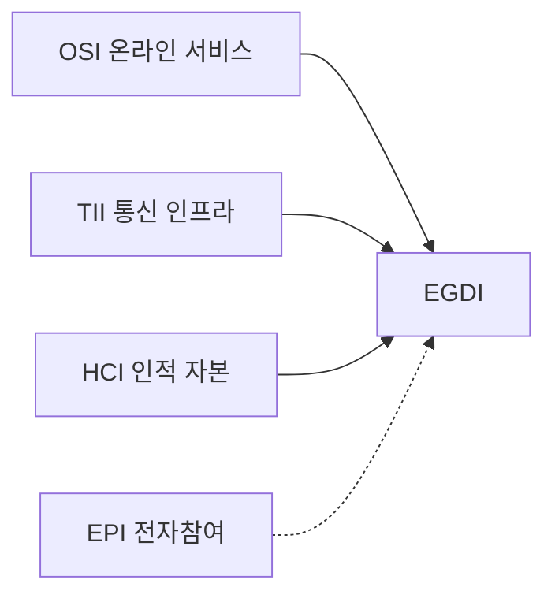

---
sidebar:
  order: 10
  label: "010. 전자정부 성숙도 모형 (E-Government Maturity Model)"
  badge:
    text: "기출 · 50%"
    variant: note
title: "전자정부 성숙도 모형 (E-Government Maturity Model)"
date: "2026-07-27T23:59:59+09:00"
tags:
  - "notes-law_policy"
weight: 10
extra:
  question_no: "010"
  source_status: "기출"
  source_history: "138회"
  priority: 50
  priority_note: "138회 기출, 전자정부 발전 단계를 평가"
---

## 미리 알고가기

- **국제연합(United Nations, UN)**: 국제 평화 유지와 전 세계 사회·경제적 발전을 지원하기 위해 각국 정부로 구성된 국제기구
- **전자정부 발전 지수(E-Government Development Index, EGDI)**: UN이 국가별 전자정부 구축 수준을 측정하기 위해 온라인 서비스, 통신 인프라, 인적 역량을 종합 산출하는 평가 지표
- **온라인 서비스 지수(Online Service Index, OSI)**: 국가 포털과 온라인 공공서비스의 범위·품질을 측정하는 EGDI 구성 지표
- **통신 인프라 지수(Telecommunication Infrastructure Index, TII)**: 인터넷·통신 접근 기반을 측정하는 EGDI 구성 지표
- **인적 자본 지수(Human Capital Index, HCI)**: 교육 수준과 인적 역량을 측정하는 EGDI 구성 지표
- **전자참여 지수(E-Participation Index, EPI)**: 정책 정보 공개, 온라인 의견 수렴 및 공동 결정 등 국민의 행정 참여 품질을 평가하는 UN의 보조 지표
- **디지털 플랫폼 정부(Digital Platform Government, DPG)**: 각 부처의 데이터를 표준 API로 연계하고 민관이 공동 활용하도록 혁신하는 신행정 플랫폼 체계
- **신청 단계 생략 원칙(Once Only)**: 행정 처리에 필요한 개인 데이터를 정부가 한 번만 수집하고, 타 망과 유기적으로 연동하여 재사용함으로써 국민의 반복 제출 부담을 방지하는 원칙
- **약어 읽기·표기**: UN은 ‘유엔’, EGDI는 ‘이지디아이’, EPI는 ‘이피아이’, DPG는 ‘디피지’로 읽으며 영문 정식명의 머리글자로 기관·평가지표·정부 모델을 구분함
- **세부 지표 읽기·표기**: OSI·TII·HCI는 ‘오에스아이·티아이아이·에이치시아이’로 읽고 영문 지표명의 머리글자로 세 평가축을 구분함
- **도식 기호(-->·-.->)**: ‘산출·보조’로 읽고 실선은 EGDI 산출, 점선은 EPI의 보조 평가 역할을 뜻함

## Ⅰ. 개요

- 정의/개념: 전자정부 발전 수준을 단계·지표로 진단하는 모형
- 기존 한계: 단순 온라인화 평가는 처리 완결성 측정 부족

### 쉽게 이해하기 (학습용)
- 정부의 IT 서비스 수준을 단순히 '홈페이지가 있는가'부터 '부서 간 데이터가 자동 연동되어 원스톱으로 처리되는가'까지 단계별로 매겨 평가하는 잣대임

## Ⅱ. 특징

- **발전 단계**: 정보 제공에서 연결 서비스로 진화한다
- **EGDI**: OSI·TII·HCI의 평균으로 수준을 비교한다
- **EPI**: 정보·의견수렴·의사결정 참여를 평가한다

### 쉽게 이해하기 (학습용)
- 기술 장비의 개수를 세기만 하는 1차원적 평가를 벗어나, 실제 온라인에서 인허가 결제까지 완결되고 정책 결정에 국민이 얼마나 소통하는지를 점검함

## Ⅲ. 아키텍처 및 구성요소

| 설계 요소 | 설명 |
|:---|:---|
| OSI | 온라인 서비스 범위·품질 평가 |
| TII | 통신 인프라 접근 수준 평가 |
| HCI | 교육·인적 자본 역량 평가 |
| EGDI | OSI·TII·HCI 산술평균 |
| EPI | 정보·협의·의사결정 참여 평가 |

> 요약: 서비스·기반·역량·참여·연계를 종합 평가함

### 쉽게 이해하기 (학습용)
- 정보 제공에서 연결 단계로 향하는 발전 아키텍처 아래 통신 속도, 교육 수준, 온라인 접점 및 다기관 데이터 연동 수준을 세부 지표로 평가함

## Ⅳ. 원리 및 절차 흐름도

| 절차 | 핵심 활동 |
|:---|:---|
| 평가 범위 확정 | 대상·모형·기준시점 결정 |
| 지표 자료 수집 | 서비스·통신·인재 자료 확보 |
| EGDI·EPI 산출 | 표준화·평균으로 지수 계산 |
| 단계·격차 진단 | 목표 대비 미흡 영역 식별 |
| 개선 과제 실행 | 참여·연계·접근성 개선 |
| 성과 재평가 | 개선 결과·성숙 단계 갱신 |

### 쉽게 이해하기 (학습용)
- 특정 성숙도 모델을 정한 뒤 포털 사이트 이용성과 인프라 속도 장부를 대조하고, 지표 점수를 분석해 뒤처진 서비스를 찾아 개선 계획을 실행함

## Ⅴ. 전자정부 성숙 단계 비교

| 비교 기준 | 정보 제공·상호작용 | 거래 단계 | 통합·연결 단계 |
|:---|:---|:---|:---|
| 적용 기준 | 초기 공공정보 안내 시 | 온라인 행정 처리 구현 시 | 다기관 융합 맞춤 행정 시 |
| 핵심 특징 | 정보 공개·양방향 소통 | 신청·결제·결과 완결 | 데이터 연계·맞춤 서비스 |
| 한계 | 처리 완결성 부족 | 기관 간 연계 부족 | 데이터 거버넌스 복잡 |

> 요약: 정보 제공에서 거래·연결 서비스로 진화함

### 쉽게 이해하기 (학습용)
- 일방적으로 글만 띄워 놓는 정보제공 수준에서 결제까지 끝내는 거래 수준을 거쳐, 정부가 알아서 세금을 정산해 주는 연결 수준으로 진화함

## Ⅵ. 실무 사례

1. 국가 비교: **EGDI**로 서비스·기반·인재 진단

### 쉽게 이해하기 (학습용)
- 매 2년마다 발표되는 UN 전자정부 순위 평가에 발맞추어, 한국의 모바일 주민등록증과 원스톱 행정 연계 수준이 글로벌 규격에 부합하는지 비교함

## Ⅶ. 결론

- 연계 확대 시 **처리 완결성·포용성**을 함께 평가

### 쉽게 이해하기 (학습용)
- 서비스 점수 올리기식 전산망 구축에 몰두하지 말고, 취약계층의 디지털 접근성과 실질적 행정 편의를 보장하는 포용적 연계에 집중해야 함
