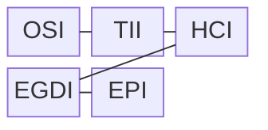
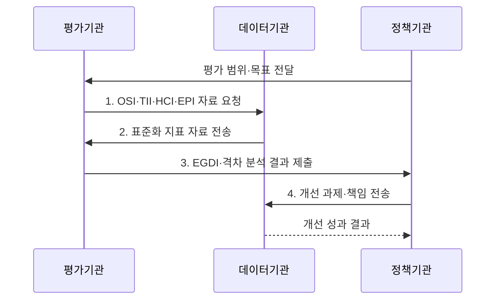

---
sidebar:
  order: 10
  label: "010. 전자정부 성숙도 모형 (E-Government Maturity Model)"
  badge:
    text: "기출 · 50%"
    variant: note
title: "전자정부 성숙도 모형 (E-Government Maturity Model)"
date: "2026-08-02T12:00:00+09:00"
tags:
  - "notes-law_policy"
weight: 10
extra:
  question_no: "010"
  source_status: "기출"
  source_history: "138회"
  priority: 50
  priority_note: "138회 기출, 전자정부 발전 단계를 평가"
---

## Ⅰ. 개요

핵심 용어

- **전자정부 성숙도 평가 모형**: 전자정부 성숙도 평가 모형은 온라인 행정의 현재 수준과 목표 수준의 격차를 단계와 지표로 진단한다.

- 정의/개념: 단계와 지표로 현재·목표 격차를 진단하는 **전자정부 성숙도 평가 모형**
- 배경/필요성: 접속 건수만으로는 **처리 완결성·기관 연계·국민 참여 수준을 판단하기 어려움**

### 쉽게 이해하기 (학습용)
- 전자정부가 정보 제공에서 온라인 처리와 기관 간 연결 서비스로 발전한 수준을 단계별로 평가하는 기준이다

## Ⅱ. 특징

핵심 용어

- **전자정부 발전 지수**: 전자정부 발전 지수는 온라인 서비스·통신 인프라·인적 자본 지수를 결합해 국가의 전자정부 수준을 평가한다.

- **단계성**: 정보 제공에서 거래를 거쳐 통합·연결 서비스로 발전하는 수준 진단
- **종합성**: 온라인 서비스·통신 인프라·인적 자본을 전자정부 발전 지수로 결합
- **참여성**: 전자정보·전자협의·전자결정에 대한 국민 참여 수준 별도 평가

### 쉽게 이해하기 (학습용)
- 인프라뿐 아니라 온라인 행정의 처리 완결성, 기관 간 연계, 국민의 정책 참여 수준을 함께 평가한다

## Ⅲ. 구조 및 구성요소

핵심 용어

- **EGDI**: EGDI는 OSI·TII·HCI의 산술평균으로 전자정부의 서비스·기반·인적 역량을 종합한다.

| 구성요소 | 책임 |
|:---|:---|
| OSI | **온라인 서비스 범위·품질** 평가 |
| TII | **통신 인프라 접근 수준** 평가 |
| HCI | **교육·전자정부 문해력** 평가 |
| EGDI | **OSI·TII·HCI 산술평균** 산출 |
| EPI | **정보·협의·의사결정 참여** 평가 |

### 쉽게 이해하기 (학습용)
- OSI는 온라인 서비스, TII는 통신 인프라, HCI는 인적 역량을 측정하며 EPI는 국민 참여를 별도로 평가한다

## Ⅳ. 흐름도

핵심 용어

- **3. EGDI·격차 분석 결과 제출**: 평가기관은 목표 수준과 지표별 측정값을 비교해 취약 영역과 개선 우선순위를 정책기관에 제출한다.

1. **OSI·TII·HCI·EPI 자료 요청**: 대상·기준시점·자료 기준 제시
2. **표준화 지표 자료 전송**: 서비스·통신·인적 자본·참여 자료 확보
3. **EGDI·격차 분석 결과 제출**: 목표 대비 취약 지표 식별
4. **개선 과제·책임 전송**: 완결성·접근성·참여·연계 개선

### 쉽게 이해하기 (학습용)
- 평가 모형과 기준시점을 정하고 지표를 산출한 뒤 목표 단계와의 격차를 분석해 개선 과제를 실행한다

## Ⅴ. 종류 및 비교

핵심 용어

- **통합·연결 단계**: 통합·연결 단계는 기관 데이터를 연계해 다기관 업무를 한 여정에서 맞춤형으로 완결하는 성숙 수준이다.

| 비교 기준 | 정보 제공·상호작용 | 거래 단계 | 통합·연결 단계 |
|:---|:---|:---|:---|
| 적용 기준 | 초기 **공공정보 안내** | **온라인 행정 처리** 구현 | **다기관 맞춤 행정** 구현 |
| 핵심 특징 | **정보 공개·양방향 소통** | **신청·결제·결과 완결** | **데이터 연계·맞춤 서비스** |
| 한계 | **처리 완결성 부족** | **기관 간 연계 부족** | **데이터 거버넌스 복잡** |

> 요약: **정보 제공 → 온라인 거래 → 통합·연결 서비스**로 발전

### 쉽게 이해하기 (학습용)
- 정보 제공 단계에서 온라인 신청·결제가 가능한 거래 단계를 거쳐 기관 데이터가 연계된 맞춤 서비스 단계로 발전한다

## Ⅵ. 실무 고려사항 및 대책

핵심 용어

- **온라인 접근 격차**: 온라인 접근 격차는 계층·지역별 통신 접근성과 디지털 역량의 차이로 서비스 이용 기회가 달라지는 문제다.

| 문제 | 대책 | 효과 |
|:---|:---|:---|
| 순위만 보는 **형식적 평가** | **UN 조사 2024 지수별 절대 수준** 분석 | 실제 **개선 우선순위** 도출 |
| 계층·지역에 따른 **온라인 접근 격차** | **접근성·보조 채널·디지털 교육** 병행 | **디지털 포용성** 향상 |
| 기관별 부분 처리로 생기는 **여정 단절** | **신청·처리·결과 통지 완결성** 측정 | 국민의 **체감 서비스 수준** 향상 |

### 쉽게 이해하기 (학습용)
- 정부는 UN EGDI의 서비스·인프라·인적 자본 점수를 비교해 취약 영역의 개선 우선순위를 정한다

## Ⅶ. 결론

핵심 용어

- **EPI**: EPI는 정책 정보 공개·온라인 의견 수렴·공동 결정에 대한 국민 참여 수준을 평가한다.

- 순위보다 낮은 **OSI·TII·HCI** 영역에 투자하고 **EPI**로 참여 보완

### 쉽게 이해하기 (학습용)
- 지수 순위보다 행정 처리의 완결성·접근성·기관 연계를 함께 개선해 국민 체감 성숙도를 높여야 한다
