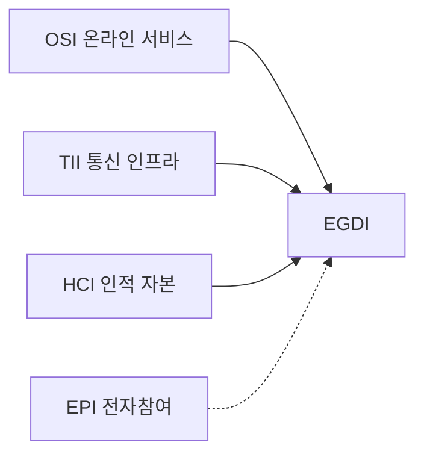

---
sidebar:
  order: 10
  label: "010. 전자정부 성숙도 모형 (E-Government Maturity Model)"
  badge:
    text: "기출 · 50%"
    variant: note
title: "전자정부 성숙도 모형 (E-Government Maturity Model)"
date: "2026-07-27T23:59:59+09:00"
tags:
  - "notes-law_policy"
weight: 10
extra:
  question_no: "010"
  source_status: "기출"
  source_history: "138회"
  priority: 50
  priority_note: "138회 기출, 전자정부 발전 단계를 평가"
---

## 미리 알고가기

- **국제연합(United Nations, UN)**: 국제 평화 유지와 전 세계 사회·경제적 발전을 지원하기 위해 각국 정부로 구성된 국제기구
- **전자정부 발전 지수(E-Government Development Index, EGDI)**: UN이 국가별 전자정부 구축 수준을 측정하기 위해 온라인 서비스, 통신 인프라, 인적 역량을 종합 산출하는 평가 지표
- **온라인 서비스 지수(Online Service Index, OSI)**: 국가 포털과 온라인 공공서비스의 범위·품질을 측정하는 EGDI 구성 지표
- **통신 인프라 지수(Telecommunication Infrastructure Index, TII)**: 인터넷·통신 접근 기반을 측정하는 EGDI 구성 지표
- **인적 자본 지수(Human Capital Index, HCI)**: 교육 수준과 인적 역량을 측정하는 EGDI 구성 지표
- **전자참여 지수(E-Participation Index, EPI)**: 정책 정보 공개, 온라인 의견 수렴 및 공동 결정 등 국민의 행정 참여 품질을 평가하는 UN의 보조 지표
- **디지털 플랫폼 정부(Digital Platform Government, DPG)**: 각 부처의 데이터를 표준 API로 연계하고 민관이 공동 활용하도록 혁신하는 신행정 플랫폼 체계
- **신청 단계 생략 원칙(Once Only)**: 행정 처리에 필요한 개인 데이터를 정부가 한 번만 수집하고, 타 망과 유기적으로 연동하여 재사용함으로써 국민의 반복 제출 부담을 방지하는 원칙

## Ⅰ. 개요

- 정의/개념: 전자정부 **발전 수준**을 단계·지표로 진단하는 **성숙도 모형**
- 기존 한계: 단순 온라인화 평가는 **처리 완결성·기관 연계·국민 참여** 측정 부족

### 쉽게 이해하기 (학습용)
- 전자정부가 정보 제공에서 온라인 처리와 기관 간 연결 서비스로 발전한 수준을 단계별로 평가하는 기준이다

## Ⅱ. 특징

- **발전 단계**: 정보 제공에서 연결 서비스로 진화한다
- **EGDI**: OSI·TII·HCI의 평균으로 수준을 비교한다
- **EPI**: 정보·의견수렴·의사결정 참여를 평가한다

### 쉽게 이해하기 (학습용)
- 인프라뿐 아니라 온라인 행정의 처리 완결성, 기관 간 연계, 국민의 정책 참여 수준을 함께 평가한다

## Ⅲ. 아키텍처 및 구성요소

| 설계 요소 | 설명 |
|:---|:---|
| OSI | 온라인 서비스 범위·품질 평가 |
| TII | 통신 인프라 접근 수준 평가 |
| HCI | 교육·인적 자본 역량 평가 |
| EGDI | OSI·TII·HCI 산술평균 |
| EPI | 정보·협의·의사결정 참여 평가 |

> 요약: **서비스·인프라·인적 역량·전자참여**를 종합 평가

### 쉽게 이해하기 (학습용)
- OSI는 온라인 서비스, TII는 통신 인프라, HCI는 인적 역량을 측정하며 EPI는 국민 참여를 별도로 평가한다

## Ⅳ. 원리 및 절차 흐름도

| 절차 | 핵심 활동 |
|:---|:---|
| 평가 범위 확정 | 대상·모형·기준시점 결정 |
| 지표 자료 수집 | 서비스·통신·인재 자료 확보 |
| EGDI·EPI 산출 | 표준화·평균으로 지수 계산 |
| 단계·격차 진단 | 목표 대비 미흡 영역 식별 |
| 개선 과제 실행 | 참여·연계·접근성 개선 |
| 성과 재평가 | 개선 결과·성숙 단계 갱신 |

### 쉽게 이해하기 (학습용)
- 평가 모형과 기준시점을 정하고 지표를 산출한 뒤 목표 단계와의 격차를 분석해 개선 과제를 실행한다

## Ⅴ. 전자정부 성숙 단계 비교

| 비교 기준 | 정보 제공·상호작용 | 거래 단계 | 통합·연결 단계 |
|:---|:---|:---|:---|
| 적용 기준 | 초기 공공정보 안내 시 | 온라인 행정 처리 구현 시 | 다기관 융합 맞춤 행정 시 |
| 핵심 특징 | 정보 공개·양방향 소통 | 신청·결제·결과 완결 | 데이터 연계·맞춤 서비스 |
| 한계 | 처리 완결성 부족 | 기관 간 연계 부족 | 데이터 거버넌스 복잡 |

> 요약: **정보 제공 → 온라인 거래 → 통합·연결 서비스**로 발전

### 쉽게 이해하기 (학습용)
- 정보 제공 단계에서 온라인 신청·결제가 가능한 거래 단계를 거쳐 기관 데이터가 연계된 맞춤 서비스 단계로 발전한다

## Ⅵ. 실무 사례

1. 국가 비교: **EGDI**로 서비스·기반·인재 진단

### 쉽게 이해하기 (학습용)
- 정부는 UN EGDI의 서비스·인프라·인적 자본 점수를 비교해 취약 영역의 개선 우선순위를 정한다

## Ⅶ. 결론

- 전자정부 발전을 위해 완결성·포용성을 검토하여 **성숙도 모델** 활용

### 쉽게 이해하기 (학습용)
- 지수 순위보다 행정 처리의 완결성·접근성·기관 연계를 함께 개선해 국민 체감 성숙도를 높여야 한다
