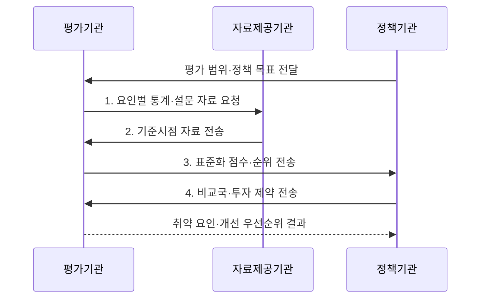

---
sidebar:
  order: 11
  label: "011. 국가 디지털 경쟁력 지수 (National Digital Competitiveness)"
  badge:
    text: "기출 · 50%"
    variant: note
title: "국가 디지털 경쟁력 지수 (National Digital Competitiveness)"
date: "2026-07-31T05:54:03+09:00"
tags:
  - "notes-law_policy"
weight: 11
extra:
  question_no: "011"
  source_status: "기출"
  source_history: "138회"
  priority: 50
  priority_note: "138회 기출, 국가 디지털 역량 비교 지표"
---

## 미리 알고가기

- **세계 디지털 경쟁력 순위 2025(World Digital Competitiveness Ranking, WDCR)**: IMD가 지식·기술·미래준비도로 69개 경제의 디지털 기술 활용 역량을 비교한 최신 평가이다.
- **국제경영개발대학원(International Institute for Management Development, IMD)**: 국가 경쟁력과 디지털 경쟁력 보고서를 발간하는 스위스의 경영교육·연구기관이다.
- **미래준비도(Future Readiness)**: 사회·기업·정부가 새로운 디지털 기술을 수용하고 활용하는 능력을 평가하는 요인이다.

> **키워드:** 국가 디지털 경쟁력 지수 (National Digital Competitiveness)

## Ⅰ. 개요

- 정의/개념: 국가의 기술 개발·채택 역량을 비교하는 **지식·기술·미래준비도 복합 지표**
- 배경/필요성: 인프라 지표만으로는 **인재·제도·기업 수용 역량 판단 불가**

### 쉽게 이해하기 (학습용)
- 인프라뿐 아니라 인재·제도·기업의 기술 수용 역량을 종합해 국가별 디지털 경쟁력을 비교한다

## Ⅱ. 특징

- **지식 역량**: 인재·교육훈련·과학 집중도를 통한 기술 이해와 개발 능력 평가
- **기술 환경**: 규제·자본·기술 기반을 통한 디지털 기술 발전 여건 평가
- **미래준비도**: 적응 태도·기업 민첩성·정보기술 통합을 통한 기술 활용 능력 평가

### 쉽게 이해하기 (학습용)
- 인프라가 우수해도 인재·규제·기업의 기술 수용 역량이 부족하면 국가 디지털 경쟁력은 낮아질 수 있다

## Ⅲ. 구조 및 구성요소

| 구성요소 | 책임 |
|:---|:---|
| 지식 | **인재·교육훈련·과학 집중도** 평가 |
| 기술 | **규제·자본·기술 프레임워크** 평가 |
| 미래준비도 | **적응 태도·기업 민첩성·IT 통합** 평가 |
| 평가 자료 | **정량 통계·경영진 설문** 결합 |

### 쉽게 이해하기 (학습용)
- 지식은 인재·교육·연구, 기술은 규제·자본·인프라, 미래준비도는 사회·기업·정부의 기술 수용 역량을 평가한다

## Ⅳ. 흐름도

1. **요인별 통계·설문 자료 요청**: 세부 지표·표본·기준시점 결정
2. **기준시점 자료 전송**: 정량 통계와 경영진 설문 확보
3. **표준화 점수·순위 전송**: 요인 점수와 국가 순위 산출
4. **비교국·투자 제약 전송**: 낮은 세부 지표와 정책 조건 식별

### 쉽게 이해하기 (학습용)
- 국가별 통계와 경영진 설문을 표준화해 요인별 점수와 순위를 산출하고 취약 영역의 정책 우선순위를 정한다

## Ⅴ. 종류 및 비교

| 비교 기준 | 지식 | 기술 | 미래준비도 |
|:---|:---|:---|:---|
| 적용 기준 | **인적·연구 역량** 진단 | **제도·인프라 환경** 진단 | **기술 수용 역량** 진단 |
| 핵심 특징 | **인재·교육·과학 집중도** | **규제·자본·기술 기반** | **태도·민첩성·IT 통합** |
| 한계 | **활용 성과 측정 제한** | **제도·현장 실행 차이** | **설문·평가 시점 민감성** |

> 요약: **지식·기술·미래준비도** 점수로 취약 영역 식별

### 쉽게 이해하기 (학습용)
- 지식은 인적·연구 역량, 기술은 제도·인프라 환경, 미래준비도는 기술 수용과 활용 역량을 비교한다

## Ⅵ. 실무 고려사항 및 대책

| 고려사항 | 대책 | 효과 |
|:---|:---|:---|
| 순위만 따라 생기는 **단기 대응** | **WDCR 2025 세부 지표·장기 추세** 분석 | **구조적 취약 원인** 식별 |
| 설문과 통계가 다른 **시차·편향** | **기준시점·산출법·복수 지표** 교차 검증 | 정책 판단의 **신뢰도** 향상 |
| 경쟁국을 베껴 생기는 **정책 부적합** | **산업 구조·전환 목표**에 맞는 과제 선별 | 투자 재원의 **정책 효과** 제고 |

### 쉽게 이해하기 (학습용)
- 정부는 종합 순위보다 지식·기술·미래준비도의 세부 점수를 비교해 하락 원인과 개선 과제를 찾는다

## Ⅶ. 결론

- **지식·기술·미래준비도** 중 장기 하락 요인에 정책 투자를 우선 배분

### 쉽게 이해하기 (학습용)
- 인프라 투자에 치우치지 않고 인재·제도·기업 수용 역량의 취약 요인을 함께 개선해야 한다
