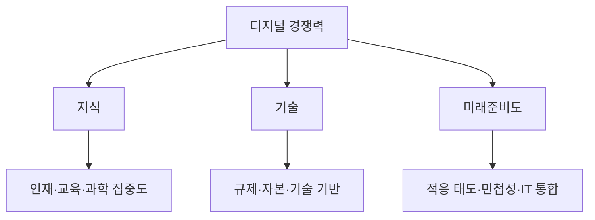

---
sidebar:
  order: 11
  label: "011. 국가 디지털 경쟁력 지수 (National Digital Competitiveness)"
  badge:
    text: "기출 · 50%"
    variant: note
title: "국가 디지털 경쟁력 지수 (National Digital Competitiveness)"
date: "2026-07-27T23:59:59+09:00"
tags:
  - "notes-law_policy"
weight: 11
extra:
  question_no: "011"
  source_status: "기출"
  source_history: "138회"
  priority: 50
  priority_note: "138회 기출, 국가 디지털 역량 비교 지표"
---

## 미리 알고가기

- **세계 디지털 경쟁력 평가(World Digital Competitiveness Ranking, WDCR)**: 스위스 국제경영개발대학원(IMD)에서 매년 국가별 디지털 인프라, 인재 풀, 기업 수용도 등을 측정하여 순위를 매기는 공신력 있는 평가 지수
- **국제경영개발대학원(International Institute for Management Development, IMD)**: 스위스 로잔에 위치한 글로벌 비즈니스 스쿨로, 국가 경쟁력과 디지털 경쟁력 보고서를 정기적으로 연구 발간하는 기관
- **미래준비도(Future Readiness)**: 사회 구성원과 기업, 정부가 클라우드, 인공지능 등 새로운 정보기술을 빠르게 받아들이고 융합하여 혁신을 이끄는 민첩성 척도

## Ⅰ. 개요

- 정의/개념: 국가의 **디지털 기술 채택·활용 준비도**를 비교하는 지표
- 기존 한계: 인프라 중심 평가는 **인재·제도·기술 수용 역량** 반영 부족

### 쉽게 이해하기 (학습용)
- 인프라뿐 아니라 인재·제도·기업의 기술 수용 역량을 종합해 국가별 디지털 경쟁력을 비교한다

## Ⅱ. 특징

- **지식**: 인재·교육·과학 집중도를 평가한다
- **기술**: 규제·자본·기술 기반을 평가한다
- **미래준비도**: 적응 태도·민첩성·IT 통합을 평가한다

### 쉽게 이해하기 (학습용)
- 인프라가 우수해도 인재·규제·기업의 기술 수용 역량이 부족하면 국가 디지털 경쟁력은 낮아질 수 있다

## Ⅲ. 아키텍처 및 구성요소

| 설계 요소 | 설명 |
|:---|:---|
| 지식 | 인재·교육훈련·과학 집중도 |
| 기술 | 규제·자본·기술 프레임워크 |
| 미래준비도 | 적응 태도·기업 민첩성·IT 통합 |
| 평가 자료 | 정량 통계·경영진 설문 결합 |

> 요약: **지식·기술·미래준비도**로 국가 디지털 역량 평가

### 쉽게 이해하기 (학습용)
- 지식은 인재·교육·연구, 기술은 규제·자본·인프라, 미래준비도는 사회·기업·정부의 기술 수용 역량을 평가한다

## Ⅳ. 원리 및 절차 흐름도

| 절차 | 핵심 활동 |
|:---|:---|
| 평가 체계 확정 | 요인·세부 지표·표본 결정 |
| 통계·설문 수집 | 정량 자료·경영진 응답 확보 |
| 지표 표준화 | 단위가 다른 자료를 점수화 |
| 요인별 점수 산출 | 지식·기술·미래준비도 계산 |
| 종합 순위 결정 | 국가별 경쟁력 순위 산출 |
| 취약 영역 분석 | 정책·제도 개선 우선순위 도출 |

### 쉽게 이해하기 (학습용)
- 국가별 통계와 경영진 설문을 표준화해 요인별 점수와 순위를 산출하고 취약 영역의 정책 우선순위를 정한다

## Ⅴ. 디지털 경쟁력 평가요인 비교

| 비교 기준 | 지식 | 기술 | 미래준비도 |
|:---|:---|:---|:---|
| 적용 기준 | 인적·연구 역량 진단 시 | 제도·인프라 환경 진단 시 | 기술 수용 역량 진단 시 |
| 핵심 특징 | 인재·교육·과학 집중도 | 규제·자본·기술 기반 | 태도·민첩성·IT 통합 |
| 한계 | 활용 성과 직접 측정 제한 | 제도와 현장 실행 차이 | 설문·평가 시점에 민감 |

> 요약: **지식·기술·미래준비도** 점수로 취약 영역 식별

### 쉽게 이해하기 (학습용)
- 지식은 인적·연구 역량, 기술은 제도·인프라 환경, 미래준비도는 기술 수용과 활용 역량을 비교한다

## Ⅵ. 실무 사례

1. 국가 정책: **IMD 요인점수**로 취약 영역 식별

### 쉽게 이해하기 (학습용)
- 정부는 종합 순위보다 지식·기술·미래준비도의 세부 점수를 비교해 하락 원인과 개선 과제를 찾는다

## Ⅶ. 결론

- 국가 경쟁력 향상을 위해 요인·지표를 검토하여 **디지털 경쟁력** 활용

### 쉽게 이해하기 (학습용)
- 인프라 투자에 치우치지 않고 인재·제도·기업 수용 역량의 취약 요인을 함께 개선해야 한다
