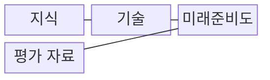
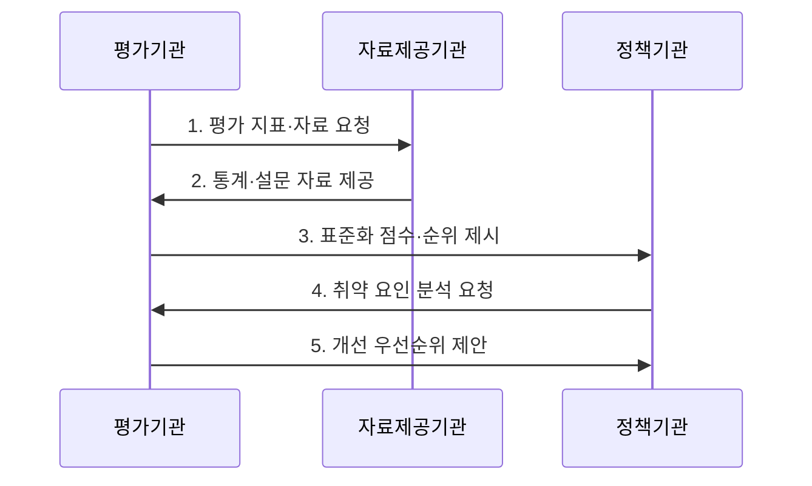

---
sidebar:
  order: 11
  label: "011. 국가 디지털 경쟁력 지수 (National Digital Competitiveness)"
  badge:
    text: "기출 · 50%"
    variant: note
title: "국가 디지털 경쟁력 지수 (National Digital Competitiveness)"
date: "2026-07-30T11:03:00+09:00"
tags:
  - "notes-law_policy"
weight: 11
extra:
  question_no: "011"
  source_status: "기출"
  source_history: "138회"
  priority: 50
  priority_note: "138회 기출, 국가 디지털 역량 비교 지표"
---

## 미리 알고가기

- **세계 디지털 경쟁력 순위(World Digital Competitiveness Ranking, WDCR)**: 국제경영개발대학원이 지식·기술·미래준비도를 기준으로 국가의 디지털 기술 활용 역량을 비교하는 평가이다.
- **국제경영개발대학원(International Institute for Management Development, IMD)**: 국가 경쟁력과 디지털 경쟁력 보고서를 발간하는 스위스의 경영교육·연구기관이다.
- **미래준비도(Future Readiness)**: 사회·기업·정부가 새로운 디지털 기술을 수용하고 활용하는 능력을 평가하는 요인이다.

## Ⅰ. 개요

- 정의/개념: **국가 디지털 경쟁력 지수**는 국가가 디지털 기술을 개발·채택하여 경제·사회 혁신에 활용하는 역량을 지식·기술·미래준비도로 비교하는 **복합 평가 지표**
- 배경/필요성: 인프라 중심 평가가 반영하지 못하는 인재·제도·기업의 기술 수용 역량까지 종합 진단

### 쉽게 이해하기 (학습용)
- 인프라뿐 아니라 인재·제도·기업의 기술 수용 역량을 종합해 국가별 디지털 경쟁력을 비교한다

## Ⅱ. 특징

- **지식 역량**: 인재·교육훈련·과학 집중도를 통한 기술 이해와 개발 능력 평가
- **기술 환경**: 규제·자본·기술 기반을 통한 디지털 기술 발전 여건 평가
- **미래준비도**: 적응 태도·기업 민첩성·정보기술 통합을 통한 기술 활용 능력 평가

### 쉽게 이해하기 (학습용)
- 인프라가 우수해도 인재·규제·기업의 기술 수용 역량이 부족하면 국가 디지털 경쟁력은 낮아질 수 있다

## Ⅲ. 구조 및 구성요소

| 구성요소 | 책임 |
|:---|:---|
| 지식 | 인재·교육훈련·과학 집중도 |
| 기술 | 규제·자본·기술 프레임워크 |
| 미래준비도 | 적응 태도·기업 민첩성·IT 통합 |
| 평가 자료 | 정량 통계·경영진 설문 결합 |

### 쉽게 이해하기 (학습용)
- 지식은 인재·교육·연구, 기술은 규제·자본·인프라, 미래준비도는 사회·기업·정부의 기술 수용 역량을 평가한다

## Ⅳ. 흐름도

1. **평가 지표·자료 요청**: 요인·세부 지표·표본과 기준시점 결정
2. **통계·설문 자료 제공**: 정량 통계와 경영진 설문 응답 확보
3. **표준화 점수·순위 제시**: 단위가 다른 지표를 표준화하여 요인 점수와 국가 순위 산출
4. **취약 요인 분석 요청**: 목표 국가와 비교하여 경쟁력이 낮은 세부 지표 식별
5. **개선 우선순위 제안**: 영향도와 실행 가능성을 기준으로 정책 과제 도출

### 쉽게 이해하기 (학습용)
- 국가별 통계와 경영진 설문을 표준화해 요인별 점수와 순위를 산출하고 취약 영역의 정책 우선순위를 정한다

## Ⅴ. 종류 및 비교

| 비교 기준 | 지식 | 기술 | 미래준비도 |
|:---|:---|:---|:---|
| 적용 기준 | 인적·연구 역량 진단 시 | 제도·인프라 환경 진단 시 | 기술 수용 역량 진단 시 |
| 핵심 특징 | 인재·교육·과학 집중도 | 규제·자본·기술 기반 | 태도·민첩성·IT 통합 |
| 한계 | 활용 성과 직접 측정 제한 | 제도와 현장 실행 차이 | 설문·평가 시점에 민감 |

> 요약: **지식·기술·미래준비도** 점수로 취약 영역 식별

### 쉽게 이해하기 (학습용)
- 지식은 인적·연구 역량, 기술은 제도·인프라 환경, 미래준비도는 기술 수용과 활용 역량을 비교한다

## Ⅵ. 실무 고려사항 및 대책

| 고려사항 | 대책 | 효과 |
|:---|:---|:---|
| 종합 순위 중심의 단기 대응 | 지식·기술·미래준비도의 세부 지표와 장기 추세 분석 | 구조적 취약 원인 식별 |
| 설문과 통계의 시차·편향 | 자료 기준시점과 산출 방법을 확인하고 복수 지표와 교차 검증 | 정책 판단의 신뢰도 향상 |
| 경쟁국 모방형 정책 수립 | 국가 산업 구조와 디지털 전환 목표에 맞춰 개선 과제 선별 | 제한된 투자 재원의 효과 제고 |

### 쉽게 이해하기 (학습용)
- 정부는 종합 순위보다 지식·기술·미래준비도의 세부 점수를 비교해 하락 원인과 개선 과제를 찾는다

## Ⅶ. 결론

- 국가 디지털 경쟁력을 높이려면 **단기 순위보다 세부 지표의 장기 추세와 국가 산업 구조를 기준으로 인재·제도·기술 수용의 취약 영역에 투자하는 정책 판단** 필요

### 쉽게 이해하기 (학습용)
- 인프라 투자에 치우치지 않고 인재·제도·기업 수용 역량의 취약 요인을 함께 개선해야 한다
