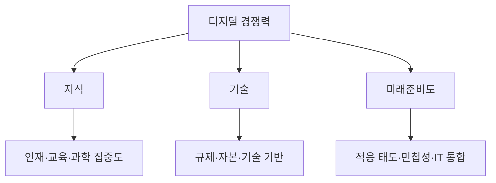

---
sidebar:
  order: 11
  label: "011. 국가 디지털 경쟁력 지수 (National Digital Competitiveness)"
  badge:
    text: "기출 · 50%"
    variant: note
title: "국가 디지털 경쟁력 지수 (National Digital Competitiveness)"
date: "2026-07-27T23:59:59+09:00"
tags:
  - "notes-law_policy"
weight: 11
extra:
  question_no: "011"
  source_status: "기출"
  source_history: "138회"
  priority: 50
  priority_note: "138회 기출, 국가 디지털 역량 비교 지표"
---

## 미리 알고가기

- **세계 디지털 경쟁력 평가(World Digital Competitiveness Ranking, WDCR)**: 스위스 국제경영개발대학원(IMD)에서 매년 국가별 디지털 인프라, 인재 풀, 기업 수용도 등을 측정하여 순위를 매기는 공신력 있는 평가 지수
- **국제경영개발대학원(International Institute for Management Development, IMD)**: 스위스 로잔에 위치한 글로벌 비즈니스 스쿨로, 국가 경쟁력과 디지털 경쟁력 보고서를 정기적으로 연구 발간하는 기관
- **미래준비도(Future Readiness)**: 사회 구성원과 기업, 정부가 클라우드, 인공지능 등 새로운 정보기술을 빠르게 받아들이고 융합하여 혁신을 이끄는 민첩성 척도
- **약어 읽기·표기**: WDCR은 ‘더블유디씨알’, IMD는 ‘아이엠디’로 읽으며 영문 정식명의 머리글자로 평가 순위와 발행 기관을 구분함
- **도식 기호(-->)**: ‘포함·진행’으로 읽고 실선 화살표는 평가요인 구성과 점수 산출 순서를 뜻함

## Ⅰ. 개요

- **정의/개념**: 디지털 기술의 채택·활용 준비도를 비교하는 국가 지표
- **기존 한계**: 인프라 중심 평가는 인재·수용 역량 반영 부족

### 쉽게 이해하기 (학습용)
- 단순히 인터넷 속도가 얼마나 빠른가만 보지 않고, IT 법률 제도, 인재 교육 수준, 민간 기업의 인공지능 활용도 등을 종합해 디지털 종합 성적표를 매기는 지표임

## Ⅱ. 특징

- **지식**: 인재·교육·과학 집중도를 평가한다
- **기술**: 규제·자본·기술 기반을 평가한다
- **미래준비도**: 적응 태도·민첩성·IT 통합을 평가한다

### 쉽게 이해하기 (학습용)
- 인터넷 강국이라 하더라도 IT 관련 행정 규제가 빡빡하거나 기술 인재가 해외로 빠져나가면 경쟁력 점수가 낮게 나오도록 유기적인 사슬 구조를 평가함

## Ⅲ. 아키텍처 및 구성요소

| 설계 요소 | 설명 |
|:---|:---|
| 지식 | 인재·교육훈련·과학 집중도 |
| 기술 | 규제·자본·기술 프레임워크 |
| 미래준비도 | 적응 태도·기업 민첩성·IT 통합 |
| 평가 자료 | 정량 통계·경영진 설문 결합 |

> 요약: 지식·기술·미래준비도로 국가 역량을 종합 평가함

### 쉽게 이해하기 (학습용)
- 지식(사람의 똑똑함), 기술(정보기술 기반과 제도 장벽), 미래준비도(실제 서비스 적응 능력)라는 3대 기둥으로 전체 성적을 설계한 모형임

## Ⅳ. 원리 및 절차 흐름도

| 절차 | 핵심 활동 |
|:---|:---|
| 평가 체계 확정 | 요인·세부 지표·표본 결정 |
| 통계·설문 수집 | 정량 자료·경영진 응답 확보 |
| 지표 표준화 | 단위가 다른 자료를 점수화 |
| 요인별 점수 산출 | 지식·기술·미래준비도 계산 |
| 종합 순위 결정 | 국가별 경쟁력 순위 산출 |
| 취약 영역 분석 | 정책·제도 개선 우선순위 도출 |

### 쉽게 이해하기 (학습용)
- 매년 세계 각국의 하드웨어 보급 통계와 비즈니스 설문지를 모아 점수를 변환하고, 약점을 찾아 법 개정이나 예산 지원 계획을 세움

## Ⅴ. 디지털 경쟁력 평가요인 비교

| 비교 기준 | 지식 | 기술 | 미래준비도 |
|:---|:---|:---|:---|
| 적용 기준 | 인적·연구 역량 진단 시 | 제도·인프라 환경 진단 시 | 기술 수용 역량 진단 시 |
| 핵심 특징 | 인재·교육·과학 집중도 | 규제·자본·기술 기반 | 태도·민첩성·IT 통합 |
| 한계 | 활용 성과 직접 측정 제한 | 제도와 현장 실행 차이 | 설문·평가 시점에 민감 |

> 요약: 3대 세부 요인의 적용 기준으로 취약점을 식별함

### 쉽게 이해하기 (학습용)
- 지식은 미래를 짊어질 인적 자원 수준을, 기술은 기업 투자를 활성화하는 법을, 미래준비도는 실제 현장의 스마트폰 결제 보급률 같은 활용력을 비교함

## Ⅵ. 실무 사례

1. 국가 정책: **IMD 요인점수**로 취약 영역 식별
2. 투자 배분: **세부 지표**로 인재·규제 개선

### 쉽게 이해하기 (학습용)
- 한국의 종합 순위가 떨어졌을 때 지식이나 기술 중 구체적으로 대학교의 이공계 역량 점수가 내려갔는지를 대조해 원인을 찾음
- 통신망 하드웨어는 세계 최고 수준인데 사이버 보안 규정이나 비즈니스 규제가 낡아 전체 경쟁력 순위 상승이 막힌 요소를 발굴함

## Ⅶ. 결론

- 순위 하락 시 **요인·세부 지표**로 원인을 통제

### 쉽게 이해하기 (학습용)
- 등수 올리기식 인프라 투자에 치우치지 말고 기업 규제 완화와 민간 혁신을 가로막는 법 개정을 동반해야 국가 경쟁력을 실질적으로 올릴 수 있음
