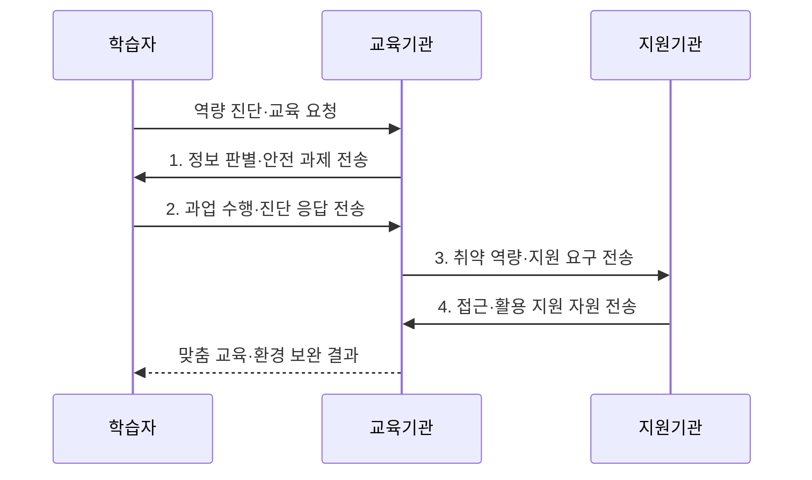

---
sidebar:
  order: 12
  label: "012. 디지털 리터러시 (Digital Literacy)"
  badge:
    text: "기출 · 50%"
    variant: note
title: "디지털 리터러시 (Digital Literacy)"
date: "2026-08-02T12:00:00+09:00"
tags:
  - "notes-law_policy"
weight: 12
extra:
  question_no: "012"
  source_status: "기출"
  source_history: "132회"
  priority: 50
  priority_note: "132회 기출, 디지털 활용 역량의 정책 기반"
---

## Ⅰ. 개요

핵심 용어

- **복합 시민 역량**: 디지털 리터러시는 정보와 도구를 접근·평가·생산하고 안전하고 책임 있게 활용하는 복합 시민 역량이다.

- 정의/개념: 디지털 정보·도구를 비판적이고 안전하게 활용하는 **복합 시민 역량**
- 배경/필요성: 기기 조작만으로는 **정보 신뢰성·개인정보·AI 편향 대응 불가**

### 쉽게 이해하기 (학습용)
- 기기 조작을 넘어 정보의 출처와 신뢰성을 검증하고 개인정보·보안 위험을 통제하며 디지털 기술을 책임 있게 활용하는 역량이다

## Ⅱ. 특징

핵심 용어

- **책임 있는 참여**: 책임 있는 참여는 저작권·개인정보·온라인 소통 규범을 지키며 디지털 시민성을 실천하는 능력이다.

- **비판적 활용**: 디지털 도구를 사용하면서 정보의 출처·정확성·편향 판단
- **책임 있는 참여**: 저작권·개인정보·온라인 소통 규범을 지키는 디지털 시민성 실천
- **포용적 대응**: 인공지능 편향과 접근·활용·성과 격차를 인식한 지원 설계

### 쉽게 이해하기 (학습용)
- 기기를 제공해 접근 격차를 줄여도 피싱 판별과 금융 앱 활용 역량이 부족하면 활용·성과 격차는 계속된다

## Ⅲ. 구조 및 구성요소

핵심 용어

- **정보 평가**: 정보 평가는 디지털 콘텐츠의 출처·정확성·편향을 확인해 신뢰 가능한 정보인지 판단한다.

| 구성요소 | 책임 |
|:---|:---|
| 접근 역량 | **기기·네트워크 기본 사용** |
| 정보 평가 | **출처·정확성·편향** 판단 |
| 데이터 활용 | **데이터 해석·문제 해결** |
| 보안·개인정보 | **계정·개인정보·사이버 위험** 관리 |
| 참여·소통 | **협업·디지털 시민성** 실천 |

### 쉽게 이해하기 (학습용)
- 기기 접근과 정보 평가, 데이터 활용, 보안, 디지털 시민성이 연결되어 실제 디지털 활용 성과를 만든다

## Ⅳ. 흐름도

핵심 용어

- **3. 취약 역량·지원 요구 전송**: 교육기관은 과업 수행 결과에서 접근·활용·평가·안전의 취약 영역과 필요한 지원을 도출해 지원기관에 전달한다.

1. **정보 판별·안전 과제 전송**: 생활 맥락의 허위정보·피싱 과제 제시
2. **과업 수행·진단 응답 전송**: 접근·활용·평가·안전 수준 측정
3. **취약 역량·지원 요구 전송**: 기기·통신·보조 교육 요구 도출
4. **접근·활용 지원 자원 전송**: 접근 조건과 지속 학습 기회 제공

### 쉽게 이해하기 (학습용)
- 학습자의 활용 수준을 진단한 뒤 정보 판별과 보안 교육을 제공하고 취약 역량을 보완한다

## Ⅴ. 종류 및 비교

핵심 용어

- **AI 리터러시**: AI 리터러시는 인공지능 산출물의 한계·편향·책임을 이해하고 출처와 결과를 비판적으로 검증하는 역량이다.

| 구분 | 디지털 리터러시 | 컴퓨터 리터러시 | AI 리터러시 |
|:---|:---|:---|:---|
| 적용 기준 | **정보 판별·보안** 필요 | **기기·SW 조작** 필요 | **AI 산출물 검증** 필요 |
| 핵심 특징 | **정보·소통·안전 활용** | **기기·SW 조작** | **AI 결과·책임 판단** |
| 한계 | **활용 성과 격차** 지속 | **정보 신뢰 판단** 부족 | **모델 내부 검증** 곤란 |

> 요약: **기기 조작·정보 활용·AI 검증** 목적에 따라 역량 구분

### 쉽게 이해하기 (학습용)
- 컴퓨터 리터러시는 기기·SW 조작, 디지털 리터러시는 정보·안전 활용, AI 리터러시는 AI 결과와 책임 판단에 초점을 둔다

## Ⅵ. 실무 고려사항 및 대책

핵심 용어

- **무비판적 수용**: 무비판적 수용은 AI 결과의 출처와 오류 가능성을 확인하지 않고 사실이나 의사결정 근거로 받아들이는 문제다.

| 문제 | 대책 | 효과 |
|:---|:---|:---|
| 기기 보급만으로 남는 **활용·성과 격차** | **접근·활용·성과 수준**을 분리 진단 | 디지털 **혜택 격차** 완화 |
| 이론 교육으로 생기는 **학습 전이 부족** | **금융·공공서비스·피싱 과업** 반복 실습 | 실생활 **위험 대응력** 향상 |
| AI 결과를 그대로 믿는 **무비판적 수용** | **출처·교차 검증·개인정보 제한** 교육 | 허위정보와 **침해 위험** 감소 |

### 쉽게 이해하기 (학습용)
- 고령층에게 금융 앱 사용법과 피싱 메시지의 발신자·주소·요청정보를 확인하는 방법을 함께 교육한다

## Ⅶ. 결론

핵심 용어

- **활용·성과 격차**: 활용·성과 격차는 기기 보급만으로 줄지 않으므로 생활 과업 중심의 반복 교육과 지원이 필요하다.

- **접근 격차**는 기기·통신, **활용·성과 격차**는 생활 과업 반복 교육

### 쉽게 이해하기 (학습용)
- 기기 보급뿐 아니라 정보 검증·안전·AI 활용 역량을 함께 높여 디지털 활용 성과의 격차를 줄여야 한다
