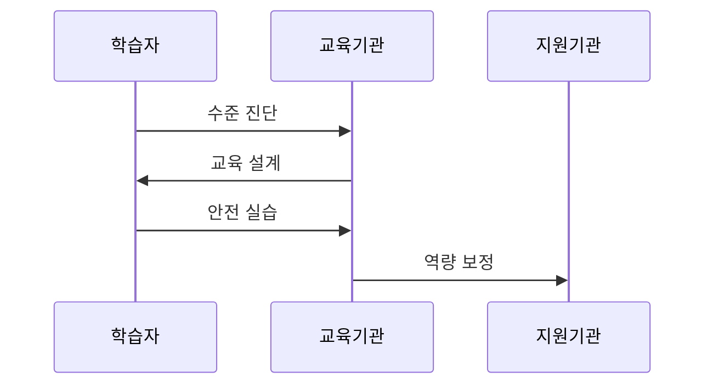

---
sidebar:
  order: 12
  label: "012. 디지털 리터러시 (Digital Literacy)"
  badge:
    text: "기출 · 50%"
    variant: note
title: "디지털 리터러시 (Digital Literacy)"
date: "2026-07-27T23:59:59+09:00"
tags:
  - "notes-law_policy"
weight: 12
extra:
  question_no: "012"
  source_status: "기출"
  source_history: "132회"
  priority: 50
  priority_note: "132회 기출, 디지털 활용 역량의 정책 기반"
---

## 미리 알고가기

- **인공지능 리터러시(Artificial Intelligence Literacy, AI Literacy)**: 인공지능이 생성한 결과물의 한계와 편향을 인지하고 비판적·도덕적 관점에서 검증하고 통제하는 역량
- **소프트웨어(Software, SW)**: 컴퓨터 하드웨어를 작동시켜 데이터를 처리하거나 인터넷 서비스를 구현하는 응용 프로그램 및 시스템 기술
- **디지털 격차(Digital Divide)**: 디지털 장비에 접근할 수 있는 격차를 넘어, 활용 능력과 정보 획득 성과의 차이로 인해 사회·경제적 혜택에서 차이가 생겨나는 현상
- **약어 읽기·표기**: AI는 ‘에이아이’, SW는 ‘에스더블유’로 읽으며 영문 정식명의 머리글자로 인공지능과 소프트웨어 역량 대상을 구분함

## Ⅰ. 개요

- 정의/개념: 디지털 정보·도구를 비판적·책임 있게 활용하는 역량
- **배경/필요성**: 기기 접근과 조작 능력만으로 정보 신뢰성·안전·AI 편향 판단 곤란

### 쉽게 이해하기 (학습용)
- 스마트폰 앱을 다루는 단순한 기술 조작을 넘어, 가짜 뉴스를 구별하고 개인정보 해킹을 조심하며 디지털 기술을 안전하게 통제하고 활용하는 인지 역량임

## Ⅱ. 특징

- 기기 조작과 정보 신뢰성·출처를 판단한다
- 소통·저작권·개인정보 규범을 이해한다
- AI 편향과 접근·활용·성과 격차를 인식하고 책임 있게 쓴다

### 쉽게 이해하기 (학습용)
- 고령층에게 스마트폰을 무료로 나누어 준다 하더라도(접근 격차 해소), 피싱 링크를 구별하거나 뱅킹 앱을 사용하는 능력(활용 및 성과 격차)은 여전히 남아 있기 때문에 교육이 필요함

## Ⅲ. 아키텍처 및 구성요소

| 설계 요소 | 설명 |
|:---|:---|
| 접근 역량 | 기기·네트워크 기본 사용 |
| 정보 평가 | 출처·정확성·편향 판단 |
| 데이터 활용 | 데이터 해석 및 문제 해결 |
| 보안·개인 | 계정·위험 관리 |
| 참여·소통 | 협업·디지털 시민성 실천 |

> 요약: 기술적 접근성부터 인지적 비판 능력까지 종합 구성

### 쉽게 이해하기 (학습용)
- 하드웨어를 만지는 능력(접근)부터 정보가 진짜인지 골라내는 능력(평가), 피해를 보지 않는 안전 보안(보안)까지 유기적으로 이어지는 역량 구조임

## Ⅳ. 원리 및 절차 흐름도

| 절차 | 핵심 활동 |
|:---|:---|
| 수준 진단 | 도구·데이터 이해도 평가 |
| 교육 설계 | 정보 판별·활용 훈련 제공 |
| 안전 실습 | 개인정보·저작권 침해 예방 |
| 역량 보정 | 취약계층 정보 격차 해소 |

### 쉽게 이해하기 (학습용)
- 현재 스마트폰 활용 점수를 평가한 뒤, 맞춤형 가짜 정보 분별법과 보안 주의 교육을 거쳐 고령층의 정보 격차를 서서히 메우는 단계임

## Ⅴ. 디지털 활용 역량 비교

| 구분 | 디지털 리터러시 | 컴퓨터 리터러시 | AI 리터러시 |
|:---|:---|:---|:---|
| 적용 기준 | 정보 판별 및 보안 필요 시 | 기기·SW 조작 기술 요구 시 | AI 산출물 신뢰성 검증 시 |
| 핵심 특징 | 정보·소통·안전 활용 | 기기·SW 조작 | AI 결과·책임 판단 |
| 한계 | 성과 격차 지속 | 정보 신뢰 판단 부족 | 모델 내부 완전 검증 곤란 |

> 요약: 기기 활용 환경에 따라 필요 역량을 식별하고 선택

### 쉽게 이해하기 (학습용)
- 옛날에는 한글 워드 조작 능력(컴퓨터)에 그쳤으나, 지금은 사이버 보안과 가짜 뉴스 판별(디지털)을 거쳐 챗GPT의 오답 검증(AI)까지 역량 범위가 넓어짐

## Ⅵ. 실무 사례

1. 취약계층의 디지털 금융 활용 및 피싱 방지

### 쉽게 이해하기 (학습용)
- 노령 사용자에게 키오스크 결제법을 가르치는 동시에, 문자 메시지로 오는 금융 사기 링크를 누르지 않도록 예방함

## Ⅶ. 결론

- 디지털 역량 향상을 위해 활용·검증 수준을 검토하여 **리터러시** 활용

### 쉽게 이해하기 (학습용)
- 첨단 정보 시스템의 도입 성공률을 올리기 위해, 전산 개발에만 집중하지 말고 임직원들의 비판적인 데이터 해독 역량을 동시에 길러야 함
