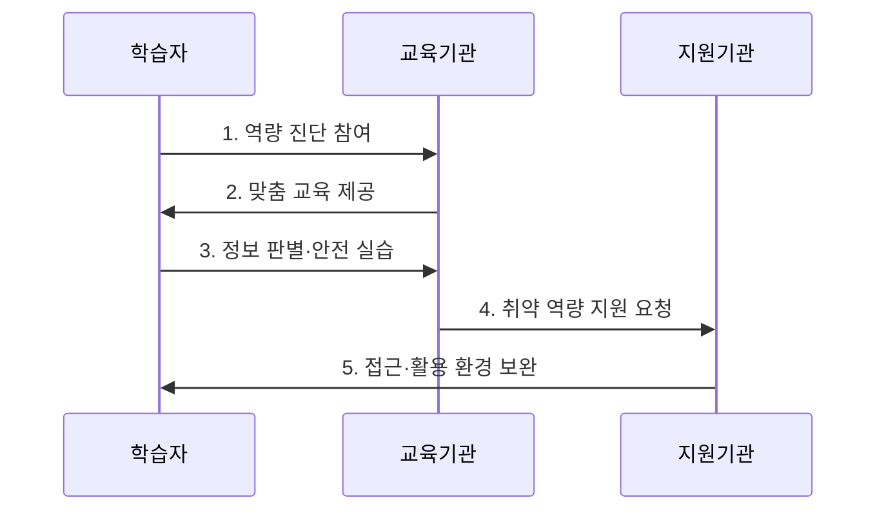

---
sidebar:
  order: 12
  label: "012. 디지털 리터러시 (Digital Literacy)"
  badge:
    text: "기출 · 50%"
    variant: note
title: "디지털 리터러시 (Digital Literacy)"
date: "2026-07-30T11:10:00+09:00"
tags:
  - "notes-law_policy"
weight: 12
extra:
  question_no: "012"
  source_status: "기출"
  source_history: "132회"
  priority: 50
  priority_note: "132회 기출, 디지털 활용 역량의 정책 기반"
---

## 미리 알고가기

- **인공지능 리터러시(Artificial Intelligence Literacy, AI Literacy)**: 인공지능이 생성한 결과물의 한계와 편향을 인지하고 비판적·도덕적 관점에서 검증하고 통제하는 역량
- **소프트웨어(Software, SW)**: 컴퓨터 하드웨어를 작동시켜 데이터를 처리하거나 인터넷 서비스를 구현하는 응용 프로그램 및 시스템 기술
- **디지털 격차(Digital Divide)**: 디지털 장비에 접근할 수 있는 격차를 넘어, 활용 능력과 정보 획득 성과의 차이로 인해 사회·경제적 혜택에서 차이가 생겨나는 현상

## Ⅰ. 개요

- 정의/개념: **디지털 리터러시**는 디지털 정보와 도구를 접근·이해·평가·생산하고 안전하며 책임 있게 활용하는 **복합 시민 역량**
- 배경/필요성: 기기 조작 능력만으로 판단하기 어려운 정보 신뢰성·개인정보 위험·인공지능 편향에 대한 대응력 확보

### 쉽게 이해하기 (학습용)
- 기기 조작을 넘어 정보의 출처와 신뢰성을 검증하고 개인정보·보안 위험을 통제하며 디지털 기술을 책임 있게 활용하는 역량이다

## Ⅱ. 특징

- **비판적 활용**: 디지털 도구를 사용하면서 정보의 출처·정확성·편향 판단
- **책임 있는 참여**: 저작권·개인정보·온라인 소통 규범을 지키는 디지털 시민성 실천
- **포용적 대응**: 인공지능 편향과 접근·활용·성과 격차를 인식한 지원 설계

### 쉽게 이해하기 (학습용)
- 기기를 제공해 접근 격차를 줄여도 피싱 판별과 금융 앱 활용 역량이 부족하면 활용·성과 격차는 계속된다

## Ⅲ. 구조 및 구성요소

| 구성요소 | 책임 |
|:---|:---|
| 접근 역량 | 기기·네트워크 기본 사용 |
| 정보 평가 | 출처·정확성·편향 판단 |
| 데이터 활용 | 데이터 해석 및 문제 해결 |
| 보안·개인정보 | 계정·개인정보·사이버 위험 관리 |
| 참여·소통 | 협업·디지털 시민성 실천 |

### 쉽게 이해하기 (학습용)
- 기기 접근과 정보 평가, 데이터 활용, 보안, 디지털 시민성이 연결되어 실제 디지털 활용 성과를 만든다

## Ⅳ. 흐름도

1. **역량 진단 참여**: 접근·활용·정보 평가·안전 수준 측정
2. **맞춤 교육 제공**: 대상과 생활 맥락에 맞는 정보 판별·도구 활용 교육
3. **정보 판별·안전 실습**: 실제 사례로 허위정보·피싱·개인정보 침해 대응 훈련
4. **취약 역량 지원 요청**: 진단 결과를 바탕으로 기기·통신·보조 교육 연계
5. **접근·활용 환경 보완**: 취약계층의 접근 조건과 지속 학습 기회 지원

### 쉽게 이해하기 (학습용)
- 학습자의 활용 수준을 진단한 뒤 정보 판별과 보안 교육을 제공하고 취약 역량을 보완한다

## Ⅴ. 종류 및 비교

| 구분 | 디지털 리터러시 | 컴퓨터 리터러시 | AI 리터러시 |
|:---|:---|:---|:---|
| 적용 기준 | 정보 판별 및 보안 필요 시 | 기기·SW 조작 기술 요구 시 | AI 산출물 신뢰성 검증 시 |
| 핵심 특징 | 정보·소통·안전 활용 | 기기·SW 조작 | AI 결과·책임 판단 |
| 한계 | 성과 격차 지속 | 정보 신뢰 판단 부족 | 모델 내부 완전 검증 곤란 |

> 요약: **기기 조작·정보 활용·AI 검증** 목적에 따라 역량 구분

### 쉽게 이해하기 (학습용)
- 컴퓨터 리터러시는 기기·SW 조작, 디지털 리터러시는 정보·안전 활용, AI 리터러시는 AI 결과와 책임 판단에 초점을 둔다

## Ⅵ. 실무 고려사항 및 대책

| 고려사항 | 대책 | 효과 |
|:---|:---|:---|
| 기기 보급 중심의 격차 해소 | 접근·활용·성과 수준을 분리 진단하고 맞춤 지원 | 실질적 디지털 혜택 격차 완화 |
| 이론 중심의 일회성 교육 | 금융 앱·공공서비스·피싱 등 생활 과업 기반 반복 실습 | 학습 전이와 위험 대응력 향상 |
| 인공지능 결과의 무비판적 수용 | 출처 확인·교차 검증·개인정보 입력 제한을 교육 | 허위정보와 개인정보 침해 위험 감소 |

### 쉽게 이해하기 (학습용)
- 고령층에게 금융 앱 사용법과 피싱 메시지의 발신자·주소·요청정보를 확인하는 방법을 함께 교육한다

## Ⅶ. 결론

- 디지털 전환의 혜택 격차를 줄이려면 **기기 보급보다 생활 과업별 활용 성과와 정보 검증 능력을 진단하여 취약계층에 반복 실습을 제공하는 역량 정책** 필요

### 쉽게 이해하기 (학습용)
- 기기 보급뿐 아니라 정보 검증·안전·AI 활용 역량을 함께 높여 디지털 활용 성과의 격차를 줄여야 한다
