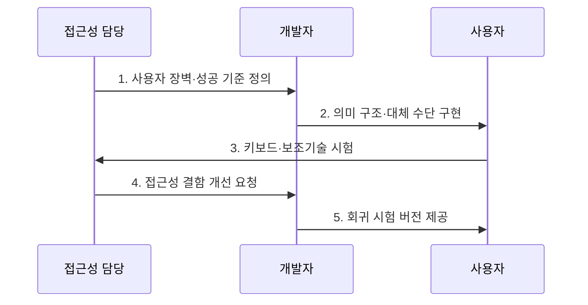

---
sidebar:
  order: 13
  label: "013. 디지털 접근성과 WCAG (Digital Accessibility & WCAG)"
  badge:
    text: "기출 · 70%"
    variant: note
title: "디지털 접근성과 WCAG (Digital Accessibility & WCAG)"
date: "2026-07-30T11:18:00+09:00"
tags:
  - "notes-law_policy"
weight: 13
extra:
  question_no: "013"
  source_status: "기출"
  source_history: "137회"
  priority: 70
  priority_note: "137회 기출, 접근성 표준·검증의 현행 핵심"
---

## 미리 알고가기

- **웹 콘텐츠 접근성 지침(Web Content Accessibility Guidelines, WCAG)**: 장애 유형과 이용 환경에 관계없이 웹 콘텐츠를 접근할 수 있도록 원칙·지침·시험 가능한 성공 기준을 제시하는 W3C 표준이다.
- **POUR 4대 원칙(Perceivable, Operable, Understandable, Robust)**: WCAG의 성공 기준을 인식성·운용성·이해성·견고성으로 분류하는 상위 원칙이다.
- **접근 가능한 리치 인터넷 애플리케이션(Web Accessibility Initiative-Accessible Rich Internet Applications, WAI-ARIA)**: 동적 사용자 인터페이스의 역할·상태·속성을 보조기술에 전달하는 기술 명세이다.

## Ⅰ. 개요

- **디지털 접근성**은 장애·연령·기기·이용 환경과 관계없이 정보와 기능을 인식·운용·이해하고 보조기술로 해석할 수 있게 설계하는 **포용적 품질 원칙**
- **배경/필요성**: 시각·마우스 중심 인터페이스가 만드는 정보 인식과 기능 조작의 장벽 제거

> 요약: 장애나 연령에 관계없이 동등하게 웹서비스에 접근하는 기준

### 쉽게 이해하기 (학습용)
- 시각·운동 장애가 있는 사용자도 키보드와 화면 낭독기로 웹 정보와 기능을 동등하게 이용하도록 설계하는 기술 규범입니다.

## Ⅱ. 특징

- **품질 내재화**: 접근성을 별도 편의 기능이 아닌 제품 품질과 이용성의 필수 속성으로 관리
- **시험 가능성**: POUR 원칙 아래 성공 기준을 A·AA·AAA 적합성 수준으로 분류
- **다중 검증**: 자동 진단·수동 점검·보조기술 사용자 시험을 결합하여 실제 접근 장벽 확인

### 쉽게 이해하기 (학습용)
- 단순 편의 기능을 넘어 화면 낭독기가 내용을 읽고 모든 입력 기능을 키보드로 조작할 수 있는지 확인합니다.

## Ⅲ. 구조 및 구성요소

| 구성요소 | 책임 |
|:---|:---|
| 요구사항 | 장애·환경·지침 반영 |
| UI 구현 | 대비·초점·입력 설계 |
| 보조기술 | 화면낭독기 호환성 확보 |
| 테스트 | 자동·수동 사용자 검증 |
| 운영관리 | 변경 시 결함 재검토 |

> 요약: 보조기술 호환 및 사용자 테스트를 통해 접근성 달성

### 쉽게 이해하기 (학습용)
- POUR 원칙을 설계에 반영하고 화면 낭독기와 대체 입력 장치가 정상 작동하는지 사용자 시험을 거칩니다.

## Ⅳ. 흐름도

### 동작 원리

1. **사용자 장벽·성공 기준 정의**: 주요 과업과 장애 유형별 접근 장벽을 WCAG 성공 기준에 연결
2. **의미 구조·대체 수단 구현**: 표준 마크업·키보드 조작·대체 텍스트·명확한 오류 안내 적용
3. **키보드·보조기술 시험**: 자동 검사로 찾기 어려운 초점 순서와 화면 낭독기 해석 확인
4. **접근성 결함 개선 요청**: 성공 기준과 사용자 과업 영향도를 기준으로 결함 우선순위 결정
5. **회귀 시험 버전 제공**: 변경 기능과 공통 구성요소를 다시 시험하여 결함 재발 방지

### 쉽게 이해하기 (학습용)
- 의미 있는 이미지에 대체 텍스트를 제공한 뒤 화면 낭독기가 의도한 정보를 올바르게 전달하는지 시험합니다.

## Ⅴ. 종류 및 비교

| 구분 | 인식성 | 운용성 | 이해성 | 견고성 |
|:---|:---|:---|:---|:---|
| 적용 기준 | 시각·청각 대체 수단 요구 시 | 입력 도구·시간 통제 필요 시 | 문맥 이해 및 입력 오류 예방 시 | 다양한 플랫폼 호환성 확보 시 |
| 핵심 특징 | 대체 정보·대비 제공 | 키보드·시간 조작 보장 | 가독성·오류 방지 | 표준 마크업·호환성 |
| 한계 | 대체 정보 품질 편차 | 복합 제스처 대체 곤란 | 쉬운 표현의 기준 편차 | 보조기술별 해석 차이 |

> 요약: 장애 제약을 극복하기 위한 네 가지 관점의 성공 기준

### 쉽게 이해하기 (학습용)
- 대체 정보의 인식성, 키보드 운용성, 내용의 이해성, 다양한 사용자 도구와의 견고성을 비교합니다.

## Ⅵ. 실무 고려사항 및 대책

| 고려사항 | 대책 | 효과 |
|:---|:---|:---|
| 자동 검사 결과만으로 적합성 판단 | 자동 검사와 키보드·화면 낭독기·사용자 과업 시험 병행 | 실제 이용 장벽 탐지율 향상 |
| 시각적 디자인 이후 접근성 보완 | 요구사항·디자인 시스템·개발 완료 기준에 WCAG 성공 기준 반영 | 재작업 비용과 결함 유입 감소 |
| 기능 변경 후 접근성 회귀 | 공통 구성요소의 자동 회귀 검사와 정기 수동 검토 운영 | 지속적인 적합성 유지 |

### 쉽게 이해하기 (학습용)
- 전자 신고 화면은 고대비 표시를 지원하고 입력 순서와 키보드 초점 이동 순서를 일치시킵니다.

## Ⅶ. 결론

- 공공·필수 서비스의 동등한 이용을 보장하려면 **WCAG 2.2 성공 기준을 개발 완료 조건으로 삼고 자동 검사와 보조기술 사용자 시험을 결합하는 지속적 접근성 관리** 필요

### 쉽게 이해하기 (학습용)
- 일회성 인증 대응에 그치지 않고 기능을 변경할 때마다 자동 검사와 보조기술 시험을 반복해야 합니다.
