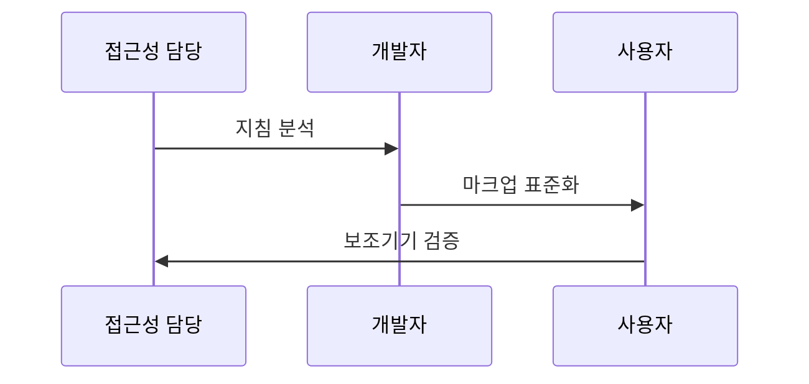

---
sidebar:
  order: 13
  label: "013. 디지털 접근성과 WCAG (Digital Accessibility & WCAG)"
  badge:
    text: "기출 · 70%"
    variant: note
title: "디지털 접근성과 WCAG (Digital Accessibility & WCAG)"
date: "2026-07-27T23:59:59+09:00"
tags:
  - "notes-law_policy"
weight: 13
extra:
  question_no: "013"
  source_status: "기출"
  source_history: "137회"
  priority: 70
  priority_note: "137회 기출, 접근성 표준·검증의 현행 핵심"
---

## 미리 알고가기

- **웹 콘텐츠 접근성 지침(Web Content Accessibility Guidelines, WCAG)**: 장애인과 고령자 등 모든 사용자가 웹 사이트 콘텐츠에 쉽고 동등하게 접근할 수 있도록 권고안을 모아 둔 국제 표준 웹 기술 지침
- **POUR 4대 원칙(Perceivable, Operable, Understandable, Robust)**: 웹 접근성을 달성하기 위한 네 가지 필수 품질 요소로 인식성, 운용성, 이해성, 견고성을 의미하는 약어
- **WAI-ARIA(Web Accessibility Initiative - Accessible Rich Internet Applications)**: 시각 장애인이 화면 낭독기를 사용할 때, 웹 브라우저의 동적 스크립트와 복잡한 사용자 인터페이스 요소의 기능과 상태를 쉽게 인지하도록 도와주는 기술 마크업 표준
- **약어 읽기·표기**: WCAG는 ‘더블유캐그’, POUR는 ‘포어’, WAI-ARIA는 ‘웨이 아리아’로 읽으며 영문 정식명 축약으로 지침·원칙·보조기술 마크업을 구분함

## Ⅰ. 개요

- 정의/개념: 장애·연령·환경 무관한 정보 인식·운용·이해 설계
- **배경/필요성**: 시각 중심·마우스 중심 설계로 장애·환경별 정보 접근과 조작 제한

> 요약: 장애나 연령에 관계없이 동등하게 웹서비스에 접근하는 기준

### 쉽게 이해하기 (학습용)
- 시각·운동 장애가 있는 사용자도 키보드와 화면 낭독기로 웹 정보와 기능을 동등하게 이용하도록 설계하는 기술 규범입니다.

## Ⅱ. 특징

- 접근성을 제품 품질과 이용성의 결정 요소로 다룬다.
- WCAG의 POUR 원칙으로 성공 기준을 분류한다.
- 자동 진단과 보조기술 시험으로 키보드·대비·대체 정보를 검증한다.

### 쉽게 이해하기 (학습용)
- 단순 편의 기능을 넘어 화면 낭독기가 내용을 읽고 모든 입력 기능을 키보드로 조작할 수 있는지 확인합니다.

## Ⅲ. 아키텍처 및 구성요소

| 설계 요소 | 설명 |
|:---|:---|
| 요구사항 | 장애·환경·지침 반영 |
| UI 구현 | 대비·초점·입력 설계 |
| 보조기술 | 화면낭독기 호환성 확보 |
| 테스트 | 자동·수동 사용자 검증 |
| 운영관리 | 변경 시 결함 재검토 |

> 요약: 보조기술 호환 및 사용자 테스트를 통해 접근성 달성

### 쉽게 이해하기 (학습용)
- POUR 원칙을 설계에 반영하고 화면 낭독기와 대체 입력 장치가 정상 작동하는지 사용자 시험을 거칩니다.

## Ⅳ. 원리 및 절차 흐름도

| 절차 | 핵심 활동 |
|:---|:---|
| 지침 분석 | 사용자 접근 장벽 식별 |
| 마크업 표준화 | 대체 정보 제공 수단 구현 |
| 보조기기 검증 | 사용자 관점 호환성 반복 확인 |

### 쉽게 이해하기 (학습용)
- 의미 있는 이미지에 대체 텍스트를 제공한 뒤 화면 낭독기가 의도한 정보를 올바르게 전달하는지 시험합니다.

## Ⅴ. WCAG POUR 원칙 비교

| 구분 | 인식성 | 운용성 | 이해성 | 견고성 |
|:---|:---|:---|:---|:---|
| 적용 기준 | 시각·청각 대체 수단 요구 시 | 입력 도구·시간 통제 필요 시 | 문맥 이해 및 입력 오류 예방 시 | 다양한 플랫폼 호환성 확보 시 |
| 핵심 특징 | 대체 정보·대비 제공 | 키보드·시간 조작 보장 | 가독성·오류 방지 | 표준 마크업·호환성 |
| 한계 | 대체 정보 품질 편차 | 복합 제스처 대체 곤란 | 쉬운 표현의 기준 편차 | 보조기술별 해석 차이 |

> 요약: 장애 제약을 극복하기 위한 네 가지 관점의 성공 기준

### 쉽게 이해하기 (학습용)
- 대체 정보의 인식성, 키보드 운용성, 내용의 이해성, 다양한 사용자 도구와의 견고성을 비교합니다.

## Ⅵ. 실무 사례

1. WCAG 최신 표준 기반 공공 웹사이트 접근성 개편
2. 동적 사용자 인터페이스에 대한 스크린리더 음성 검증

### 쉽게 이해하기 (학습용)
- 전자 신고 화면은 고대비 표시를 지원하고 입력 순서와 키보드 초점 이동 순서를 일치시킵니다.
- 실시간 도착 정보가 바뀌면 화면 낭독기가 변경 내용을 알리도록 적절한 WAI-ARIA 속성을 적용합니다.

## Ⅶ. 결론

- 배포 전 WCAG와 보조기술 검증을 반복

### 쉽게 이해하기 (학습용)
- 일회성 인증 대응에 그치지 않고 기능을 변경할 때마다 자동 검사와 보조기술 시험을 반복해야 합니다.
