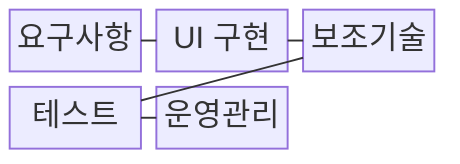
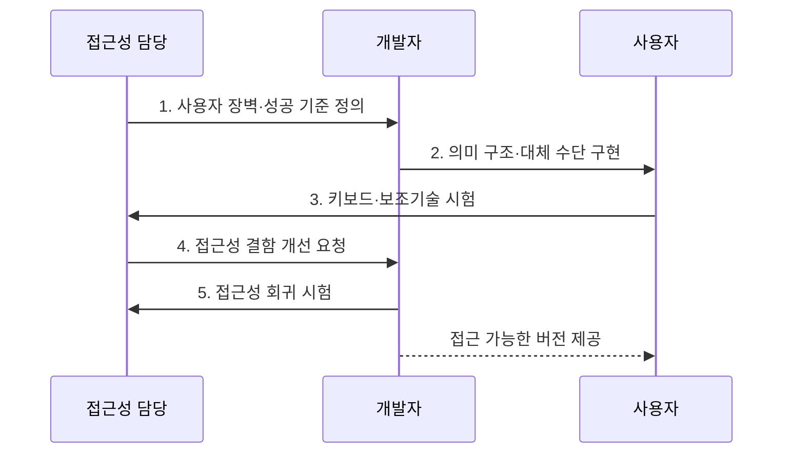

---
sidebar:
  order: 13
  label: "013. 디지털 접근성과 WCAG (Digital Accessibility & WCAG)"
  badge:
    text: "기출 · 70%"
    variant: note
title: "디지털 접근성과 WCAG (Digital Accessibility & WCAG)"
date: "2026-08-02T12:00:00+09:00"
tags:
  - "notes-law_policy"
weight: 13
extra:
  question_no: "013"
  source_status: "기출"
  source_history: "137회"
  priority: 70
  priority_note: "137회 기출, 접근성 표준·검증의 현행 핵심"
---

## Ⅰ. 개요

핵심 용어

- **디지털 접근성**: 장애·연령·기기와 관계없이 디지털 정보와 기능을 인식·운용·이해하고 보조기술로 이용할 수 있게 하는 성질이다.
- **보조기술**: 화면 낭독기·대체 입력 장치처럼 장애 사용자의 정보 인식과 기능 조작을 지원하는 기술이다.
- **보조기술 호환 보장**: 보조기술 호환 보장은 화면 낭독기와 대체 입력 장치가 웹의 정보 구조·상태·기능을 정확히 해석하게 한다.

- 정의/개념: **디지털 접근성** 은 장애·연령·기기와 무관하게 디지털 정보와 기능을 인식·운용·이해하고 보조기술과 호환되게 보장하는 설계 원칙
- 배경/필요성: 시각·마우스 중심 인터페이스로 **정보 인식·기능 조작 제한**

#### 한줄 요약
- 시각·운동 장애가 있는 사용자도 키보드와 화면 낭독기로 웹 정보와 기능을 동등하게 이용하도록 설계하는 기술 규범입니다.

## Ⅱ. 특징

핵심 용어

- **POUR 원칙**: 인식 가능(Perceivable)·운용 가능(Operable)·이해 가능(Understandable)·견고(Robust)를 뜻하는 웹 접근성의 네 가지 원칙이다.
- **A·AA·AAA 적합성 수준**: 웹 콘텐츠 접근성 지침의 성공 기준을 기본·중간·최고 수준으로 구분한 등급이다.
- **다중 검증**: 다중 검증은 자동 진단·수동 점검·보조기술 사용자 시험을 결합해 실제 접근 장벽을 확인한다.

- **품질 내재화**: 접근성을 별도 편의 기능이 아닌 제품 품질과 이용성의 필수 속성으로 관리
- **시험 가능성**: POUR 원칙 아래 성공 기준을 A·AA·AAA 적합성 수준으로 분류
- **다중 검증**: 자동 진단·수동 점검·보조기술 사용자 시험을 결합하여 실제 접근 장벽 확인

#### 한줄 요약
- 단순 편의 기능을 넘어 화면 낭독기가 내용을 읽고 모든 입력 기능을 키보드로 조작할 수 있는지 확인합니다.

## Ⅲ. 구조 및 구성요소

핵심 용어

- **웹 콘텐츠 접근성 지침(Web Content Accessibility Guidelines, WCAG)**: 웹 콘텐츠를 인식·운용·이해하고 보조기술과 호환되게 만드는 국제 성공 기준이다.
- **POUR 원칙**: 인식 가능(Perceivable)·운용 가능(Operable)·이해 가능(Understandable)·견고(Robust)를 뜻하는 WCAG의 네 가지 원칙이다.
- **사용자 인터페이스(User Interface, UI)**: 사용자가 서비스 정보를 인식하고 기능을 조작하는 화면과 입력 요소의 접점이다.
- **웹 접근성 이니셔티브의 접근 가능한 리치 인터넷 애플리케이션(Web Accessibility Initiative-Accessible Rich Internet Applications, WAI-ARIA)**: 동적 UI의 역할·상태·속성을 보조기술에 전달하는 기술 명세이다.
- **접근성 회귀**: 기능 변경 뒤 기존 키보드 조작·대체 텍스트·화면 낭독기 동작이 다시 깨지는 현상이다.

| 구성요소 | 책임 |
|:---|:---|
| 요구사항 | 장애·환경·**WCAG 성공 기준** 반영 |
| UI 구현 | 의미 구조·초점·**WAI-ARIA 역할·상태** 구현 |
| 보조기술 | 화면낭독기·대체입력 **호환성 확보** |
| 테스트 | 자동·수동·**사용자 검증** |
| 운영관리 | 변경 시 **접근성 회귀검토** |

#### 한줄 요약
- POUR 원칙을 설계에 반영하고 화면 낭독기와 대체 입력 장치가 정상 작동하는지 사용자 시험을 거칩니다.

## Ⅳ. 흐름도

핵심 용어

- **웹 콘텐츠 접근성 지침(Web Content Accessibility Guidelines, WCAG)**: 사용자 장벽을 검증 가능한 성공 기준과 연결하는 국제 지침이다.
- **대체 텍스트**: 이미지를 보지 못하는 사용자에게 시각 정보의 의미와 기능을 문자로 전달하는 설명이다.
- **키보드 초점 순서**: 키보드만 사용할 때 입력·버튼·링크로 이동하는 논리적 순서이다.
- **접근성 회귀 시험**: 기능 변경 뒤 기존 접근성 동작과 공통 구성요소 결함이 재발하지 않았는지 확인하는 시험이다.

1. **사용자 장벽·성공 기준 정의**: 과업별 **접근 장벽** 을 WCAG 기준에 연결
2. **의미 구조·대체 수단 구현**: **표준 마크업·키보드·대체 텍스트** 적용
3. **키보드·보조기술 시험**: **초점 순서·화면 낭독기 해석** 확인
4. **접근성 결함 개선 요청**: **과업 영향도** 기반 결함 우선순위 결정
5. **접근성 회귀 시험**: 공통 구성요소의 **결함 재발** 확인

#### 한줄 요약
- 의미 있는 이미지에 대체 텍스트를 제공한 뒤 화면 낭독기가 의도한 정보를 올바르게 전달하는지 시험합니다.

## Ⅴ. 종류 및 비교

핵심 용어

- **POUR 원칙**: 웹 접근성을 인식성·운용성·이해성·견고성으로 구분한 네 가지 설계 원칙이다.
- **견고성**: 견고성은 표준 마크업과 접근성 의미를 사용해 다양한 브라우저와 보조기술의 호환성을 확보하는 원칙이다.

| 구분 | 인식성 | 운용성 | 이해성 | 견고성 |
|:---|:---|:---|:---|:---|
| 적용 기준 | 시각·청각 **대체 수단** 요구 시 | 입력 도구·**시간 통제** 필요 시 | 문맥 이해·**입력 오류 예방** 필요 시 | 다양한 플랫폼 **호환성 확보** 시 |
| 핵심 특징 | **대체 정보·명도 대비** 제공 | **키보드·시간 조작** 보장 | **가독성·오류 방지** | **표준 마크업·호환성** |
| 한계 | 대체 정보의 **품질 편차** | 복합 제스처의 **대체 곤란** | 쉬운 표현의 **기준 편차** | 보조기술별 **해석 차이** |

> 요약: **POUR** 는 인식·운용·이해·견고성의 성공 기준

#### 한줄 요약
- 대체 정보의 인식성, 키보드 운용성, 내용의 이해성, 다양한 사용자 도구와의 견고성을 비교합니다.

## Ⅵ. 실무 고려사항 및 대책

핵심 용어

- **접근성 회귀**: 접근성 회귀는 기능 변경 뒤 기존 키보드 조작·대체 텍스트·화면 낭독 동작이 다시 깨지는 문제다.
- **웹 콘텐츠 접근성 지침(Web Content Accessibility Guidelines, WCAG)**: 개발 완료 기준에 반영해 접근성 적합성을 지속 검증하는 국제 지침이다.
- **사용자 시험**: 장애 사용자가 실제 과업을 수행하며 자동 검사로 찾기 어려운 이용 장벽을 확인하는 시험이다.

| 문제 | 대책 | 효과 |
|:---|:---|:---|
| 자동 검사만으로 **적합성 판단** | 자동·수동·보조기술·**사용자 시험** 병행 | 실제 이용 장벽의 **탐지율 향상** |
| 디자인 이후 **접근성 보완** | 개발 완료 기준에 **WCAG 성공 기준** 반영 | **재작업 비용·결함 유입** 감소 |
| 기능 변경 후 **접근성 회귀** | 공통 구성요소의 자동·수동 **회귀검사** | 지속적인 **적합성 유지** |

#### 한줄 요약
- 전자 신고 화면은 고대비 표시를 지원하고 입력 순서와 키보드 초점 이동 순서를 일치시킵니다.

## Ⅶ. 결론

핵심 용어

- **웹 콘텐츠 접근성 지침 2.2 AA(Web Content Accessibility Guidelines 2.2 AA, WCAG 2.2 AA)**: A와 AA 성공 기준을 모두 충족하는 중간 수준이며, 실제 의무 여부와 적용 범위는 관할 법령·계약·조직 정책에 따라 정해진다.

- 공공·필수 서비스는 적용 법령과 정책을 확인해 **WCAG 2.2 AA 목표 수준·보조기술 시험** 병행

#### 한줄 요약
- 일회성 인증 대응에 그치지 않고 기능을 변경할 때마다 자동 검사와 보조기술 시험을 반복해야 합니다.
