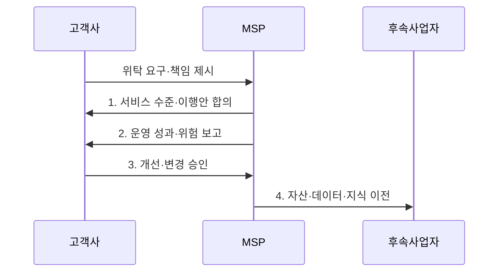

---
sidebar:
  order: 14
  label: "014. IT 아웃소싱과 MSP (IT Outsourcing & Managed Service Provider)"
  badge:
    text: "기출 · 50%"
    variant: note
title: "IT 아웃소싱과 MSP (IT Outsourcing & MSP)"
date: "2026-07-31T05:50:30+09:00"
tags:
  - "notes-law_policy"
weight: 14
extra:
  question_no: "014"
  source_status: "기출"
  source_history: "131회"
  priority: 50
  priority_note: "131회 기출, MSP 전환과 책임 경계 비교"
---

## 미리 알고가기

- **정보기술 아웃소싱(IT Outsourcing)**: 기업의 정보시스템 개발, 운영, 인프라 관리 등의 업무 전부 또는 일부를 외부 전문 업체에 위탁하여 수행하는 경영 기획 기법
- **클라우드 관리 서비스 제공사(Managed Service Provider, MSP)**: 고객의 멀티·하이브리드 클라우드 인프라를 최적화하고 기술 지원, 자원 모니터링, 비용 절감 및 보안을 대행하는 전문 기업
- **서비스 수준 합의서(Service Level Agreement, SLA)**: 위탁 계약 시 제공할 서비스의 가용성, 장애 복구 시간 등의 성능 목표 수준과 이에 미달할 때의 패널티 조건을 명시한 공식 합의서
- **서비스 수준 관리(Service Level Management, SLM)**: 합의된 SLA 지표를 달성하기 위해 실시간 성과를 감시하고 피드백을 통해 서비스 품질을 지속적으로 제어하는 관리 활동

## Ⅰ. 개요

- 정의/개념: 정보기술 업무를 외부에 위탁하고 성과를 통제하는 **서비스 조달**
- 배경/필요성: 내부 전문성·확장성 부족으로 자체 운영의 **품질·비용 최적화 제약**

### 쉽게 이해하기 (학습용)
- 정보기술 업무를 전문 업체에 맡기되 서비스 기준과 핵심 의사결정 권한은 위탁 조직이 유지하는 활동입니다.

## Ⅱ. 특징

- **책임 분리**: 고객이 요구·통제 기준을 정하고 외부 사업자가 합의된 범위의 운영 수행
- **성과 계약**: **SLA·SLM**으로 가용성·복구·보안 목표와 미달 책임 관리
- **통제권 유지**: 관리 서비스 제공사가 비용·성능·보안을 운영하더라도 고객이 의사결정권과 핵심 지식 보유

### 쉽게 이해하기 (학습용)
- MSP는 전문 도구와 운영 역량으로 클라우드 비용·성능·보안을 지속 관리하는 서비스 제공자입니다.

## Ⅲ. 구조 및 구성요소

| 구성요소 | 책임 |
|:---|:---|
| **위탁 범위** | 운영·개발·인프라·보안의 **책임 경계** |
| **서비스 수준 합의서** | 가용성·복구·응답·보안 목표와 **미달 책임** |
| **운영 거버넌스** | 변경·비용·위험에 대한 고객의 **승인·감독** |
| **성과 관리** | 서비스 수준 지표의 **측정·개선 추적** |
| **전환·출구 계획** | 계약 종료 시 자산·데이터·지식의 **이전 조건** |

### 쉽게 이해하기 (학습용)
- 고객이 통제 기준과 SLA를 정하고 MSP가 운영·감시 결과와 개선 조치를 증적으로 보고하는 구조입니다.

## Ⅳ. 흐름도

1. **서비스 수준·이행안 합의**: 측정 가능한 품질 목표·보고·보상 조건 계약
2. **운영 성과·위험 보고**: 비용·가용성·장애·보안 지표와 개선 필요 사항 제출
3. **개선·변경 승인**: 목표 미달 원인을 분석하고 고객이 개선·변경 여부 결정
4. **자산·데이터·지식 이전**: 계약 종료 조건에 따른 후속 사업자 전환

### 쉽게 이해하기 (학습용)
- 위탁 범위와 서비스 기준을 합의하고 성과를 점검하며 계약 종료 때 자산·데이터·지식을 이전할 계획을 준비합니다.

## Ⅴ. 종류 및 비교

| 구분 | IT 아웃소싱 | MSP |
|:---|:---|:---|
| **적용 기준** | 레거시 인프라·**인력 위탁** 시 | 클라우드 고도화·**자동 관리** 필요 시 |
| **핵심 특징** | **업무 범위·인력 위탁** 중심 | **SLA·비용·자동 운영** 중심 |
| **한계** | 범위 분쟁·**내부 역량 약화** | 플랫폼 종속·**권한 통제 약화** |

> 요약: 시스템 환경에 맞추어 인력 위탁과 전문 운영 관리 선택

### 쉽게 이해하기 (학습용)
- 일반 아웃소싱은 개발·운영 업무를 폭넓게 위탁하고 MSP는 클라우드 운영과 최적화에 특화된 관리 서비스를 제공합니다.

## Ⅵ. 실무 고려사항 및 대책

| 고려사항 | 대책 | 효과 |
|:---|:---|:---|
| 위탁 범위와 **책임 모호성** | 책임 할당표·**서비스 수준 지표**를 계약에 명시 | 장애·비용 **분쟁 감소** |
| 사업자 종속·**내부 역량 약화** | 핵심 설계·계정·**의사결정권**을 내부 유지 | 통제력·**전환 역량 확보** |
| 계약 종료 시 **전환 실패** | 자산 반환·검증 절차를 **출구 계획**에 포함 | 서비스 연속성·**자산 회수 보장** |

### 쉽게 이해하기 (학습용)
- 계약 종료 조건에 소스 코드·데이터·운영 문서의 반환 형식과 검증 절차를 명시합니다.

## Ⅶ. 결론

- 클라우드 운영 역량이 부족하면 **MSP**를 선택하되 **SLA·출구 시험** 계약

### 쉽게 이해하기 (학습용)
- 위탁 뒤에도 핵심 설계 지식과 의사결정권을 내부에 유지해야 성과 저하나 계약 종료 때 안전하게 전환할 수 있습니다.
