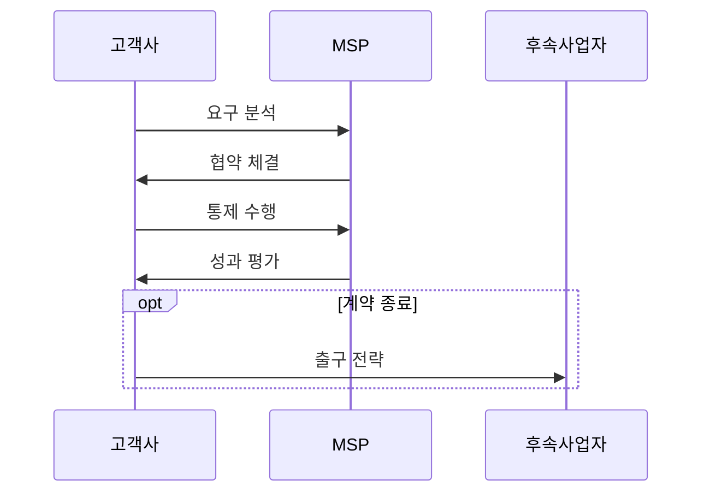

---
sidebar:
  order: 14
  label: "014. IT 아웃소싱과 MSP (IT Outsourcing & Managed Service Provider)"
  badge:
    text: "기출 · 50%"
    variant: note
title: "IT 아웃소싱과 MSP (IT Outsourcing & MSP)"
date: "2026-07-27T23:59:59+09:00"
tags:
  - "notes-law_policy"
weight: 14
extra:
  question_no: "014"
  source_status: "기출"
  source_history: "131회"
  priority: 50
  priority_note: "131회 기출, MSP 전환과 책임 경계 비교"
---

## 미리 알고가기

- **정보기술 아웃소싱(IT Outsourcing)**: 기업의 정보시스템 개발, 운영, 인프라 관리 등의 업무 전부 또는 일부를 외부 전문 업체에 위탁하여 수행하는 경영 기획 기법
- **클라우드 관리 서비스 제공사(Managed Service Provider, MSP)**: 고객의 멀티·하이브리드 클라우드 인프라를 최적화하고 기술 지원, 자원 모니터링, 비용 절감 및 보안을 대행하는 전문 기업
- **서비스 수준 합의서(Service Level Agreement, SLA)**: 위탁 계약 시 제공할 서비스의 가용성, 장애 복구 시간 등의 성능 목표 수준과 이에 미달할 때의 패널티 조건을 명시한 공식 합의서
- **서비스 수준 관리(Service Level Management, SLM)**: 합의된 SLA 지표를 달성하기 위해 실시간 성과를 감시하고 피드백을 통해 서비스 품질을 지속적으로 제어하는 관리 활동

## Ⅰ. 개요

- 정의/개념: IT 업무 외부 위탁 및 책임 기반 성과 통제
- 기존 한계: 자체 운영은 전문성 확보가 어렵고 단순 위탁은 통제권 약화

> 요약: 전문 기술 활용과 비용 절감을 위한 외부 위탁 관리

### 쉽게 이해하기 (학습용)
- 정보기술 업무를 전문 업체에 맡기되 서비스 기준과 핵심 의사결정 권한은 위탁 조직이 유지하는 활동입니다.

## Ⅱ. 특징

- 고객이 업무 요구와 통제 기준을 정하고 외부사가 운영한다.
- SLA로 가용성·장애·보안 책임을 계약한다.
- MSP는 비용·성능·보안을 관리하되 고객은 통제권과 내부 역량을 유지한다.

### 쉽게 이해하기 (학습용)
- MSP는 전문 도구와 운영 역량으로 클라우드 비용·성능·보안을 지속 관리하는 서비스 제공자입니다.

## Ⅲ. 아키텍처 및 구성요소

| 설계 요소 | 설명 |
|:---|:---|
| 위탁 범위 | 운영·개발·인프라·보안 경계 |
| SLA/거버넌스 | 가용성 수치화 및 변경·비용 검토 |
| 성과/전환 | 장애·보안 측정 및 데이터 이전 |

> 요약: 성과 관리 지표 수립을 통한 위탁 품질 검증

### 쉽게 이해하기 (학습용)
- 고객이 통제 기준과 SLA를 정하고 MSP가 운영·감시 결과와 개선 조치를 증적으로 보고하는 구조입니다.

## Ⅳ. 원리 및 절차 흐름도

| 절차 | 핵심 활동 |
|:---|:---|
| 요구 분석 | 위탁 범위·이행 주체 식별 |
| 협약 체결 | 서비스 품질·SLA 설계 |
| 통제 수행 | 품질·장애 실시간 감시 |
| 성과 평가 | 비용·가용성 측정 |
| 출구 전략 | 이전 비용·종속 위험 절감 |

### 쉽게 이해하기 (학습용)
- 위탁 범위와 서비스 기준을 합의하고 성과를 점검하며 계약 종료 때 자산·데이터·지식을 이전할 계획을 준비합니다.

## Ⅴ. IT 운영 위탁 방식 비교

| 구분 | IT 아웃소싱 | MSP |
|:---|:---|:---|
| 적용 기준 | 레거시 인프라 및 전반적인 인력 위탁 시 | 클라우드 환경 고도화 및 자동 관리 필요 시 |
| 핵심 특징 | 업무 범위·인력 위탁 중심 | SLA·비용·자동 운영 중심 |
| 한계 | 범위 분쟁·내부 역량 약화 | 플랫폼 종속·권한 통제 약화 |

> 요약: 시스템 환경에 맞추어 인력 위탁과 전문 운영 관리 선택

### 쉽게 이해하기 (학습용)
- 일반 아웃소싱은 개발·운영 업무를 폭넓게 위탁하고 MSP는 클라우드 운영과 최적화에 특화된 관리 서비스를 제공합니다.

## Ⅵ. 실무 사례

1. 아웃소싱 계약 종료 시 **소스 코드·데이터 반환** 검증

### 쉽게 이해하기 (학습용)
- 계약 종료 조건에 소스 코드·데이터·운영 문서의 반환 형식과 검증 절차를 명시합니다.

## Ⅶ. 결론

- 위탁 위험 통제를 위해 SLA·출구 전략을 검토하여 **MSP** 활용

### 쉽게 이해하기 (학습용)
- 위탁 뒤에도 핵심 설계 지식과 의사결정권을 내부에 유지해야 성과 저하나 계약 종료 때 안전하게 전환할 수 있습니다.
