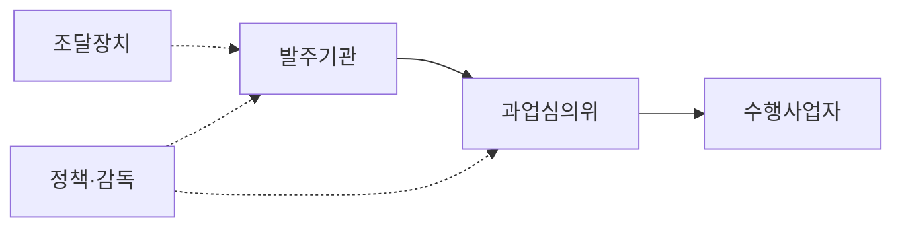
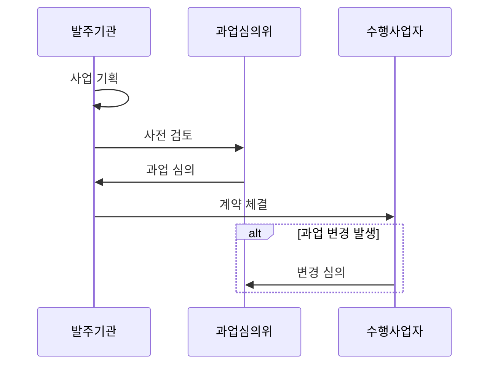

---
sidebar:
  order: 15
  label: "015. 소프트웨어 진흥법 (SW Promotion Act)"
  badge:
    text: "기출 · 50%"
    variant: note
title: "소프트웨어 진흥법"
date: "2026-07-25T22:30:00+09:00"
tags:
  - "notes-law_policy"
weight: 15
extra:
  question_no: "015"
  source_status: "기출"
  source_history: "126회, 129회"
  priority: 50
  priority_note: "분리발주·직접구매를 묶는 SW 법제 핵심"
---

## 미리 알고가기

- **소프트웨어(Software, SW)**: 컴퓨터, 통신 장비 등의 하드웨어를 작동시키고 정보를 처리하는 프로그램과 이와 관련된 일련의 문서 및 기술 서비스
- **정보시스템 마스터 계획(Information System Master Plan, ISMP)**: 구축할 정보시스템의 요건을 상세화하고 예산 범위를 조율하여 발주 규격서를 작성하는 사업 준비 계획
- **상용 소프트웨어 직접구매(상용SW 직접구매)**: 공공사업 발주 시 소프트웨어를 하드웨어나 시스템 통합(SI) 사업과 일괄 계약하지 않고, 발주기관이 직접 조달청을 통해 분리하여 구매하는 제도
- **약어 읽기·표기**: SW는 ‘에스더블유’, ISMP는 ‘아이에스엠피’, SI는 ‘에스아이’로 읽으며 영문 정식명의 머리글자로 소프트웨어·발주 계획·시스템 통합을 구분함
- **도식 기호(→·-.->)**: ‘절차·지원’으로 읽고 실선은 발주·심의·수행 절차, 점선은 조달과 정책의 지원 관계를 나타냄
- **시퀀스 기호(->>·alt/end)**: ‘요청 전달·조건 분기’로 읽고 과업 변경 발생 여부에 따른 심의 흐름을 나타냄

## Ⅰ. 개요

- **정의/개념**: SW 산업 진흥과 공공 SW사업의 계약·과업 규율
- **배경/필요성**: 공정성 확보와 SW 생태계 육성 및 위험 통제

> 요약: 공공 소프트웨어 사업의 공정 계약 및 품질 강화 규격

### 쉽게 이해하기 (학습용)
- 소프트웨어 산업을 진흥하고 공공 소프트웨어사업의 과업·대가·기간과 상용 소프트웨어 조달 기준을 규율하는 법률입니다.

## Ⅱ. 특징

- 산업 진흥과 공공 소프트웨어사업 규율을 포괄한다.
- 과업·대가·기간 기준으로 불공정 발주 위험을 줄인다.
- 직접구매·영향평가·참여 기준으로 시장을 조정한다.
- 적정 사업 기간과 작업 환경으로 수행 여건을 개선한다.

### 쉽게 이해하기 (학습용)
- 공공사업의 과업 변경과 대가를 공식 절차로 심의해 발주자의 일방적 범위 확대와 수행사의 무상 작업을 줄입니다.

## Ⅲ. 아키텍처 및 구성요소

| 설계 요소 | 설명 |
|:---|:---|
| 발주기관 | 요구·기간·예산·직접구매 검토 |
| 수행사업자 | 개발·통합·품질·지원 책임 |
| 과업심의위 | 과업 확정·변경·대가 조정 심의 |
| 조달장치 | 직접구매·영향평가 지원 |
| 정책·감독 | 법령·고시·실태 점검 운영 |

> 요약: 법적 심의 및 조달 장치 조정을 통해 사업 범위 보호

### 쉽게 이해하기 (학습용)
- 발주기관이 사업을 기획하고 과업심의위원회가 범위와 변경을 심의하며 조달 체계가 직접구매 등을 지원합니다.

## Ⅳ. 원리 및 절차 흐름도

| 절차 | 핵심 활동 |
|:---|:---|
| 사업 기획 | 요구사항·사업 기간 정의 |
| 사전 검토 | 상용 SW 직접구매 판별 |
| 과업 심의 | 적정 대가·개발 기간 확정 |
| 계약 체결 | 표준 계약서로 품질 관리 |
| 변경 심의 | 추가 과업의 적정 대가 보상 |

### 쉽게 이해하기 (학습용)
- 사업 준비 단계에서 직접구매 대상을 검토하고 과업을 확정하며, 계약 뒤 변경이 생기면 심의 절차로 대가와 기간을 조정합니다.

## Ⅴ. 종류 및 비교

| 판단 기준 | SW 진흥법 기준 | 임의 발주 관행 |
|:---|:---|:---|
| 요구·과업 | 명확한 범위 정의 및 심의 조정 | 모호한 과업 범위 및 구두 계약 변경 |
| 수행·대가 | 적정 사업 기간 보장 및 대가 지급 | 일방적인 일정 단축 및 무상 과업 요구 |
| 적용 기준 | 공공 소프트웨어 사업 발주 시 | 법적 규제가 미적용되는 일반 발주 시 |

> 요약: 무상 과업 등의 관행을 혁파하고 법적 강제 규격 적용

### 쉽게 이해하기 (학습용)
- 법정 기준은 과업의 자의적 확대와 무상 변경을 줄이고 수행사가 공식 절차로 조정을 요청할 근거를 제공합니다.

## Ⅵ. 실무 사례

1. 과업심의위원회를 통한 추가 과업에 대한 정당 대가 지급
2. 공공 SW 사업 시 대기업 참여 제한 예외 사업 신청 및 검토

### 쉽게 이해하기 (학습용)
- 계약 뒤 생체 인증 기능이 추가되면 과업심의 절차로 범위·대가·기간을 함께 조정합니다.
- 대기업 참여 제한의 예외가 필요한 사업은 법령상 사유와 절차에 따라 신청·검토합니다.

## Ⅶ. 결론

- 사전 과업 심의 및 대가 보상을 통한 소프트웨어 가치 확립

### 쉽게 이해하기 (학습용)
- 과업·대가·기간과 조달 기준을 실제 계약과 변경 관리에 반영해 소프트웨어의 정당한 가치를 보장해야 합니다.
