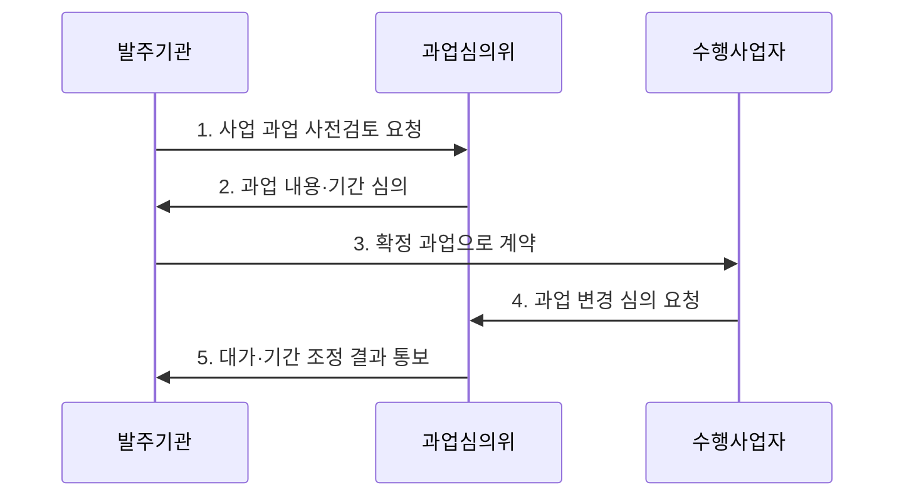

---
sidebar:
  order: 15
  label: "015. 소프트웨어 진흥법 (SW Promotion Act)"
  badge:
    text: "기출 · 50%"
    variant: note
title: "소프트웨어 진흥법"
date: "2026-07-30T11:34:00+09:00"
tags:
  - "notes-law_policy"
weight: 15
extra:
  question_no: "015"
  source_status: "기출"
  source_history: "126회, 129회"
  priority: 50
  priority_note: "분리발주·직접구매를 묶는 SW 법제 핵심"
---

## 미리 알고가기

- **소프트웨어(Software, SW)**: 컴퓨터·통신·자동화 장비 등이 목적에 맞게 작동하도록 하는 프로그램과 관련 자료를 포괄하는 지식 산출물이다.
- **정보시스템 마스터 계획(Information System Master Plan, ISMP)**: 구축할 정보시스템의 기능·기술·품질 요구사항과 이행 계획을 구체화하는 사업 준비 계획이다.
- **상용 소프트웨어 직접구매**: 공공 소프트웨어사업에서 일정 기준에 해당하는 상용 소프트웨어를 시스템 구축 사업과 분리하여 발주기관이 구매하는 제도이다.

## Ⅰ. 개요

- 정의/개념: **소프트웨어 진흥법**은 소프트웨어 산업의 기반 조성과 공공 소프트웨어사업의 과업·계약·조달·사업 참여 질서를 규율하는 **산업 진흥 법률**
- 배경/필요성: 모호한 과업·무상 변경·불합리한 사업 기간으로 악화된 공공 소프트웨어사업의 수행 여건과 공정 거래 질서 개선

### 쉽게 이해하기 (학습용)
- 소프트웨어 산업을 진흥하고 공공 소프트웨어사업의 과업·대가·기간과 상용 소프트웨어 조달 기준을 규율하는 법률입니다.

## Ⅱ. 특징

- **포괄성**: 인력 양성·기술 개발·창업 지원과 공공 소프트웨어사업의 발주 질서를 함께 규율
- **과업 통제**: 과업심의위원회가 사업 전 과업 확정과 계약 후 과업 변경의 적정성 심의
- **시장 보호**: 상용 소프트웨어 직접구매·소프트웨어사업 영향평가·적정 사업 기간으로 공정한 참여 여건 조성

### 쉽게 이해하기 (학습용)
- 공공사업의 과업 변경과 대가를 공식 절차로 심의해 발주자의 일방적 범위 확대와 수행사의 무상 작업을 줄입니다.

## Ⅲ. 구조 및 구성요소

| 구성요소 | 책임 |
|:---|:---|
| 발주기관 | 요구·기간·예산·직접구매 검토 |
| 수행사업자 | 개발·통합·품질·지원 책임 |
| 과업심의위 | 과업 확정·변경·대가 조정 심의 |
| 조달장치 | 직접구매·영향평가 지원 |
| 정책·감독 | 법령·고시·실태 점검 운영 |

### 쉽게 이해하기 (학습용)
- 발주기관이 사업을 기획하고 과업심의위원회가 범위와 변경을 심의하며 조달 체계가 직접구매 등을 지원합니다.

## Ⅳ. 흐름도

1. **사업 과업 사전검토 요청**: 요구사항·직접구매 대상·적정 사업 기간을 포함한 과업 제시
2. **과업 내용·기간 심의**: 과업의 명확성·적정성·수행 가능성을 과업심의위원회에서 검토
3. **확정 과업으로 계약**: 심의 결과를 제안요청서와 계약 내용에 반영
4. **과업 변경 심의 요청**: 계약 후 추가·변경 과업의 범위와 영향을 공식 절차로 제출
5. **대가·기간 조정 결과 통보**: 변경 과업에 필요한 대가와 사업 기간을 함께 조정

### 쉽게 이해하기 (학습용)
- 사업 준비 단계에서 직접구매 대상을 검토하고 과업을 확정하며, 계약 뒤 변경이 생기면 심의 절차로 대가와 기간을 조정합니다.

## Ⅴ. 종류 및 비교

| 구분 | 법정 발주 기준 | 임의 발주 관행 |
|:---|:---|:---|
| 적용 기준 | 공공 소프트웨어 사업 발주 시 | 법적 규제가 미적용되는 일반 발주 시 |
| 핵심 특징 | 과업 심의·적정 기간·대가 | 구두 변경·일방적 일정 조정 |
| 한계 | 절차 준수의 형식화 위험 | 무상 과업·분쟁·품질 저하 |

> 요약: 무상 과업 등의 관행을 혁파하고 법적 강제 규격 적용

### 쉽게 이해하기 (학습용)
- 법정 기준은 과업의 자의적 확대와 무상 변경을 줄이고 수행사가 공식 절차로 조정을 요청할 근거를 제공합니다.

## Ⅵ. 실무 고려사항 및 대책

| 고려사항 | 대책 | 효과 |
|:---|:---|:---|
| 제안요청서의 과업 범위 불명확 | 기능·산출물·완료 기준을 명시하고 계약 전 과업심의 수행 | 견적 정확도 향상과 범위 분쟁 감소 |
| 계약 후 구두·무상 과업 추가 | 변경 요청을 기록하고 과업심의로 대가·기간을 동시 조정 | 정당한 대가 보장과 품질 저하 방지 |
| 직접구매 제품과 구축 사업자의 책임 공백 | 설치·연동·하자·기술지원 책임을 계약서에 구분 | 장애 발생 시 책임 추적과 복구 신속화 |

### 쉽게 이해하기 (학습용)
- 계약 뒤 생체 인증 기능이 추가되면 과업심의 절차로 범위·대가·기간을 함께 조정합니다.

## Ⅶ. 결론

- 공공 소프트웨어사업의 제값과 품질을 함께 확보하려면 **계약 전 과업을 명확히 심의하고 계약 후 변경을 대가·기간 조정과 연계하며 직접구매 제품의 책임 경계를 계약하는 법정 절차 준수** 필요

### 쉽게 이해하기 (학습용)
- 과업·대가·기간과 조달 기준을 실제 계약과 변경 관리에 반영해 소프트웨어의 정당한 가치를 보장해야 합니다.
