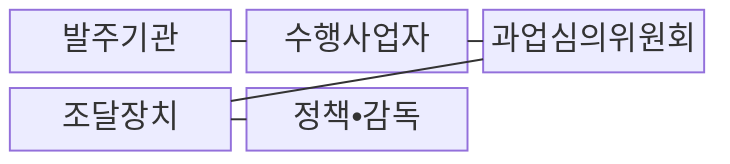
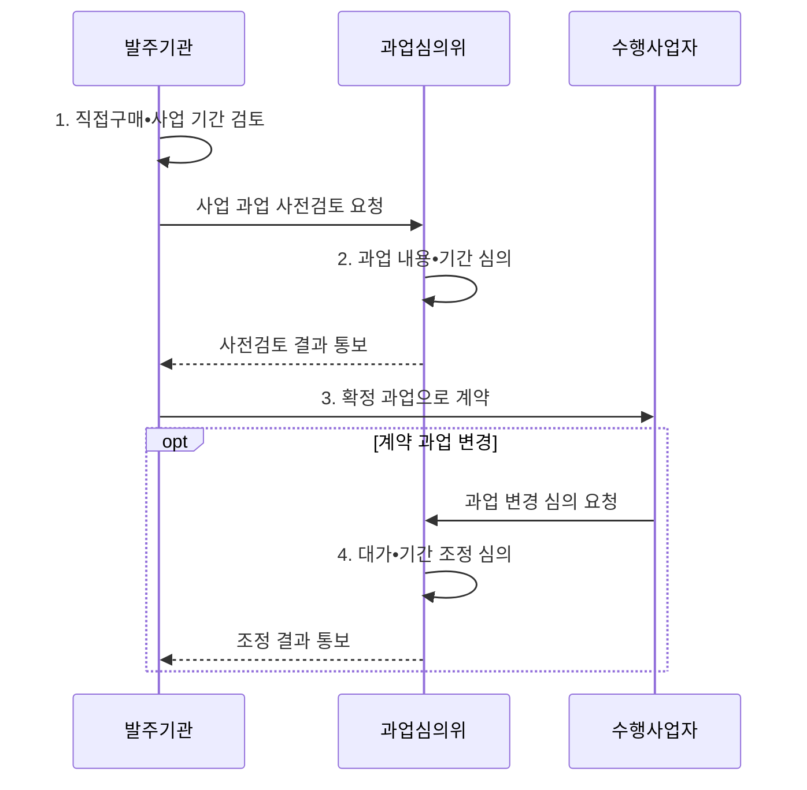

---
sidebar:
  order: 15
  label: "015. 소프트웨어 진흥법 (SW Promotion Act)"
  badge:
    text: "기출 • 50%"
    variant: note
title: "소프트웨어 진흥법"
date: "2026-08-04T14:49:50+09:00"
tags:
  - "notes-law_policy"
weight: 15
extra:
  question_no: "015"
  source_status: "기출"
  source_history: "126회, 129회"
  priority: 50
  priority_note: "분리발주•직접구매를 묶는 SW 법제 핵심"
---

## Ⅰ. 개요

핵심 용어

- **소프트웨어(Software, SW) 진흥법**: SW 산업•기술•인력을 지원하고 공공 SW사업의 발주 질서를 규율하는 법률이다.
- **산업 진흥 법률**: 산업 기반을 육성하고 공정한 시장 질서를 규율하는 법률이다.
- **공공 소프트웨어사업**: 국가•공공기관이 소프트웨어의 기획•구축•운영•유지관리를 발주하는 사업이다.

- 정의/개념: SW 산업과 공공사업 발주 질서를 규율하는 **산업 진흥 법률**
- 배경/필요성: 모호한 과업•무상 변경으로 **수행 여건•공정거래 질서 훼손**

#### 한줄 요약
- 소프트웨어 산업을 진흥하고 공공 소프트웨어사업의 과업•대가•기간과 상용 소프트웨어 조달 기준을 규율하는 법률입니다.

## Ⅱ. 특징

핵심 용어

- **과업 통제**: 과업 통제는 과업심의위원회가 계약 전 범위를 확정하고 계약 뒤 변경의 필요성과 대가•기간을 심의하는 장치다.
- **상용 소프트웨어 직접구매**: 일정 기준의 상용 소프트웨어를 시스템 통합사업과 분리해 발주기관이 직접 구매하는 제도이다.
- **소프트웨어사업 영향평가**: 공공 소프트웨어사업이 민간 시장과 기존 상용 제품에 미칠 영향을 검토해 사업 범위를 조정하는 제도이다.

- **포괄성**: 인력 양성•기술 개발•창업 지원과 공공 소프트웨어사업의 발주 질서를 함께 규율
- **과업 통제**: 과업심의위원회가 사업 전 과업 확정과 계약 후 과업 변경의 적정성 심의
- **시장 보호**: 상용 소프트웨어 직접구매•소프트웨어사업 영향평가•적정 사업 기간으로 공정한 참여 여건 조성

#### 한줄 요약
- 공공사업의 과업 변경과 대가를 공식 절차로 심의해 발주자의 일방적 범위 확대와 수행사의 무상 작업을 줄입니다.

## Ⅲ. 구조 및 구성요소

핵심 용어

- **과업심의위원회**: 과업심의위원회는 공공 소프트웨어사업의 과업 내용•기간과 변경에 따른 대가 조정의 적정성을 심의한다.

| 구성요소 | 책임 |
|:---|:---|
| 발주기관 | 요구•기간•예산•**직접구매 검토** |
| 수행사업자 | 개발•통합•품질•**지원 책임** |
| 과업심의위원회 | 과업 확정•변경•**대가 조정 심의** |
| 조달장치 | **직접구매•영향평가** 지원 |
| 정책•감독 | 법령•고시•**실태 점검** 운영 |

#### 한줄 요약
- 발주기관이 사업을 기획하고 과업심의위원회가 범위와 변경을 심의하며 조달 체계가 직접구매 등을 지원합니다.

## Ⅳ. 흐름도

핵심 용어

- **제안요청서(Request for Proposal, RFP)**: 확정된 과업•기간•산출물•평가 조건을 공급자에게 제시하는 발주 문서이다.
- **대가•기간 조정**: 승인된 과업 변경이 계약금액과 수행 기간에 미치는 영향을 함께 반영하는 조치이다.

**동작 원리**

1. **직접구매•사업 기간 검토**: 대상 제품과 적정 사업 기간의 사전 확인
2. **과업 내용•기간 심의**: 과업의 명확성•적정성•수행 가능성 검토
3. **확정 과업으로 계약**: 심의 결과를 제안요청서와 계약 내용에 반영
4. **대가•기간 조정 심의**: 변경 과업에 필요한 계약금액과 기간 조정

#### 한줄 요약
- 사업 준비 단계에서 직접구매 대상을 검토하고 과업을 확정하며, 계약 뒤 변경이 생기면 심의 절차로 대가와 기간을 조정합니다.

## Ⅴ. 종류 및 비교

핵심 용어

- **공공 SW사업**: 국가•공공기관이 발주하며 과업심의•적정 기간•대가 조정 등 법정 기준을 적용하는 사업이다.
- **과업심의**: 계약 전 과업의 명확성•적정성을 검토하고 계약 후 변경의 필요성과 대가•기간을 심의하는 절차이다.

| 구분 | 법정 발주 기준 | 임의 발주 관행 |
|:---|:---|:---|
| 적용 기준 | 공공 소프트웨어사업의 **법정 발주** 시 | 법정 절차가 없는 **일반 발주** 시 |
| 핵심 특징 | **과업심의•적정 기간•대가** | 구두 변경•**일방적 일정 조정** |
| 한계 | 절차 준수의 **형식화 위험** | **무상 과업•분쟁•품질 저하** |

> 요약: **공공 SW사업** 은 **과업심의•적정 기간•대가 조정** 적용

#### 한줄 요약
- 법정 기준은 과업의 자의적 확대와 무상 변경을 줄이고 수행사가 공식 절차로 조정을 요청할 근거를 제공합니다.

## Ⅵ. 실무 고려사항 및 대책

핵심 용어

- **구두•무상 과업**: 구두•무상 과업은 계약 후 추가 범위를 공식 변경 기록과 대가•기간 조정 없이 수행시키는 문제다.
- **기술지원 책임**: 직접구매 제품의 설치•연동•하자•장애 복구를 어느 공급자가 담당하는지 정한 책임이다.

| 문제 | 대책 | 효과 |
|:---|:---|:---|
| 제안요청서의 **과업 범위 불명확** | 기능•산출물•완료 기준 명시 후 **과업심의** | 견적 정확도 향상•**범위 분쟁 감소** |
| 계약 후 **구두•무상 과업** 추가 | 변경 기록과 **대가•기간 동시 조정** | 정당한 대가•**품질 저하 방지** |
| 직접구매 제품의 **책임 공백** | 설치•연동•하자•**기술지원 책임** 구분 | 장애 책임 추적•**복구 신속화** |

#### 한줄 요약
- 계약 뒤 생체 인증 기능이 추가되면 과업심의 절차로 범위•대가•기간을 함께 조정합니다.

## Ⅶ. 결론

핵심 용어

- 공공 SW사업은 **과업심의** 후 계약하고 변경 시 **대가•기간 조정**

#### 한줄 요약
- 과업•대가•기간과 조달 기준을 실제 계약과 변경 관리에 반영해 소프트웨어의 정당한 가치를 보장해야 합니다.
