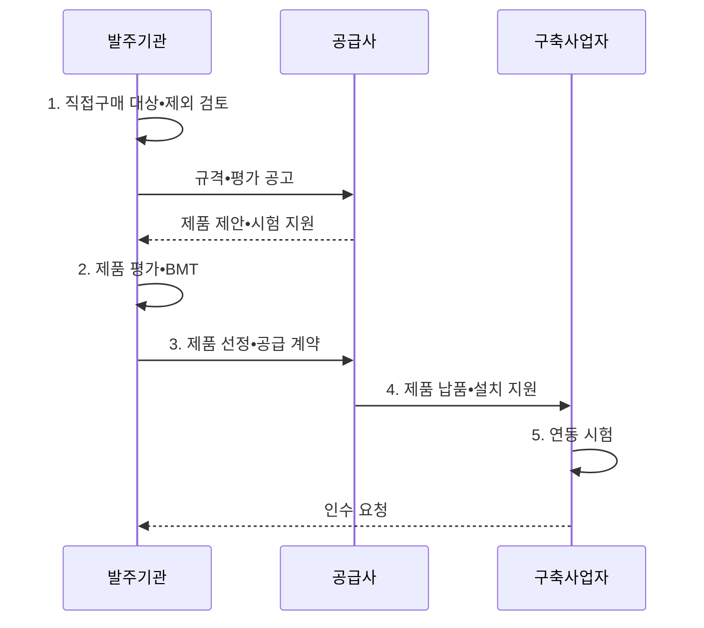

---
sidebar:
  order: 16
  label: "016. 상용SW 직접 구매 (Commercial SW Direct Purchase)"
  badge:
    text: "기출 • 50%"
    variant: note
title: "상용SW 직접 구매 (Commercial SW Direct Purchase)"
date: "2026-08-05T00:00:00+09:00"
tags:
  - "notes-law_policy"
weight: 16
extra:
  question_no: "016"
  source_status: "기출"
  source_history: "126회, 129회"
  priority: 50
  priority_note: "반복 기출, 상용SW 구매 대상•절차의 핵심"
---

## Ⅰ. 개요

<details>
<summary>핵심 용어</summary>

- **상용 소프트웨어(Commercial Software, 상용 SW)**: 다수 고객에게 판매하도록 완제품 형태로 개발돼 라이선스로 이용하는 소프트웨어이다.
- **공공 조달 제도**: 상용 소프트웨어 직접구매는 완제품 소프트웨어를 구축 용역과 분리해 발주기관이 직접 선정•계약하는 공공 조달 제도다.
- **법적 근거**: 「소프트웨어 진흥법」 제54조와 관련 지침을 적용한다.
- **적용 대상**: 사업 규모와 제품 등록•인증 기준으로 직접구매 여부를 판단한다.

</details>

- 정의/개념: 상용 SW를 구축 용역과 분리 계약하는 **공공 조달 제도**
- 배경/필요성: 일괄 구매로 제품 가격•선정•**기술지원 책임 추적 곤란**
- 적용 근거/대상: 「소프트웨어 진흥법」 제54조와 「소프트웨어사업 계약 및 관리감독에 관한 지침」에 따라 총사업규모 3억 원 이상인 사업의 종합쇼핑몰•디지털서비스몰 등록 제품 또는 5천만 원 이상 인증•검증 제품을 검토

#### 한줄 요약

- 공공기관이 직접구매 대상 상용 소프트웨어를 정보시스템 구축 용역에 포함하지 않고 별도 조달 절차로 선정•계약하는 방식이다.

## Ⅱ. 특징

<details>
<summary>핵심 용어</summary>

- **적합성 검증**: 적합성 검증은 중립 규격과 벤치마크 테스트•유지관리 조건으로 제품의 기능•성능•호환성과 지원 능력을 확인한다.
- **벤치마크 테스트(Benchmark Test, BMT)**: 동일한 규격과 시험 조건에서 후보 제품의 기능•성능•호환성을 비교하는 시험이다.

</details>

- **선정 통제**: 발주기관이 요구 규격과 평가 기준을 정하고 제품 선택•공급 계약을 직접 수행
- **책임 분리**: 제품 공급자의 납품•기술지원 책임과 구축 사업자의 설치•연동•통합 책임 구분
- **적합성 검증**: 규격 검토•BMT•유지관리 조건으로 기능•성능•지원 능력 확인

#### 한줄 요약

- 발주기관이 요구에 맞는 제품을 직접 선정하고 공급 계약과 구축 계약의 기술지원•설치•연동 책임을 연결해 하자보수 공백을 막는다.

## Ⅲ. 구조 및 구성요소

<details>
<summary>핵심 용어</summary>

- **조달 계약**: 조달 계약은 제품•라이선스•납기와 기술지원•하자 책임을 공급자에게 명확히 부여한다.
- **라이선스**: 상용 소프트웨어를 정한 사용자•장치•기간•기능 범위에서 사용할 수 있도록 부여한 이용 권리이다.
- **발주기관**: 직접구매 대상과 요구조건을 정하고 제품 계약•구축 계약 사이 책임을 조정하는 주체이다.
- **상용 소프트웨어 공급자**: 제품•라이선스•기술지원•하자보수와 규격 적합성을 책임지는 계약 상대방이다.
- **시스템 구축 사업자**: 직접구매 제품을 목표 시스템에 설치•구성•연동하고 통합 시험을 수행하는 주체이다.
- **통합 검증•운영 지원**: 제품과 구축 결과의 호환성•성능•장애 책임을 공동 기준으로 확인하고 운영 인계를 완성하는 활동이다.

</details>

```text
[발주기관] ----- [조달 계약]
                     /       \
 [상용 소프트웨어 공급자]   [시스템 구축 사업자]
                     \       /
              [통합 검증•운영 지원]
```

선의 의미: 발주기관이 분리한 조달 계약은 상용 소프트웨어 공급자와 시스템 구축 사업자의 책임 경계를 정하고, 두 사업자의 납품•설치•연동 책임은 통합 검증•운영 지원에서 결합되는 정적 계약 구조를 뜻한다.

| 구성요소 | 책임 |
|:---|:---|
| 발주기관 | 대상 판단•규격 작성•**평가•계약** |
| 조달 계약 | 제품•납기•**기술지원•하자 조건** 명시 |
| 상용 소프트웨어 공급자 | 제품•라이선스•**기술지원 제공** |
| 시스템 구축 사업자 | 설치 환경•시스템 연계•**통합 시험** |
| 통합 검증•운영 지원 | 인수•장애•**유지관리 책임 연계** |

#### 한줄 요약

- 발주처, 조달청, 소프트웨어 제조사, 그리고 시스템 구축업체 간의 납품 및 설치 연계 구조이다.

## Ⅳ. 흐름도

<details>
<summary>핵심 용어</summary>

</details>



**동작 원리**

1. **직접구매 대상•제외 검토**: 법정 대상과 예외 사유의 사전 확인
2. **제품 평가•BMT**: 기능•성능•호환성과 기술지원 능력 검증
3. **제품 선정•공급 계약**: **라이선스•납기•기술지원 조건** 확정
4. **제품 납품•설치 지원**: **설치•연동 책임** 에 따라 공급•구축 협업
5. **연동 시험**: **통합 기능•성능•장애 대응** 인수 기준 확인

#### 한줄 요약

- 직접구매 대상 여부를 확인한 후 조달 계약을 맺고 시스템 구축업체와 연계하여 통합 작동 여부를 검증한다.

## Ⅴ. 종류 및 비교

<details>
<summary>핵심 용어</summary>

- **직접 구매**: 직접 구매는 발주기관이 제품을 분리 계약해 가격과 기술지원 책임을 투명하게 관리하는 방식이다.
- **시스템 통합(System Integration, SI) 일괄 구매**: 상용 제품을 시스템 구축 용역에 포함해 통합사업자가 함께 공급하는 조달 방식이다.
- **서비스형 소프트웨어(Software as a Service, SaaS)**: 소프트웨어를 설치•소유하지 않고 네트워크를 통해 구독해 사용하는 서비스 모델이다.
- **서비스 수준 협약(Service Level Agreement, SLA)**: 구독 서비스의 가용성•성능•지원과 미달 책임을 합의한 계약이다.
</details>

| 구분 | 직접 구매 | SI 일괄 구매 | 구독 계약 |
|:---|:---|:---|:---|
| 적용 기준 | 법령•고시의 **직접구매 대상** 제품 | 제외 사유가 인정되는 **밀접한 통합 사업** | **SaaS 이용** 이 적합한 업무 |
| 핵심 특징 | **분리 발주•BMT** 기반 제품 계약 | 구축 용역에 **제품 포함** | 사용권•**SLA 구독 계약** |
| 한계 | 통합 **책임 조정 필요** | 제품 가격•**책임 불투명** | 종속•**장기 비용 증가** |

#### 한줄 요약

- 발주 분리 여부와 비용 지급 형태에 따라 직접구매, 일괄 용역 계약, 구독형 서비스 방식으로 대조한다.

## Ⅵ. 실무 고려사항 및 대책

<details>
<summary>핵심 용어</summary>

- **책임 공백**: 책임 공백은 제품 공급자의 납품•기술지원 범위와 구축 사업자의 설치•연동 범위가 계약에서 연결되지 않을 때 발생한다.
- **중립 규격**: 특정 제품이나 공급자에 유리한 고유 명칭 대신 필요한 기능•성능•호환성으로 작성한 규격이다.
- **총소유비용(Total Cost of Ownership, TCO)**: 제품의 도입 가격뿐 아니라 운영•유지관리•전환•폐기까지 포함한 전체 비용이다.

</details>

| 문제 | 대책 | 효과 |
|:---|:---|:---|
| 특정 제품에 유리한 **규격 작성** | 기능•성능•호환성 중심의 **중립 규격** 마련 | 공정 경쟁•**선택 투명성 확보** |
| 공급자와 구축 사업자의 **책임 공백** | 설치•연동•하자•**장애 책임** 을 계약 간 일치 | 통합 장애의 **원인 규명 신속화** |
| 구매 가격만 고려한 **제품 선정** | **총소유비용•기술지원** 평가 | 장기 운영 비용•**종속 위험 감소** |

#### 한줄 요약

- 공공 정보시스템의 대규모 데이터베이스 소프트웨어 도입 시 직접구매 대상과 제외 사유를 먼저 검토하고 공급자의 기술지원 조건을 계약한다.

## Ⅶ. 결론

<details>
<summary>핵심 용어</summary>

</details>

- **중립 규격•TCO**로 직접구매와 책임 분리 결정

#### 한줄 요약

- 법정 직접구매 대상과 예외를 먼저 판단하고 제품 공급과 구축 용역의 계약 범위•연계 책임을 명확히 해야 한다.
