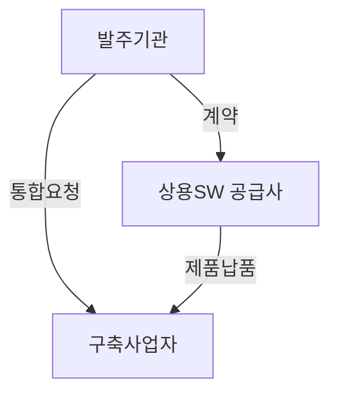
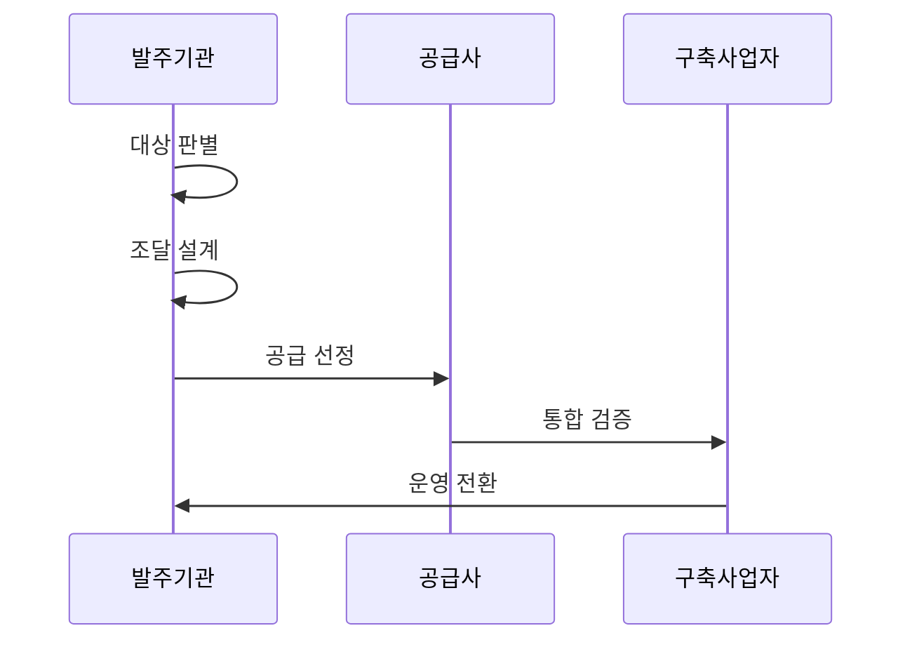

---
sidebar:
  order: 16
  label: "016. 상용SW 직접 구매 (Commercial SW Direct Purchase)"
  badge:
    text: "기출 · 50%"
    variant: note
title: "상용SW 직접 구매 (Commercial SW Direct Purchase)"
date: "2026-07-27T23:59:59+09:00"
tags:
  - "notes-law_policy"
weight: 16
extra:
  question_no: "016"
  source_status: "기출"
  source_history: "126회, 129회"
  priority: 50
  priority_note: "반복 기출, 상용SW 구매 대상·절차의 핵심"
---

## 미리 알고가기

- **상용 소프트웨어(Commercial Software, SW)**: SW는
  ‘에스더블유’로 읽는 머리글자 표기다. 완제품을 뜻한다.
- **나라장터(Korea ON-line E-Procurement System, KONEPS)**:
  ‘코넵스’로 읽는 머리글자 표기다. 공공 조달 창구다.
- **벤치마크 테스트(Benchmark Test, BMT)**: ‘비엠티’로
  읽는 머리글자 표기다. 후보 제품의 성능을 비교한다.
- **시스템 통합(System Integration, SI)**: ‘에스아이’로
  읽는 머리글자 표기다. 제품과 시스템을 연계한다.
- **서비스형 소프트웨어(Software as a Service, SaaS)**:
  ‘사스’로 읽는 축약 표기다. 구독형 소프트웨어를 뜻한다.
- **총소유비용(Total Cost of Ownership, TCO)**: ‘티씨오’로
  읽는 머리글자 표기다. 도입부터 폐기까지의 비용이다.
- **데이터베이스 관리 시스템(Database Management System, DBMS)**:
  ‘디비엠에스’로 읽는 머리글자 표기다. 데이터베이스를 관리한다.
- **서비스 수준 협약(Service Level Agreement, SLA)**: ‘에스엘에이’로
  읽는 머리글자 표기다. 성능·보안 책임 기준을 정한다.
- **2단계 경쟁**: 숫자 2는 기술과 가격의 두 평가 단계를 뜻한다.

## Ⅰ. 개요

- 정의/개념: 공공이 상용SW를 구축 용역과 분리해 조달
- **배경/필요성**: SI 일괄 계약에서 제품 가격·선정 근거·제조사 기술지원 책임 불명확

### 쉽게 이해하기 (학습용)

- 공공기관이 소프트웨어를 살 때 정보시스템 구축 대행업체에게 맡기지 않고 나라장터 등에서 제조사와 직접 계약하여 구매하는 방식이다.

## Ⅱ. 특징

- 발주기관이 제품 선택과 공급 계약을 직접 통제한다.
- 구축사와 제품 공급사의 역할·책임을 분리한다.
- 규격·BMT·유지관리 계약으로 제품 적합성과 기술지원을 검증한다.

### 쉽게 이해하기 (학습용)

- 발주처가 우수한 소프트웨어를 직접 선택하고 개발사와 기술지원 계약을 별도로 맺어 하자보수 공백을 막는다.

## Ⅲ. 아키텍처 및 구성요소

| 설계 요소 | 설명 |
|:---|:---|
| 발주기관 | 조달 계획 수립, 규격 및 BMT 평가 |
| 상용SW 공급사 | 라이선스 공급 및 제조사 직접 기술지원 |
| 구축사업자 | 시스템 연계, 연동 테스트 및 통합 검증 |

### 쉽게 이해하기 (학습용)

- 발주처, 조달청, 소프트웨어 제조사, 그리고 시스템 구축업체 간의 납품 및 설치 연계 구조이다.

## Ⅳ. 원리 및 절차 흐름도

| 절차 | 설명 |
|:---|:---|
| 대상 판별 | 직접구매 의무 대상 여부 및 예산 확인 |
| 조달 설계 | 기술 평가 기준 및 조달 규격서 작성 |
| 공급 선정 | BMT 평가 수행 및 라이선스 공급 계약 |
| 통합 검증 | 구축사업자 주도 시스템 연계 및 테스트 |
| 운영 전환 | 유지관리 체계 이관 및 기술지원 확보 |

### 쉽게 이해하기 (학습용)

- 직접구매 대상 여부를 확인한 후 조달 계약을 맺고 시스템 구축업체와 연계하여 통합 작동 여부를 검증한다.

## Ⅴ. 상용 SW 조달 방식 비교

| 구분 | 직접 구매 | SI 일괄 구매 | 구독 계약 |
|:---|:---|:---|:---|
| 적용 기준 | 고시 금액 이상 상용SW | 자체 개발과 밀접한 연계 요구 시 | 클라우드 자원 활용 시 |
| 핵심 특징 | 제품·유지관리 분리 계약 | 구축 용역에 제품 포함 | 사용권·서비스 수준 계약 |
| 한계 | 통합 책임 조정 필요 | 제품 가격·책임 불투명 | 종속·장기 비용 증가 |

> 요약: 도입 환경 및 요구 방식에 따른 조달 구분

### 쉽게 이해하기 (학습용)

- 발주 분리 여부와 비용 지급 형태에 따라 직접구매, 일괄 용역 계약, 구독형 서비스 방식으로 대조한다.

## Ⅵ. 실무 사례

1. 상용 DBMS 분리발주와 BMT 수행

### 쉽게 이해하기 (학습용)

- 대규모 데이터베이스 소프트웨어 도입 시 조달청 분리발주 제도를 적용해 예산 낭비를 막고 제조사의 기술지원을 확보한다.

## Ⅶ. 결론

- 직접구매 대상이면 제품 계약을 분리한다

### 쉽게 이해하기 (학습용)

- 소프트웨어 개발을 대행하는 용역 계약과 완제품을 구매하는 물품 계약을 철저히 분리하여 기술 생태계를 보호해야 한다.
