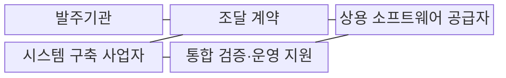

---
sidebar:
  order: 16
  label: "016. 상용SW 직접 구매 (Commercial SW Direct Purchase)"
  badge:
    text: "기출 · 50%"
    variant: note
title: "상용SW 직접 구매 (Commercial SW Direct Purchase)"
date: "2026-07-31T11:44:38+09:00"
tags:
  - "notes-law_policy"
weight: 16
extra:
  question_no: "016"
  source_status: "기출"
  source_history: "126회, 129회"
  priority: 50
  priority_note: "반복 기출, 상용SW 구매 대상·절차의 핵심"
---

## 미리 알고가기

- **상용 소프트웨어(Commercial Software, SW)**: 시장에서 구매하여 사용할 수 있도록 개발된 완제품 소프트웨어다.
- **나라장터(Korea ON-line E-Procurement System, KONEPS)**: 공공기관의 입찰·계약·구매를 처리하는 전자조달 시스템이다.
- **벤치마크 테스트(Benchmark Test, BMT)**: 동일한 조건에서 후보 제품의 성능과 기능을 비교하는 시험이다.
- **시스템 통합(System Integration, SI)**: 소프트웨어·하드웨어·데이터를 연계하여 하나의 정보시스템을 구축하는 사업이다.
- **서비스형 소프트웨어(Software as a Service, SaaS)**: 소프트웨어를 설치하지 않고 네트워크를 통해 구독하는 서비스 방식이다.
- **총소유비용(Total Cost of Ownership, TCO)**: 도입부터 운영·유지보수·폐기까지 발생하는 전체 비용이다.
- **서비스 수준 협약(Service Level Agreement, SLA)**: 서비스의 성능·가용성·보안과 미달 시 책임을 정한 협약이다.

> **키워드:** 상용SW 직접 구매 (Commercial SW Direct Purchase)

## Ⅰ. 개요

- 정의/개념: 상용 SW를 구축 용역과 분리 계약하는 **공공 조달 제도**
- 배경/필요성: 일괄 구매로 제품 가격·선정·**기술지원 책임 추적 곤란**

### 쉽게 이해하기 (학습용)

- 공공기관이 소프트웨어를 살 때 정보시스템 구축 대행업체에게 맡기지 않고 나라장터 등에서 제조사와 직접 계약하여 구매하는 방식이다.

## Ⅱ. 특징

- **선정 통제**: 발주기관이 요구 규격과 평가 기준을 정하고 제품 선택·공급 계약을 직접 수행
- **책임 분리**: 제품 공급자의 납품·기술지원 책임과 구축 사업자의 설치·연동·통합 책임 구분
- **적합성 검증**: 규격 검토·벤치마크 테스트·유지관리 조건으로 기능·성능·지원 능력 확인

### 쉽게 이해하기 (학습용)

- 발주처가 우수한 소프트웨어를 직접 선택하고 개발사와 기술지원 계약을 별도로 맺어 하자보수 공백을 막는다.

## Ⅲ. 구조 및 구성요소

| 구성요소 | 책임 |
|:---|:---|
| 발주기관 | 대상 판단·규격 작성·**평가·계약** |
| 조달 계약 | 제품·납기·**기술지원·하자 조건** 명시 |
| 상용 소프트웨어 공급자 | 제품·라이선스·**기술지원 제공** |
| 시스템 구축 사업자 | 설치 환경·시스템 연계·**통합 시험** |
| 통합 검증·운영 지원 | 인수·장애·**유지관리 책임 연계** |

### 쉽게 이해하기 (학습용)

- 발주처, 조달청, 소프트웨어 제조사, 그리고 시스템 구축업체 간의 납품 및 설치 연계 구조이다.

## Ⅳ. 흐름도

**동작 원리**

1. **직접구매 대상·제외 검토**: 법정 대상과 예외 사유의 사전 확인
2. **제품 평가·BMT**: 기능·성능·호환성과 기술지원 능력 검증
3. **제품 선정·공급 계약**: **라이선스·납기·기술지원 조건** 확정
4. **제품 납품·설치 지원**: **설치·연동 책임**에 따라 공급·구축 협업
5. **연동 시험**: **통합 기능·성능·장애 대응** 인수 기준 확인

### 쉽게 이해하기 (학습용)

- 직접구매 대상 여부를 확인한 후 조달 계약을 맺고 시스템 구축업체와 연계하여 통합 작동 여부를 검증한다.

## Ⅴ. 종류 및 비교

| 구분 | 직접 구매 | SI 일괄 구매 | 구독 계약 |
|:---|:---|:---|:---|
| 적용 기준 | 법령·고시의 **직접구매 대상** 제품 | 제외 사유가 인정되는 **밀접한 통합 사업** | **SaaS 이용**이 적합한 업무 |
| 핵심 특징 | **나라장터·BMT** 기반 분리 계약 | 구축 용역에 **제품 포함** | 사용권·**SLA 구독 계약** |
| 한계 | 통합 **책임 조정 필요** | 제품 가격·**책임 불투명** | 종속·**장기 비용 증가** |

### 쉽게 이해하기 (학습용)

- 발주 분리 여부와 비용 지급 형태에 따라 직접구매, 일괄 용역 계약, 구독형 서비스 방식으로 대조한다.

## Ⅵ. 실무 고려사항 및 대책

| 고려사항 | 대책 | 효과 |
|:---|:---|:---|
| 특정 제품에 유리한 **규격 작성** | 기능·성능·호환성 중심의 **중립 규격** 마련 | 공정 경쟁·**선택 투명성 확보** |
| 공급자와 구축 사업자의 **책임 공백** | 설치·연동·하자·**장애 책임**을 계약 간 일치 | 통합 장애의 **원인 규명 신속화** |
| 구매 가격만 고려한 **제품 선정** | **총소유비용·기술지원** 평가 | 장기 운영 비용·**종속 위험 감소** |

### 쉽게 이해하기 (학습용)

- 대규모 데이터베이스 소프트웨어 도입 시 조달청 분리발주 제도를 적용해 예산 낭비를 막고 제조사의 기술지원을 확보한다.

## Ⅶ. 결론

- **중립 규격·총소유비용**으로 직접구매와 책임 분리 결정

### 쉽게 이해하기 (학습용)

- 소프트웨어 개발을 대행하는 용역 계약과 완제품을 구매하는 물품 계약을 철저히 분리하여 기술 생태계를 보호해야 한다.
