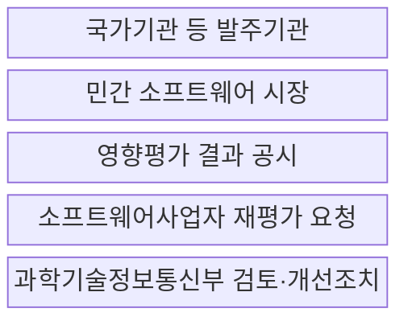
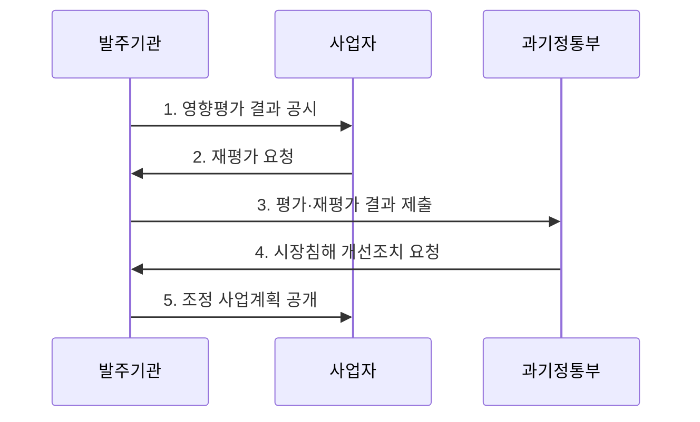

---
sidebar:
  order: 17
  label: "017. 소프트웨어 사업 영향 평가 (SW Business Impact Assessment)"
  badge:
    text: "기출 · 50%"
    variant: note
title: "소프트웨어 사업 영향 평가 (SW Business Impact Assessment)"
date: "2026-07-30T11:50:00+09:00"
tags:
  - "notes-law_policy"
weight: 17
extra:
  question_no: "017"
  source_status: "기출"
  source_history: "128회, 131회, 132회"
  priority: 50
  priority_note: "3회 기출, 민간 SW 시장 영향 검토 제도"
---

## 미리 알고가기

- **소프트웨어 사업 영향평가(SW Business Impact Assessment)**: 공공 소프트웨어 사업이 민간시장에 미치는 영향을 사전에 평가하는 제도다.
- **민간시장 침해(Market Infringement)**: 공공 서비스가 민간 제품·서비스와 경쟁하여 민간의 사업 기회를 제한하는 상황이다.
- **디지털플랫폼정부(Digital Platform Government, DPG)**: 공공 데이터와 서비스를 플랫폼으로 연계하여 국민 맞춤형 서비스를 제공하는 정부 운영 모델이다.
- **응용 프로그램 인터페이스(Application Programming Interface, API)**: 서로 다른 시스템이 기능과 데이터를 정해진 방식으로 교환하는 연결 규약이다.
- **자체평가(Self-Assessment)**: 발주기관이 사업 추진 전에 민간 영향과 직접 구축의 필요성을 점검하는 절차다.

## Ⅰ. 개요

- **소프트웨어사업 영향평가**는 국가기관 등이 공공 소프트웨어사업을 추진하기 전에 민간 소프트웨어 시장에 미치는 영향을 분석하고 사업계획에 반영하는 **사전 규제영향평가 제도**
- **배경/필요성**: 공공기관의 직접 개발·서비스가 기존 민간 제품과 중복되어 사업 기회와 시장 혁신을 위축시키는 위험 예방

### 쉽게 이해하기 (학습용)

- 공공기관이 소프트웨어 사업을 발주하기 전에 민간 시장에 이미 비슷한 서비스가 있는지 확인하여 민간 기업의 영역을 침해하지 않도록 사전 평가하는 제도이다.

## Ⅱ. 특징

- **시장 대체성**: 민간 유사 제품·서비스의 존재와 공공 사업에 의한 대체 가능성 검토
- **사전 조정성**: 입찰공고 전 평가를 통해 직접 개발의 필요성과 기능·범위 조정 가능성 확인
- **이의 절차**: 결과 공시·사업자의 재평가 요청·정부의 개선조치 요청으로 평가의 객관성 보완

### 쉽게 이해하기 (학습용)

- 공공이 새 서비스를 직접 개발하기 전에 기존 민간 소프트웨어로 목적을 달성할 수 있는지 검토합니다.

## Ⅲ. 구조 및 구성요소

| 설계 요소 | 설명 |
|:---|:---|
| 국가기관 등 발주기관 | 영향평가 실시·결과 공시·사업계획 반영 |
| 민간 소프트웨어 시장 | 유사 제품·서비스와 공공 사업의 중복·대체성 판단 대상 |
| 영향평가 결과 공시 | 평가 근거와 민간시장 침해 가능성의 공개 |
| 소프트웨어사업자 재평가 요청 | 공시 결과에 이의가 있는 사업자의 검토 요청 절차 |
| 과학기술정보통신부 검토·개선조치 | 평가·재평가 결과를 검토하고 침해 가능성에 대한 개선 요청 |

### 쉽게 이해하기 (학습용)

- 국가기관 등이 평가 결과를 공시하고 사업자가 재평가를 요청하며 과기정통부가 결과를 검토하는 관계입니다.

## Ⅳ. 흐름도

| 절차 | 설명 |
|:---|:---|
| 영향평가 결과 공시 | 대상·제외 여부를 확인하고 민간 유사 서비스와 대체성을 분석한 결과 공개 |
| 재평가 요청 | 소프트웨어사업자가 공시된 평가의 근거·결론에 이의를 제기 |
| 평가·재평가 결과 제출 | 발주기관이 정부 검토를 위해 결과서와 조치 내용을 제출 |
| 시장침해 개선조치 요청 | 침해 가능성이 예상되면 민간 활용·기능 축소 등 개선 요구 |
| 조정 사업계획 공개 | 평가 결과에 따라 범위·확보 방식을 조정하여 사업 추진 |

### 쉽게 이해하기 (학습용)

- 평가 대상을 확인하고 민간시장 영향을 분석해 결과를 공시한 뒤 사업계획에 반영합니다.

## Ⅴ. 종류 및 비교

| 구분 | 직접 구축 | 민간 활용 |
|:---|:---|:---|
| 적용 기준 | 고유성·부재 입증 | 서비스 활용 목적 달성 |
| 핵심 특징 | 공공 고유 기능 직접 구현 | 기존 민간 제품·서비스 활용 |
| 한계 | 시장 중복·운영 책임 증가 | 공급자 종속·맞춤 한계 |

> 요약: 직접 구축과 민간 활용 방식을 비교 검증함

### 쉽게 이해하기 (학습용)

- 사업 목적과 공공성에 따라 자체 시스템을 직접 구축할 것인지 아니면 이미 검증된 민간의 상용 서비스를 도입할 것인지 대조한다.

## Ⅵ. 실무 고려사항 및 대책

| 고려사항 | 대책 | 효과 |
|:---|:---|:---|
| 민간 유사 서비스 조사 누락 | 제품·서비스·공공 조달 사례를 조사하고 사업자의 의견 수렴 | 시장 중복 판단의 객관성 향상 |
| 공공성만으로 직접 구축 정당화 | 법적 의무·보안·연계 특수성과 민간 대체 가능성을 비교 | 불필요한 직접 개발 감소 |
| 평가 결과의 사업 미반영 | 공시·재평가·개선조치와 제안요청서 변경 이력을 연결 | 형식적 평가 방지와 민간시장 보호 |

### 쉽게 이해하기 (학습용)

- 법령상 시기와 절차에 맞춰 평가서를 작성하고 결과를 공시해 평가 의무를 이행합니다.

## Ⅶ. 결론

- 공공 목적과 민간시장 보호를 균형 있게 달성하려면 **입찰 전 민간 대체재와 직접 구축의 불가피성을 근거로 평가하고 재평가·개선조치 결과를 사업 범위와 확보 방식에 반영하는 영향평가** 필요

### 쉽게 이해하기 (학습용)

- 중복 개발을 줄이고 공공 목적과 민간시장 보호가 균형을 이루도록 평가 결과를 사업에 반영해야 합니다.
