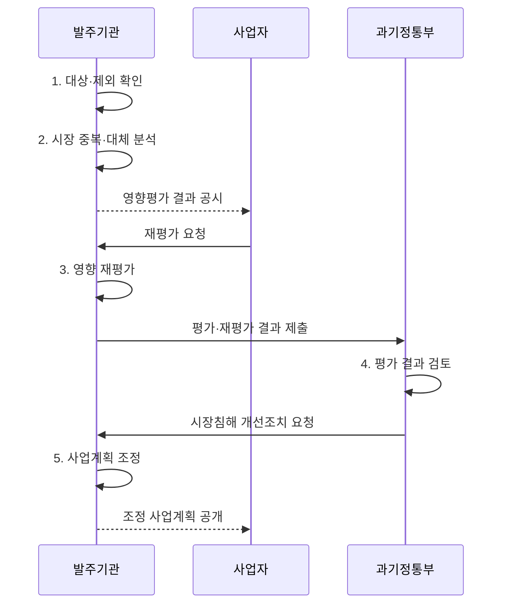

---
sidebar:
  order: 17
  label: "017. 소프트웨어 사업 영향 평가 (SW Business Impact Assessment)"
  badge:
    text: "기출 · 50%"
    variant: note
title: "소프트웨어 사업 영향 평가 (SW Business Impact Assessment)"
date: "2026-08-02T12:00:00+09:00"
tags:
  - "notes-law_policy"
weight: 17
extra:
  question_no: "017"
  source_status: "기출"
  source_history: "128회, 131회, 132회"
  priority: 50
  priority_note: "3회 기출, 민간 SW 시장 영향 검토 제도"
---

## Ⅰ. 개요

핵심 용어

- **사전 평가 제도**: 소프트웨어 사업 영향평가는 공공 소프트웨어사업이 민간 제품·서비스를 중복하거나 대체할 가능성을 검토하는 사전 평가 제도다.

- 정의/개념: 공공 SW사업의 민간시장 영향을 보는 **사전 평가 제도**
- 배경/필요성: 공공 직접 개발로 민간 제품의 **중복·대체 위험 증가**

### 쉽게 이해하기 (학습용)

- 공공기관이 소프트웨어 사업을 발주하기 전에 민간 시장에 이미 비슷한 서비스가 있는지 확인하여 민간 기업의 영역을 침해하지 않도록 사전 평가하는 제도이다.

## Ⅱ. 특징

핵심 용어

- **자체평가·사전 조정**: 자체평가·사전 조정은 입찰공고 전에 직접 개발 필요성과 민간 대체성을 검토해 사업 기능과 범위를 조정한다.

- **시장 대체성**: 민간 유사 제품·서비스의 존재와 공공 사업에 의한 대체 가능성 검토
- **자체평가·사전 조정**: 입찰공고 전 직접 개발의 필요성과 기능·범위 조정
- **이의 절차**: 결과 공시·사업자의 재평가 요청·정부의 개선조치 요청으로 평가의 객관성 보완

### 쉽게 이해하기 (학습용)

- 공공이 새 서비스를 직접 개발하기 전에 기존 민간 소프트웨어로 목적을 달성할 수 있는지 검토합니다.

## Ⅲ. 구조 및 구성요소

핵심 용어

- **소프트웨어사업자 재평가 요청**: 소프트웨어사업자 재평가 요청은 민간 사업자가 공시된 영향평가의 근거와 시장 침해 판단을 다시 검토하도록 요구하는 절차다.

| 구성요소 | 책임 |
|:---|:---|
| 국가기관 등 발주기관 | 영향평가·공시·**사업계획 반영** |
| 민간 소프트웨어 시장 | 유사 제품과 **중복·대체성 판단** |
| 영향평가 결과 공시 | 평가 근거와 **침해 가능성 공개** |
| 소프트웨어사업자 재평가 요청 | 공시 결과의 **이의·검토 요청** |
| 과학기술정보통신부 | 결과 검토와 **개선조치 요청** |

### 쉽게 이해하기 (학습용)

- 국가기관 등이 평가 결과를 공시하고 사업자가 재평가를 요청하며 과기정통부가 결과를 검토하는 관계입니다.

## Ⅳ. 흐름도

핵심 용어

- **4. 평가 결과 검토**: 과학기술정보통신부는 평가와 재평가 결과에서 민간시장 침해 가능성과 개선조치 필요성을 검토한다.

**동작 원리**

1. **대상·제외 확인**: 입찰공고 30일 전까지 법정 대상과 제외 사유 확인
2. **시장 중복·대체 분석**: 민간 유사 제품과 공공사업의 시장 대체 가능성 분석
3. **영향 재평가**: 사업자의 이의 근거와 최초 평가 결과 재검토
4. **평가 결과 검토**: 민간시장 침해 가능성과 개선조치 필요성 검토
5. **사업계획 조정**: 민간 활용·기능 축소·확보 방식 변경 반영

### 쉽게 이해하기 (학습용)

- 평가 대상을 확인하고 민간시장 영향을 분석해 결과를 공시한 뒤 사업계획에 반영합니다.

## Ⅴ. 종류 및 비교

핵심 용어

- **민간 활용**: 민간 활용은 공공 목적을 달성할 수 있는 기존 제품·서비스를 구매하거나 연계해 불필요한 직접 개발을 줄인다.

| 구분 | 직접 구축 | 민간 활용 |
|:---|:---|:---|
| 적용 기준 | 공공 고유성·**민간 제품 부재** 입증 | 민간 서비스로 **사업 목적 달성** |
| 핵심 특징 | 공공 고유 기능의 **직접 구현** | 기존 **민간 제품·서비스 활용** |
| 한계 | 시장 중복·**운영 책임 증가** | 공급자 종속·**맞춤 한계** |

### 쉽게 이해하기 (학습용)

- 사업 목적과 공공성에 따라 자체 시스템을 직접 구축할 것인지 아니면 이미 검증된 민간의 상용 서비스를 도입할 것인지 대조한다.

## Ⅵ. 실무 고려사항 및 대책

핵심 용어

- **사업 미반영**: 사업 미반영은 영향평가에서 확인한 시장 중복과 개선조치를 실제 기능·조달 방식 변경에 반영하지 않는 문제다.

| 문제 | 대책 | 효과 |
|:---|:---|:---|
| 민간 유사 서비스의 **조사 누락** | 제품·조달 사례 조사와 **사업자 의견 수렴** | 시장 중복 판단의 **객관성 향상** |
| 공공성만으로 **직접 구축 정당화** | 법적 의무·보안과 **민간 대체성 비교** | 불필요한 **직접 개발 감소** |
| 평가 결과의 **사업 미반영** | 공시·재평가·개선조치와 **변경 이력 연결** | 형식적 평가 방지·**민간시장 보호** |

### 쉽게 이해하기 (학습용)

- 법령상 시기와 절차에 맞춰 평가서를 작성하고 결과를 공시해 평가 의무를 이행합니다.

## Ⅶ. 결론

핵심 용어

- **민간 대체성·구축 불가피성**: 민간 제품으로 목적을 달성할 수 있는지와 공공 직접 구축이 불가피한지를 입증해 사업 범위를 결정해야 한다.

- **민간 대체성·구축 불가피성**으로 공공사업 범위 결정

### 쉽게 이해하기 (학습용)

- 중복 개발을 줄이고 공공 목적과 민간시장 보호가 균형을 이루도록 평가 결과를 사업에 반영해야 합니다.
