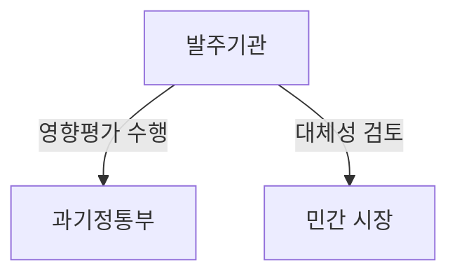
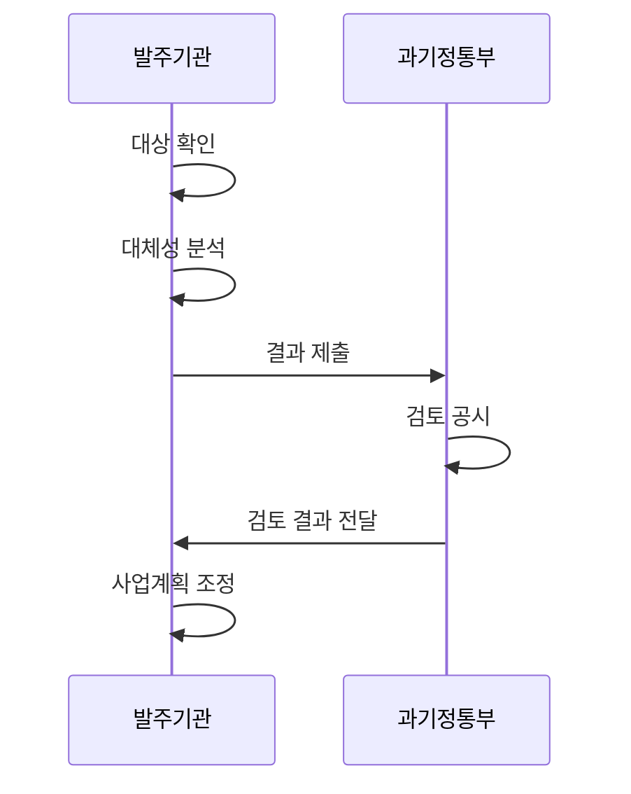

---
sidebar:
  order: 17
  label: "017. 소프트웨어 사업 영향 평가 (SW Business Impact Assessment)"
  badge:
    text: "기출 · 50%"
    variant: note
title: "소프트웨어 사업 영향 평가 (SW Business Impact Assessment)"
date: "2026-07-27T23:59:59+09:00"
tags:
  - "notes-law_policy"
weight: 17
extra:
  question_no: "017"
  source_status: "기출"
  source_history: "128회, 131회, 132회"
  priority: 50
  priority_note: "3회 기출, 민간 SW 시장 영향 검토 제도"
---

## 미리 알고가기

- **소프트웨어 사업 영향평가(SW Business Impact Assessment)**:
  SW는 ‘에스더블유’로 읽는 머리글자 표기다. 민간 영향을 검토한다.
- **민간시장 침해(Market Infringement)**: 공공 서비스가
  민간과 경쟁해 시장을 위축시키는 상황이다.
- **디지털플랫폼정부(Digital Platform Government, DPG)**:
  ‘디피지’로 읽는 머리글자 표기다. 공공·민간 서비스를 연결한다.
- **응용 프로그램 인터페이스(Application Programming Interface, API)**:
  ‘에이피아이’로 읽는 머리글자 표기다. 기능과 데이터를 연결한다.
- **자체평가(Self-Assessment)**: 발주기관이 사업 전
  민간 영향과 직접 구축 필요성을 점검하는 절차다.

## Ⅰ. 개요

- 정의/개념: 공공SW사업의 민간시장 영향을 사전 분석
- **배경/필요성**: 공공 직접 개발이 기존 민간 SW와 중복돼 시장을 위축할 위험

### 쉽게 이해하기 (학습용)

- 공공기관이 소프트웨어 사업을 발주하기 전에 민간 시장에 이미 비슷한 서비스가 있는지 확인하여 민간 기업의 영역을 침해하지 않도록 사전 평가하는 제도이다.

## Ⅱ. 특징

- 민간 유사 서비스와의 중복·대체 가능성을 검토한다.
- 사업 추진 전 평가해 기능 축소·조정 기회를 확보한다.
- 평가 공시·재평가와 사업계획 반영으로 민간 영향 통제한다.

### 쉽게 이해하기 (학습용)

- 공공이 새 서비스를 직접 개발하기 전에 기존 민간 소프트웨어로 목적을 달성할 수 있는지 검토합니다.

## Ⅲ. 아키텍처 및 구성요소

| 설계 요소 | 설명 |
|:---|:---|
| 발주기관 | 영향평가·공시·사업 반영 수행 |
| 소프트웨어사업자 | 공시 결과에 재평가 요청 가능 |
| 과기정통부 | 결과 검토와 개선조치 요청 |

### 쉽게 이해하기 (학습용)

- 국가기관 등이 평가 결과를 공시하고 사업자가 재평가를 요청하며 과기정통부가 결과를 검토하는 관계입니다.

## Ⅳ. 원리 및 절차 흐름도

| 절차 | 설명 |
|:---|:---|
| 대상 확인 | 공공SW 사업의 영향평가 대상 여부 확인 |
| 대체성 분석 | 민간SW 시장 중복성 및 대체 가능성 분석 |
| 결과 제출 | 검토 대상 평가 결과를 제출 |
| 검토 공시 | 평가 결과를 공시하고 검토 |
| 검토 결과 전달 | 공공SW 사업 영향 검토 결과를 전달 |
| 사업계획 조정 | 검토 결과에 따라 기능·범위를 조정 |

### 쉽게 이해하기 (학습용)

- 평가 대상을 확인하고 민간시장 영향을 분석해 결과를 공시한 뒤 사업계획에 반영합니다.

## Ⅴ. 공공 SW 확보 방식 비교

| 구분 | 직접 구축 | 민간 활용 |
|:---|:---|:---|
| 적용 기준 | 고유성·부재 입증 | 서비스 활용 목적 달성 |
| 핵심 특징 | 공공 고유 기능 직접 구현 | 기존 민간 제품·서비스 활용 |
| 한계 | 시장 중복·운영 책임 증가 | 공급자 종속·맞춤 한계 |

> 요약: 직접 구축과 민간 활용 방식을 비교 검증함

### 쉽게 이해하기 (학습용)

- 사업 목적과 공공성에 따라 자체 시스템을 직접 구축할 것인지 아니면 이미 검증된 민간의 상용 서비스를 도입할 것인지 대조한다.

## Ⅵ. 실무 사례

1. 법정 기한 및 절차에 맞춘 영향평가 수행 및 결과 공시

### 쉽게 이해하기 (학습용)

- 법령상 시기와 절차에 맞춰 평가서를 작성하고 결과를 공시해 평가 의무를 이행합니다.

## Ⅶ. 결론

- 민간시장 보호를 위해 대체재·공공성을 검토하여 **영향평가** 활용

### 쉽게 이해하기 (학습용)

- 중복 개발을 줄이고 공공 목적과 민간시장 보호가 균형을 이루도록 평가 결과를 사업에 반영해야 합니다.
