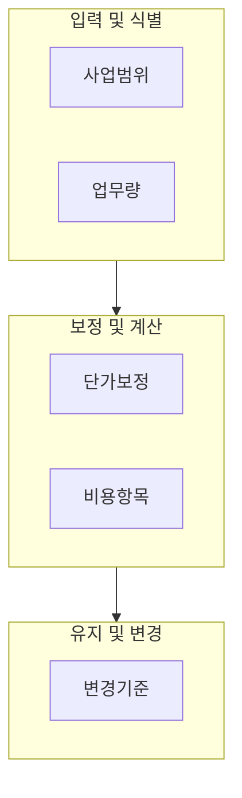
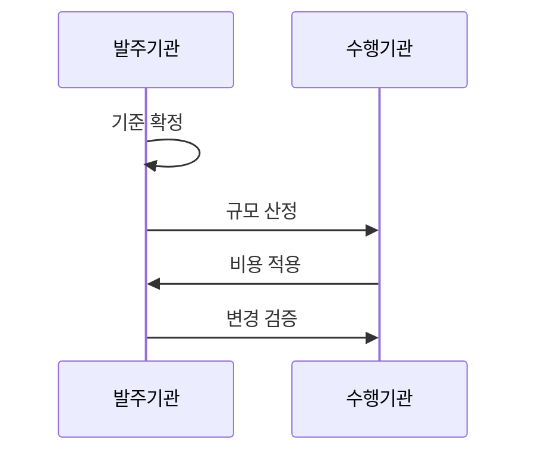

---
sidebar:
  order: 18
  label: "018. 소프트웨어 대가 산정 (SW Cost Estimation)"
  badge:
    text: "기출 · 70%"
    variant: note
title: "소프트웨어 대가 산정 (SW Cost Estimation)"
date: "2026-07-27T23:59:59+09:00"
tags:
  - "notes-law_policy"
weight: 18
extra:
  question_no: "018"
  source_status: "기출"
  source_history: "126회, 135회, 138회"
  priority: 70
  priority_note: "3회 기출, 기능점수·AI 대가 산정의 핵심축"
---

## 미리 알고가기

- **소프트웨어(Software, SW)**: ‘에스더블유’로 읽는
  머리글자 표기다. 대가를 산정할 개발·서비스 대상을 뜻한다.
- **기능점수(Function Point, FP)**: ‘에프피’로 읽는
  머리글자 표기다. 사용자 기능의 규모를 잰다.
- **내부논리파일(Internal Logical File, ILF)**과
  **외부연계파일(External Interface File, EIF)**: 각각
  ‘아이엘에프’, ‘이아이에프’로 읽는다. 데이터 기능을 구분한다.
- **외부입력(External Input, EI)**, **외부출력(External Output, EO)**,
  **외부조회(External Inquiry, EQ)**: ‘이아이·이오·이큐’로 읽는
  머리글자 표기다. 트랜잭션 기능을 분류한다.
- **보정계수(Adjustment Factor, AF)**: ‘에이에프’로 읽는
  머리글자 표기다. 복잡도와 비기능 요구를 반영한다.
- **인공지능(Artificial Intelligence, AI)**: ‘에이아이’로
  읽는 머리글자 표기다. 모델 학습 대가를 구분한다.
- **서비스형 소프트웨어(Software as a Service, SaaS)**:
  ‘사스’로 읽는 축약 표기다. 구독 비용을 산정한다.
- **인월(Person-Month, M/M)**: ‘맨먼스’로 읽으며
  사람과 월을 결합한 단위다. 한 사람의 한 달 작업량이다.

## Ⅰ. 개요

- 정의/개념: 사업 유형·규모·작업량·단가로 대가 산정
- **배경/필요성**: 인원 수 중심 추정만으로 기능 규모·사업 유형·변경 범위 반영 곤란

### 쉽게 이해하기 (학습용)

- 소프트웨어 개발이나 인프라 도입 시 투입될 인력과 기능의 가치를 계산하여 합당한 예산을 뽑아내는 기준이다.

## Ⅱ. 특징

- 개발 사업은 사용자 기능 규모를 중심으로 산정한다.
- 기능 기준선으로 변경 전후의 대가를 일관되게 계산한다.
- 사업 유형별 기준과 데이터·AI·클라우드 작업량을 별도 반영한다.

### 쉽게 이해하기 (학습용)

- 개발 사업은 투입 인원만 세지 않고 사용자가 요구한 기능 규모와 보정 요소를 기준으로 대가를 계산합니다.

## Ⅲ. 아키텍처 및 구성요소

| 설계 요소 | 설명 |
|:---|:---|
| 사업범위 | 기획, 개발, AI 등 사업 유형 정의 |
| 업무량 | 기능점수, 인-월 공수, 데이터 크기 측정 |
| 단가보정 | 연도별 SW 엔지니어 단가 및 복잡도 보정 |
| 비용항목 | 직접인건비, 제경비, 기술료, 이윤 합산 |
| 변경기준 | 요구사항 변경 시 추가 기능 대가 산출 |

### 쉽게 이해하기 (학습용)

- 어떤 성격의 소프트웨어를 얼마나 만드는지 정의하고 보정계수를 더해 금액을 내는 전체적 평가 구성 요소이다.

## Ⅳ. 원리 및 절차 흐름도

| 절차 | 설명 |
|:---|:---|
| 기준 확정 | 사업 유형 정의 및 예산 범위 확정 |
| 규모 산정 | 기능점수 및 투입 공수 산출 |
| 비용 적용 | 단가와 보정계수를 곱하여 금액 계산 |
| 변경 검증 | 추가 요구사항 반영을 위한 증감 확인 |

### 쉽게 이해하기 (학습용)

- 발주기관이 어떤 업무를 할지 결정한 뒤 규모를 측정하여 보정 단가를 곱해 최종 견적을 도출하는 정형화된 수순이다.

## Ⅴ. 소프트웨어 대가 산정 방식 비교

| 구분 | 투입공수 | 기능점수 | AI 도입 |
|:---|:---|:---|:---|
| 적용 기준 | 정형화가 어려운 연구·유지관리 시 | 일반적 소프트웨어 개발 및 재구축 시 | 데이터 전처리 및 모델 학습 필요 시 |
| 핵심 특징 | 인월·기술 등급별 단가 | 데이터·트랜잭션 기능 규모 | 데이터·학습·인프라 작업량 |
| 한계 | 생산성 차이 반영 곤란 | 경계·기능 식별 편차 | 작업 범위·성과 불확실성 |

> 요약: 대상 특성에 맞춘 대가 산정 방식의 대조

### 쉽게 이해하기 (학습용)

- 시스템 성격이 인력 투입 중심인지, 단순 기능 구현 위주인지, 아니면 인공지능 학습 중심인지에 따라 대가를 재는 잣대가 달라진다.

## Ⅵ. 실무 사례

1. 고시 단가로 기능점수 예산 수립

### 쉽게 이해하기 (학습용)

- 공공 정보화사업에서 적용하는 산정 기준과 기능점수 단가로 개발비 근거를 투명하게 작성합니다.

## Ⅶ. 결론

- 기능 규모와 변경 범위로 예산을 확정한다

### 쉽게 이해하기 (학습용)

- 기술 혁신과 신규 비즈니스 모델에 맞춰 산정 기준을 지속해서 갱신해야만 정당한 기술적 가치를 보상할 수 있다.
