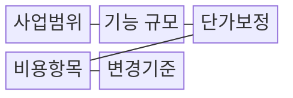
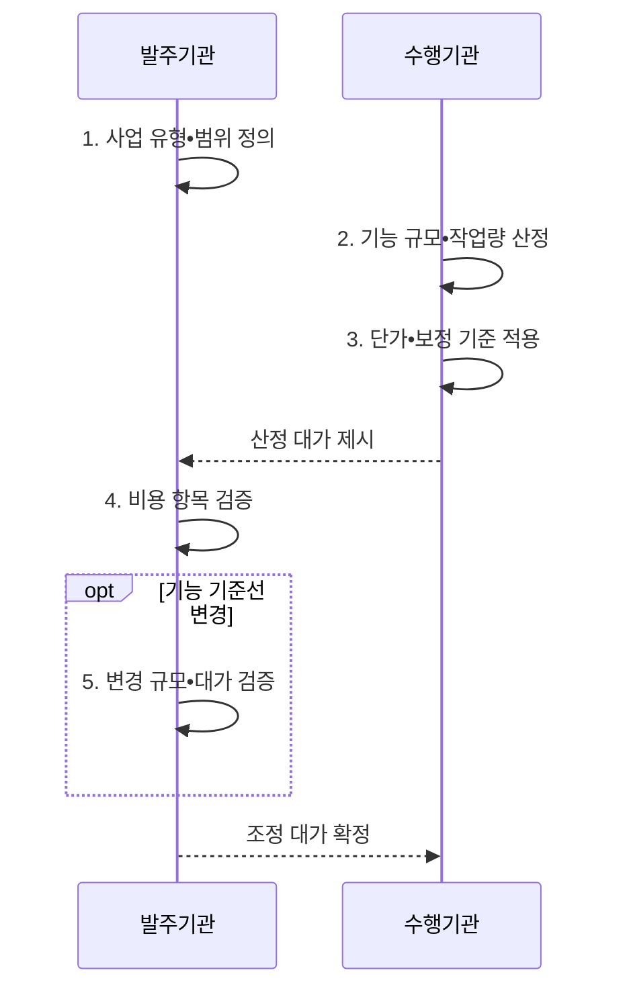

---
sidebar:
  order: 18
  label: "018. 소프트웨어 대가 산정 (SW Cost Estimation)"
  badge:
    text: "기출 • 70%"
    variant: note
title: "소프트웨어 대가 산정 (SW Cost Estimation)"
date: "2026-08-04T14:49:50+09:00"
tags:
  - "notes-law_policy"
weight: 18
extra:
  question_no: "018"
  source_status: "기출"
  source_history: "126회, 135회, 138회"
  priority: 70
  priority_note: "3회 기출, 기능점수•AI 대가 산정의 핵심축"
---

## Ⅰ. 개요

핵심 용어

- **소프트웨어(Software, SW) 대가**: 소프트웨어 사업의 규모•작업량•단가와 보정 요소를 근거로 산정한 적정 비용이다.
- **원가 추정 체계**: 소프트웨어 대가 산정은 사업 규모•작업량과 단가•보정 요소를 근거로 적정 비용을 계산하는 원가 추정 체계다.

- 정의/개념: **SW 대가 산정** — 규모•작업량과 단가로 적정 비용을 계산하는 **원가 추정 체계**
- 배경/필요성: 투입 인원만으로는 **기능 규모•변경 가치 산정 곤란**

#### 한줄 요약

- 소프트웨어 사업의 기능 규모•작업량•단가로 적정 예산을 산정하는 기준

## Ⅱ. 특징

핵심 용어

- **기능점수(Function Point, FP)**: 사용자가 인식하는 데이터•입력•출력•조회 기능을 유형과 복잡도로 계량한 소프트웨어 규모 단위이다.
- **인공지능(Artificial Intelligence, AI) 사업**: 데이터 전처리•모델 학습•검증•배포와 맞춤화 작업을 포함하는 사업 유형이다.
- **추적 가능성**: 추적 가능성은 승인된 기능 기준선과 요구 변경 전후의 규모•기간•대가 증감을 연결해 산정 근거를 재현하게 한다.

- **규모 기반성**: 개발 사업은 사용자가 인식하는 데이터•트랜잭션 기능을 기능점수로 측정
- **추적 가능성**: 기능 기준선을 통해 요구사항 변경 전후의 규모와 대가 증감을 연결
- **유형 적합성**: 기획•개발•유지관리•데이터•인공지능•클라우드의 작업 특성에 맞는 산정 방식 선택

#### 한줄 요약

- 투입 인원뿐 아니라 사용자 기능 규모와 보정 요소를 반영한 대가 산정

## Ⅲ. 구조 및 구성요소

핵심 용어

- **기능 규모**: 기능 규모는 사용자가 인식하는 데이터와 입력•출력•조회 기능을 기능점수로 계수한 소프트웨어 규모다.
- **내부 논리 파일(Internal Logical File, ILF)**: 산정 대상 시스템이 유지•관리하는 사용자 관점의 논리 데이터 집합이다.
- **외부 연계 파일(External Interface File, EIF)**: 다른 시스템이 관리하고 산정 대상 시스템이 참조하는 논리 데이터 집합이다.
- **외부 입력(External Input, EI)**: 외부에서 들어온 데이터로 내부 논리 파일이나 시스템 상태를 변경하는 기능이다.
- **외부 출력(External Output, EO)**: 계산•가공한 데이터나 제어 정보를 시스템 밖으로 제공하는 기능이다.
- **외부 조회(External Query, EQ)**: 내부 데이터를 변경하지 않고 요청 조건에 맞는 정보를 조회•반환하는 기능이다.
- **조정 계수(Adjustment Factor, AF)**: 시스템 특성•복잡도 등 보정 요소를 기능 규모나 단가에 반영하는 계수이다.

| 구성요소 | 책임 |
|:---|:---|
| 사업범위 | 기획•개발•**인공지능 사업 유형** 정의 |
| 기능 규모 | 데이터•입력•출력•조회 **기능점수** 측정 |
| 단가보정 | 엔지니어 단가와 **조정 계수** 적용 |
| 비용항목 | 인건비•제경비•**기술료•이윤** 합산 |
| 변경기준 | 요구 변경의 **추가 대가** 산출 |

#### 한줄 요약

- 사업 유형•기능 규모•단가 보정을 연결한 소프트웨어 대가 구성

## Ⅳ. 흐름도

핵심 용어

- **투입공수**: 과업을 수행하는 데 필요한 인력 수와 투입 기간을 결합한 작업량이다.
- **기능 기준선**: 승인된 기능 목록과 규모를 변경 전후의 대가•기간 조정 기준으로 고정한 상태이다.

**동작 원리**

1. **사업 유형•범위 정의**: 개발•운영•데이터•인공지능의 **산정 대상•책임 범위** 확정
2. **기능 규모•작업량 산정**: **기능점수•과업별 투입공수** 를 근거로 측정
3. **단가•보정 기준 적용**: **단가•복잡도•품질 보정 요소** 반영
4. **비용 항목 검증**: **직접비•제경비•기술료 산식** 확인
5. **변경 규모•대가 검증**: 기준선 대비 **추가•삭제 기능**으로 대가 조정

#### 한줄 요약

- 사업 범위 확정부터 규모 측정•단가 보정•변경 검증까지의 대가 산정 절차

## Ⅴ. 종류 및 비교

핵심 용어

- **투입공수 방식**: 수행 인력의 직무•등급•투입 기간을 인월(Man-Month, M/M)로 산정하는 방식이다.
- **혼합 산정**: 기능으로 계량할 수 있는 범위는 기능점수를 적용하고 데이터 구축•모델 학습처럼 기능점수로 표현하기 어려운 작업은 투입공수로 산정하는 접근이다.

| 산정 접근 | 투입공수 방식 | 기능점수 방식 |
|:---|:---|:---|
| 적용 범위 | 연구•유지관리처럼 **기능 규모 측정이 어려운 작업** | 데이터•트랜잭션 기능이 식별되는 **개발•재구축** |
| 산정 근거 | **M/M•직무별 단가** | **FP•보정계수•단가** |
| 한계 | 인력별 **생산성 차이•투입 적정성** 검증 부담 | 시스템 경계와 **기능 식별 편차** |

- 인공지능 사업의 기능 식별 범위는 **기능점수 방식**, 데이터•모델 작업은 **투입공수 방식** 기반 **혼합 산정**

#### 한줄 요약

- 기능 규모와 작업량 산정 범위를 구분한 인공지능 사업의 혼합 산정

## Ⅵ. 실무 고려사항 및 대책

핵심 용어

- **주관적 식별**: 주관적 식별은 시스템 경계와 데이터•트랜잭션 기능의 판정 근거가 없어 평가자마다 기능점수가 달라지는 문제다.
- **오차 범위**: 초기 정보 부족에 따라 실제 비용이 추정값에서 벗어날 수 있는 상•하한의 범위이다.

| 문제 | 대책 | 효과 |
|:---|:---|:---|
| 요구 불명확 상태의 **조기 확정 견적** | 사전•상세 산정을 구분하고 **오차 범위** 명시 | 예산 과소•과대 **산정 위험 감소** |
| 기능점수의 **주관적 식별** | 경계•기능의 판정 근거 기록과 **독립 검토** | 규모 측정의 **일관성•재현성 향상** |
| 추가 과업의 **무상 수행** | 기능 기준선과 **규모•기간•대가** 동시 조정 | 정당한 보상•**일정•품질 보호** |

#### 한줄 요약

- 공공 정보화사업의 산정 기준과 기능점수 단가에 따른 개발비 근거 명확화

## Ⅶ. 결론

핵심 용어

- **변경 범위**: 기준선에서 추가•삭제된 기능을 식별한 조정 대상이다.

- **기능 규모•변경 범위** 로 SW 대가 조정

#### 한줄 요약

- 기술•사업 변화에 맞춘 산정 기준 갱신과 정당한 기술 가치 보상
