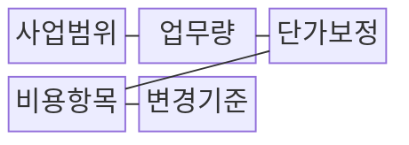
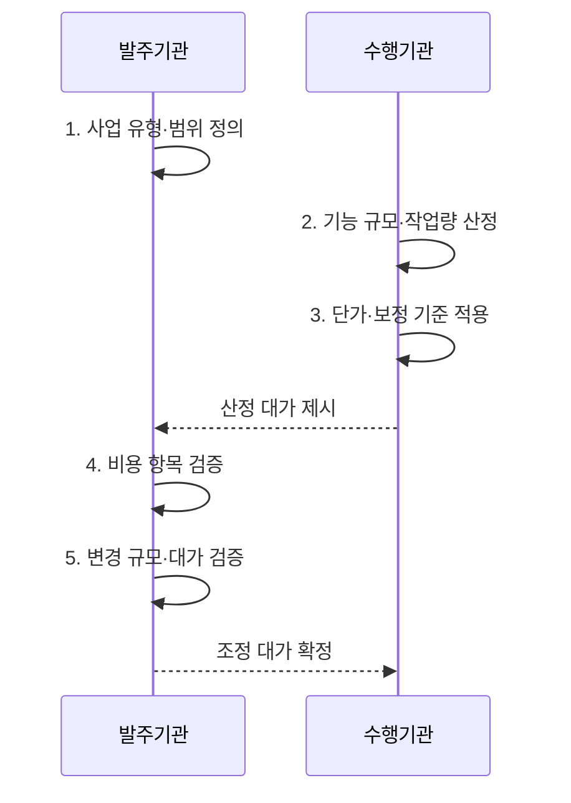

---
sidebar:
  order: 18
  label: "018. 소프트웨어 대가 산정 (SW Cost Estimation)"
  badge:
    text: "기출 · 70%"
    variant: note
title: "소프트웨어 대가 산정 (SW Cost Estimation)"
date: "2026-07-31T05:53:05+09:00"
tags:
  - "notes-law_policy"
weight: 18
extra:
  question_no: "018"
  source_status: "기출"
  source_history: "126회, 135회, 138회"
  priority: 70
  priority_note: "3회 기출, 기능점수·AI 대가 산정의 핵심축"
---

## 미리 알고가기

- **소프트웨어(Software, SW)**: 개발·운영 대가를 산정하는 프로그램과 관련 서비스다.
- **기능점수(Function Point, FP)**: 사용자가 인식하는 데이터·처리 기능을 기준으로 소프트웨어 규모를 측정하는 단위다.
- **내부논리파일·외부연계파일(Internal Logical File·External Interface File, ILF·EIF)**: 시스템이 직접 관리하는 데이터와 외부 시스템이 관리하는 참조 데이터를 구분한다.
- **외부입력·외부출력·외부조회(External Input·External Output·External Inquiry, EI·EO·EQ)**: 데이터의 입력, 가공 결과의 출력, 단순 조회 기능을 구분한다.
- **보정계수(Adjustment Factor, AF)**: 시스템 복잡도와 비기능 요구를 규모 또는 대가에 반영하는 계수다.
- **인공지능(Artificial Intelligence, AI)**: 데이터 학습을 통해 분류·예측·생성 기능을 수행하는 시스템이다.
- **인월(Person-Month, M/M)**: 한 사람이 한 달 동안 수행하는 작업량을 나타내는 투입 단위다.

## Ⅰ. 개요

- 정의/개념: 규모·작업량과 단가로 적정 비용을 계산하는 **원가 추정 체계**
- 배경/필요성: 투입 인원만으로는 **기능 규모·변경 가치 산정 곤란**

### 쉽게 이해하기 (학습용)

- 소프트웨어 개발이나 인프라 도입 시 투입될 인력과 기능의 가치를 계산하여 합당한 예산을 뽑아내는 기준이다.

## Ⅱ. 특징

- **규모 기반성**: 개발 사업은 사용자가 인식하는 데이터·트랜잭션 기능을 기능점수로 측정
- **추적 가능성**: 기능 기준선을 통해 요구사항 변경 전후의 규모와 대가 증감을 연결
- **유형 적합성**: 기획·개발·유지관리·데이터·인공지능·클라우드의 작업 특성에 맞는 산정 방식 선택

### 쉽게 이해하기 (학습용)

- 개발 사업은 투입 인원만 세지 않고 사용자가 요구한 기능 규모와 보정 요소를 기준으로 대가를 계산합니다.

## Ⅲ. 구조 및 구성요소

| 구성요소 | 책임 |
|:---|:---|
| **사업범위** | 기획·개발·**AI 사업 유형** 정의 |
| **기능 규모** | 사용자 관점의 **FP** 측정 |
| **데이터 기능** | 내부·외부 데이터인 **ILF·EIF** 식별 |
| **입력·출력 기능** | 데이터 처리 기능인 **EI·EO** 식별 |
| **조회 기능** | 단순 조회 기능인 **EQ** 식별 |
| **단가보정** | 엔지니어 단가와 **AF** 적용 |
| **비용항목** | 인건비·제경비·**기술료·이윤** 합산 |
| **변경기준** | 요구 변경의 **추가 대가** 산출 |

### 쉽게 이해하기 (학습용)

- 어떤 성격의 소프트웨어를 얼마나 만드는지 정의하고 보정계수를 더해 금액을 내는 전체적 평가 구성 요소이다.

## Ⅳ. 흐름도

**동작 원리**

1. **사업 유형·범위 정의**: 개발·운영·데이터·인공지능 등 산정 대상과 책임 범위 확정
2. **기능 규모·작업량 산정**: 기능점수 또는 과업별 투입공수를 객관적 근거로 측정
3. **단가·보정 기준 적용**: 적용 시점의 단가와 규모·복잡도·품질 보정 요소 반영
4. **비용 항목 검증**: 직접비·제경비·기술료 등 항목별 산식과 근거 확인
5. **변경 규모·대가 검증**: 기준선 대비 추가·삭제 기능을 측정하여 계약 대가 조정

### 쉽게 이해하기 (학습용)

- 발주기관이 어떤 업무를 할지 결정한 뒤 규모를 측정하여 보정 단가를 곱해 최종 견적을 도출하는 정형화된 수순이다.

## Ⅴ. 종류 및 비교

| 구분 | 투입공수 | 기능점수 | AI 도입 |
|:---|:---|:---|:---|
| **적용 기준** | 정형화가 어려운 **연구·유지관리** | 일반 소프트웨어 **개발·재구축** | 데이터 전처리·**모델 학습** 필요 시 |
| **핵심 특징** | **M/M·직무별 단가** | 데이터·트랜잭션의 **FP 규모** | 데이터·모델·**커스터마이징 작업량** |
| **한계** | 생산성 차이의 **반영 곤란** | 경계·기능의 **식별 편차** | 작업 범위·**성과 불확실성** |

### 쉽게 이해하기 (학습용)

- 시스템 성격이 인력 투입 중심인지, 단순 기능 구현 위주인지, 아니면 인공지능 학습 중심인지에 따라 대가를 재는 잣대가 달라진다.

## Ⅵ. 실무 고려사항 및 대책

| 고려사항 | 대책 | 효과 |
|:---|:---|:---|
| 요구 불명확 상태의 **조기 확정 견적** | 사전·상세 산정을 구분하고 **오차 범위** 명시 | 예산 과소·과대 **산정 위험 감소** |
| 기능점수의 **주관적 식별** | 경계·기능의 판정 근거 기록과 **독립 검토** | 규모 측정의 **일관성·재현성 향상** |
| 추가 과업의 **무상 수행** | 기능 기준선과 **규모·기간·대가** 동시 조정 | 정당한 보상·**일정·품질 보호** |

### 쉽게 이해하기 (학습용)

- 공공 정보화사업에서 적용하는 산정 기준과 기능점수 단가로 개발비 근거를 투명하게 작성합니다.

## Ⅶ. 결론

- **기능 규모·변경 범위**로 SW 대가 조정

### 쉽게 이해하기 (학습용)

- 기술 혁신과 신규 비즈니스 모델에 맞춰 산정 기준을 지속해서 갱신해야만 정당한 기술적 가치를 보상할 수 있다.
