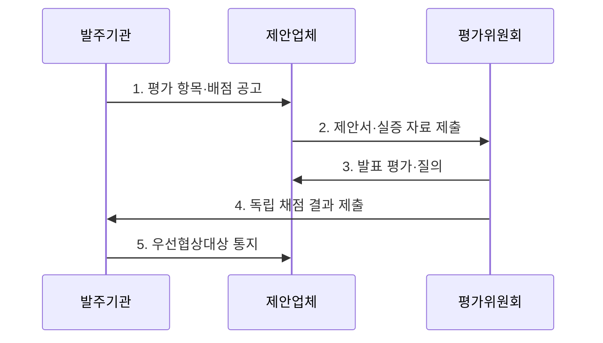

---
sidebar:
  order: 19
  label: "019. 소프트웨어 기술성 평가 (SW Technology Evaluation)"
  badge:
    text: "기출 · 50%"
    variant: note
title: "소프트웨어 기술성 평가 (SW Technology Evaluation)"
date: "2026-07-30T12:05:00+09:00"
tags:
  - "notes-law_policy"
weight: 19
extra:
  question_no: "019"
  source_status: "기출"
  source_history: "132회, 137회"
  priority: 50
  priority_note: "최근 반복 기출, 기술성 평가 항목·절차"
---

## 미리 알고가기

- **제안요청서(Request for Proposal, RFP)**: 발주기관이 사업 요구사항과 제안·평가 조건을 제시하는 문서다.
- **협상에 의한 계약(Negotiated Contract)**: 기술능력과 입찰가격을 종합 평가하여 우선협상대상자를 정하고 협상으로 계약하는 방식이다.
- **기술능력 평가(Technical Capability Evaluation)**: 제안자의 사업 이해·기술·품질·프로젝트 관리 역량을 평가하는 절차이다.
- **차등점수제(Differential Scoring System)**: 순위에 따라 기술점수 차이를 두어 제안자 간 기술 변별력을 높이는 평가 방식이다.
- **벤치마크 테스트(Benchmark Test, BMT)**: 동일한 조건에서 후보 제품의 성능과 기능을 비교하는 시험이다.
- **개념검증(Proof of Concept, PoC)**: 제안 기술이 목표 환경에서 구현 가능한지 사전에 검증하는 활동이다.

## Ⅰ. 개요

- **소프트웨어 기술성 평가**는 제안자의 요구사항 이해도와 기술·품질·관리 역량을 공개된 기준으로 심사하여 사업 수행 적합성을 판단하는 **공공 소프트웨어사업자 선정 절차**
- **배경/필요성**: 가격 중심 선정으로 확인하기 어려운 복잡한 소프트웨어사업의 구현 가능성·운영 품질·수행 위험 검증

### 쉽게 이해하기 (학습용)

- 소프트웨어 구축 사업 시 싼 가격만 보지 않고 제안 업체가 기술적으로 정보화 사업을 제대로 완수할 능력이 있는지 점수를 매겨 평가하는 제도이다.

## Ⅱ. 특징

- **요구 적합성**: 제안 내용이 사업 목표·기능·품질·운영 요구를 충족하는지 평가
- **수행 능력**: 기술 전략·품질보증·프로젝트 관리·인력 역량을 종합하여 실패 위험 판단
- **증거 기반성**: 공개 배점·차등점수와 벤치마크 테스트·개념검증 자료로 기술 변별력 확보

### 쉽게 이해하기 (학습용)

- 사업 특성에 맞는 기술 평가 기준과 배점을 공개하고 필요하면 차등점수와 실증 자료로 제안사를 구분합니다.

## Ⅲ. 구조 및 구성요소

| 구성요소 | 책임 |
|:---|:---|
| 발주기관 | 사업 특성에 맞는 요구사항·평가 항목·배점 설계 |
| 제안요청서·평가 기준 | 제안 조건·증빙 자료·평가 방법과 협상 절차 공개 |
| 제안업체 | 기술 제안서·인력·실적·실증 자료 제출과 발표 |
| 평가위원회 | 이해충돌을 통제하고 독립적으로 제안 내용 심사 |
| 평가 결과·협상 | 기술·가격 평가를 결합하여 우선협상대상자 결정 |

### 쉽게 이해하기 (학습용)

- 발주기관이 낸 제안요청서에 맞춰 제안업체가 기술을 제안하고 외부 평가위원이 심사하는 협업 관계이다.

## Ⅳ. 흐름도

### 동작 원리

1. **평가 항목·배점 공고**: 사업 목표와 위험에 맞는 기술 평가 기준·증빙·배점 공개
2. **제안서·실증 자료 제출**: 제안자가 구현 방안·수행 조직·실적·검증 자료 제시
3. **발표 평가·질의**: 제안 내용의 구체성·진위·위험 대응 가능성을 확인
4. **독립 채점 결과 제출**: 위원이 이해충돌을 배제하고 근거와 함께 개별 채점
5. **우선협상대상 통지**: 기술·가격 점수를 종합하여 순위와 협상 대상 결정

### 쉽게 이해하기 (학습용)

- 평가 기준을 세운 뒤 제안서의 사실 여부를 검증하고 위원들이 독립적으로 채점하여 최종 계약 대상자를 협상하는 순서이다.

## Ⅴ. 종류 및 비교

| 구분 | 기술성 평가 | 최저가 선정 |
|:---|:---|:---|
| 적용 기준 | 전문성과 기술력이 필요한 사업 | 규격이 단순한 표준 사업 |
| 핵심 특징 | 기술·가격·실증 종합 평가 | 규격 충족 후 최저가 선정 |
| 한계 | 평가위원·배점 편차 | 수행 역량·품질 차이 누락 |

> 요약: 사업 특성에 따른 적절한 낙찰 방식 선택

### 쉽게 이해하기 (학습용)

- 규격이 획일화되어 가격만 깎는 최저가 방식과 기술력을 종합적으로 검증하는 기술성 평가 방식을 대조한다.

## Ⅵ. 실무 고려사항 및 대책

| 고려사항 | 대책 | 효과 |
|:---|:---|:---|
| 추상적 평가 항목과 배점 | 사업 위험과 산출물에 연결된 세부 판단 기준·증빙 정의 | 평가의 일관성과 설명 가능성 향상 |
| 평가위원의 이해충돌·점수 편차 | 사전 제척·회피 확인과 독립 채점·편차 검토 수행 | 공정성 확보와 평가 왜곡 감소 |
| 제안서 표현력과 실제 역량의 차이 | 핵심 기술에 벤치마크 테스트·개념검증·유사 실적 확인 적용 | 구현 가능성과 운영 품질 검증 |

### 쉽게 이해하기 (학습용)

- 기술력 편차가 심한 공공 사업에서 기술 변별력을 강화하기 위해 차등점수제를 적용해 업체를 선정한다.

## Ⅶ. 결론

- 고난도 소프트웨어사업의 수행자를 선정하려면 **사업 위험에 연결된 평가 기준을 공개하고 독립 채점과 실증 자료 검증을 결합하여 제안서 표현이 아닌 실제 구현·운영 역량을 판별하는 기술성 평가** 필요

### 쉽게 이해하기 (학습용)

- 형식적인 정성 평가에서 벗어나 정량화된 실증 자료를 바탕으로 공정한 평가가 이루어져야 사업 실패를 막을 수 있다.
