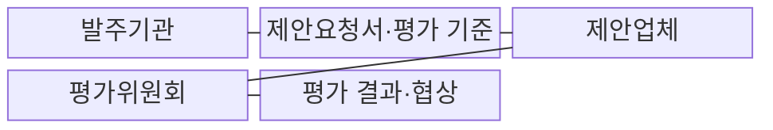
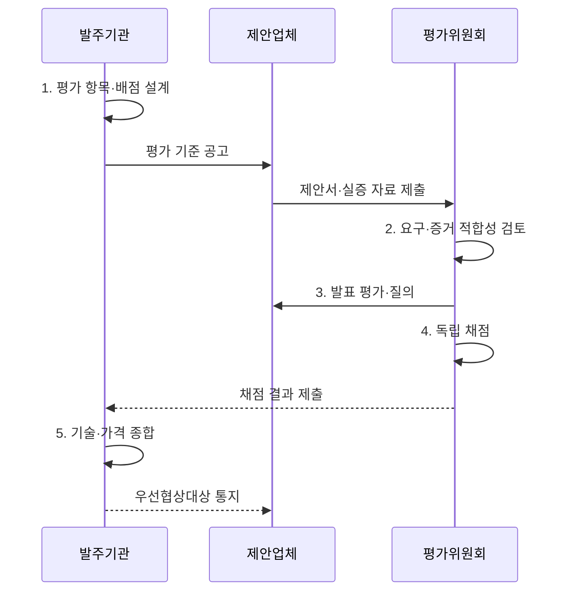

---
sidebar:
  order: 19
  label: "019. 소프트웨어 기술성 평가 (SW Technology Evaluation)"
  badge:
    text: "기출 · 50%"
    variant: note
title: "소프트웨어 기술성 평가 (SW Technology Evaluation)"
date: "2026-08-02T12:00:00+09:00"
tags:
  - "notes-law_policy"
weight: 19
extra:
  question_no: "019"
  source_status: "기출"
  source_history: "132회, 137회"
  priority: 50
  priority_note: "최근 반복 기출, 기술성 평가 항목·절차"
---

## Ⅰ. 개요

핵심 용어

- **공공 소프트웨어사업(Public Software Project, 공공 SW사업)**: 국가·공공기관이 소프트웨어 구축·운영을 발주하는 사업이다.
- **기술성 평가**: 제안 기술·수행 조직·품질·프로젝트 관리 역량을 공통 기준으로 심사해 적합한 사업자를 정하는 절차이다.

- 정의/개념: 제안자의 수행 적합성을 심사하는 **공공 SW사업자 선정 절차**
- 배경/필요성: 가격만으로는 **구현 가능성·수행 위험 검증 곤란**

#### 한줄 요약

- 소프트웨어 구축 사업 시 싼 가격만 보지 않고 제안 업체가 기술적으로 정보화 사업을 제대로 완수할 능력이 있는지 점수를 매겨 평가하는 제도이다.

## Ⅱ. 특징

핵심 용어

- **차등점수제**: 차등점수제는 기술평가 순위에 따라 점수 차이를 부여해 제안자 사이의 기술 변별력을 높인다.
- **제안요청서(Request for Proposal, RFP) 평가기준**: 사업 목표·요구·위험에 맞춰 평가항목·배점·증빙과 적격 기준을 사전에 공개한 기준이다.
- **벤치마크 테스트(Benchmark Test, BMT)**: 후보 기술·제품을 동일한 시험 조건에서 비교해 기능·성능을 검증하는 시험이다.
- **개념검증(Proof of Concept, PoC)**: 제안 기술이 핵심 요구와 환경에서 실제 구현 가능한지 제한된 범위로 확인하는 검증이다.

- **요구 적합성**: 제안 내용이 사업 목표·기능·품질·운영 요구를 충족하는지 평가
- **수행 능력**: 기술 전략·품질보증·프로젝트 관리·인력 역량을 종합하여 실패 위험 판단
- **RFP 평가기준**: 사업 특성에 맞는 평가항목·배점·적격 기준 공개
- **차등점수제**: 순위 간 점수 차이로 기술 변별력 강화
- **BMT·PoC**: 객관적 시험·개념검증 결과로 구현 가능성 확인

#### 한줄 요약

- 사업 특성에 맞는 기술 평가 기준과 배점을 공개하고 필요하면 차등점수와 실증 자료로 제안사를 구분합니다.

## Ⅲ. 구조 및 구성요소

핵심 용어

- **평가위원회**: 평가위원회는 이해충돌을 통제하고 제안서·인력·실적·실증 자료를 근거로 독립 심사한다.
- **제안요청서(Request for Proposal, RFP)**: 사업 요구와 평가항목·배점·증빙·협상 절차를 제안업체에 공개하는 문서이다.
- **우선협상대상자**: 기술·가격 종합점수 순위에 따라 계약 조건을 먼저 협상할 권한을 부여받은 제안업체이다.

| 구성요소 | 책임 |
|:---|:---|
| 발주기관 | 요구사항·**평가항목·배점** 설계 |
| 제안요청서·평가기준 | 조건·증빙·방법·**협상 절차** 공개 |
| 제안업체 | 제안서·인력·실적·**실증 자료** 제출 |
| 평가위원회 | 이해충돌 통제와 **독립 심사** |
| 평가 결과·협상 | 기술·가격 결합과 **협상대상 결정** |

#### 한줄 요약

- 발주기관이 낸 제안요청서에 맞춰 제안업체가 기술을 제안하고 외부 평가위원이 심사하는 협업 관계이다.

## Ⅳ. 흐름도

핵심 용어

- **이해충돌 제척·회피**: 제안업체와 이해관계가 있는 평가위원을 심사에서 배제하거나 위원이 스스로 참여하지 않는 통제이다.
- **독립 채점**: 평가위원이 다른 위원의 점수에 영향받지 않고 공개된 척도와 증거에 따라 근거를 남겨 개별 채점하는 방식이다.
- **우선협상대상자**: 기술·가격 종합점수가 높은 순서로 계약 조건을 우선 협상할 제안업체이다.

**동작 원리**

1. **평가 항목·배점 설계**: 사업 목표와 위험에 맞는 기술 기준·증빙·배점 구성
2. **요구·증거 적합성 검토**: 구현 방안·수행 조직·실적·검증 자료 확인
3. **발표 평가·질의**: 제안 내용의 구체성·진위·위험 대응 가능성을 확인
4. **독립 채점**: 위원이 이해충돌을 배제하고 근거와 함께 개별 채점
5. **기술·가격 종합**: 기술·가격 점수를 합산하여 협상 순위 결정

#### 한줄 요약

- 평가 기준을 세운 뒤 제안서의 사실 여부를 검증하고 위원들이 독립적으로 채점하여 최종 계약 대상자를 협상하는 순서이다.

## Ⅴ. 종류 및 비교

핵심 용어

- **기술성 평가**: 기술성 평가는 전문성과 기술력이 필요한 협상 계약에서 기술·가격·실증 근거를 종합한다.

| 구분 | 기술성 평가 | 최저가 선정 |
|:---|:---|:---|
| 적용 기준 | 전문성·기술력이 필요한 **협상 계약** | 규격이 단순한 **표준 사업** |
| 핵심 특징 | 기술·가격·실증의 **종합 평가** | 규격 충족 후 **최저가 선정** |
| 한계 | 평가위원·**배점 편차** | 수행 역량·**품질 차이 누락** |

#### 한줄 요약

- 규격이 획일화되어 가격만 깎는 최저가 방식과 기술력을 종합적으로 검증하는 기술성 평가 방식을 대조한다.

## Ⅵ. 실무 고려사항 및 대책

핵심 용어

- **이해충돌·점수 편차**: 이해충돌·점수 편차는 평가위원의 관계나 서로 다른 판단 척도가 제안자의 기술점수를 왜곡하는 문제다.
- **벤치마크 테스트(Benchmark Test, BMT)**: 제안 제품의 기능·성능을 공통 조건에서 객관적으로 비교하는 시험이다.
- **개념검증(Proof of Concept, PoC)**: 핵심 기술의 구현 가능성과 환경 적합성을 제한된 범위로 실증하는 검증이다.

| 문제 | 대책 | 효과 |
|:---|:---|:---|
| 추상적인 **평가항목·배점** | 사업 위험·산출물별 **판단 기준·증빙** 정의 | 평가의 **일관성·설명 가능성** 향상 |
| 평가위원의 **이해충돌·점수 편차** | 사전 제척·회피와 **독립 채점·편차 검토** | 공정성 확보·**평가 왜곡 감소** |
| 제안서 표현력과 **실제 역량 차이** | 핵심 기술의 **BMT·PoC**와 유사 실적 확인 | 구현 가능성·**운영 품질 검증** |

#### 한줄 요약

- 기술력 편차가 심한 공공 사업에서 기술 변별력을 강화하기 위해 차등점수제를 적용해 업체를 선정한다.

## Ⅶ. 결론

핵심 용어

- **사업 위험·실증 근거**: 우선협상대상자는 제안 표현보다 사업 위험에 대응하는 구체적 방안과 BMT·PoC 등 실증 근거로 결정해야 한다.
- **벤치마크 테스트(Benchmark Test, BMT)**: 후보 기술·제품의 기능과 성능을 동일한 조건에서 비교한 실증 근거이다.
- **개념검증(Proof of Concept, PoC)**: 제안 기술의 핵심 요구 구현 가능성을 실제 환경에서 제한적으로 확인한 근거이다.

- **사업 위험·실증 근거**로 우선협상대상자 결정

#### 한줄 요약

- 형식적인 정성 평가에서 벗어나 정량화된 실증 자료를 바탕으로 공정한 평가가 이루어져야 사업 실패를 막을 수 있다.
