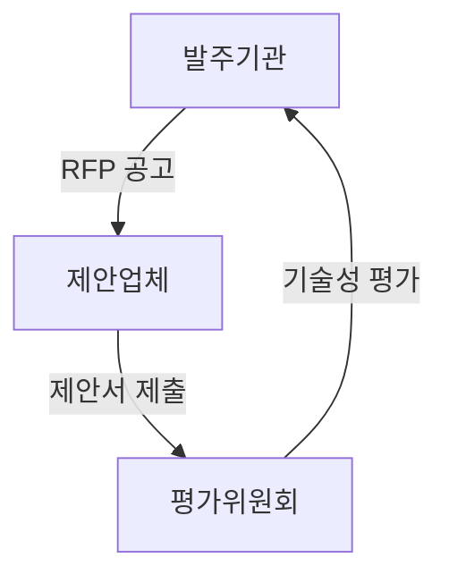
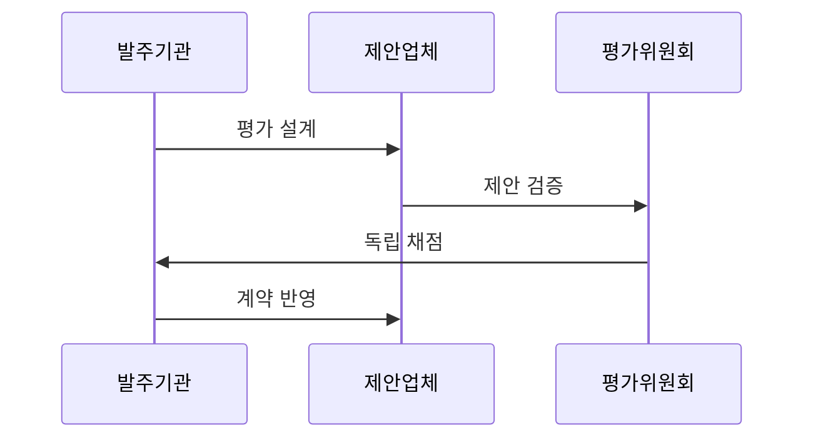

---
sidebar:
  order: 19
  label: "019. 소프트웨어 기술성 평가 (SW Technology Evaluation)"
  badge:
    text: "기출 · 50%"
    variant: note
title: "소프트웨어 기술성 평가 (SW Technology Evaluation)"
date: "2026-07-27T23:59:59+09:00"
tags:
  - "notes-law_policy"
weight: 19
extra:
  question_no: "019"
  source_status: "기출"
  source_history: "132회, 137회"
  priority: 50
  priority_note: "최근 반복 기출, 기술성 평가 항목·절차"
---

## 미리 알고가기

- **제안요청서(Request for Proposal, RFP)**: ‘알에프피’로
  읽는 머리글자 표기다. 요구사항과 평가 조건을 제시한다.
- **협상에 의한 계약(Negotiated Contract)**: 기술과 가격을
  종합 평가해 협상 대상자를 정하는 계약 방식이다.
- **기술능력 평가(Technical Capability Evaluation)**:
  제안·개발·관리 역량을 심사한다.
- **차등점수제(Differential Scoring System)**: 기술점수 차이를
  확대해 제안사 간 변별력을 높이는 방식이다.
- **벤치마크 테스트(Benchmark Test, BMT)**: ‘비엠티’로
  읽는 머리글자 표기다. 동일 조건의 제품 성능을 비교한다.
- **개념검증(Proof of Concept, PoC)**: ‘피오시’로 읽으며
  개념의 실현 가능성을 줄인 표기다. 기술 적용성을 검증한다.

## Ⅰ. 개요

- **정의/개념**: 제안자의 요구 적합성과 수행 역량을 심사
- **배경/필요성**: 가격 중심 선정만으로 복잡한 SW사업의 구현·운영 역량 검증 곤란

### 쉽게 이해하기 (학습용)

- 소프트웨어 구축 사업 시 싼 가격만 보지 않고 제안 업체가 기술적으로 정보화 사업을 제대로 완수할 능력이 있는지 점수를 매겨 평가하는 제도이다.

## Ⅱ. 특징

- 요구 이해도와 구현·운영 역량을 기준으로 평가한다.
- 전략·품질·관리 역량을 종합해 수행 위험을 낮춘다.
- 배점·차등점수와 BMT·PoC 증거로 제안 간 변별력을 확보한다.

### 쉽게 이해하기 (학습용)

- 사업 특성에 맞는 기술 평가 기준과 배점을 공개하고 필요하면 차등점수와 실증 자료로 제안사를 구분합니다.

## Ⅲ. 아키텍처 및 구성요소

| 설계 요소 | 설명 |
|:---|:---|
| 발주기관 | RFP 작성 및 배점 기준 공고 |
| 제안업체 | 기술 제안서 및 실증 자료 제출 |
| 평가위원회 | 독립적 제안서 심사 및 평가 수행 |

### 쉽게 이해하기 (학습용)

- 발주기관이 낸 제안요청서에 맞춰 제안업체가 기술을 제안하고 외부 평가위원이 심사하는 협업 관계이다.

## Ⅳ. 원리 및 절차 흐름도

| 절차 | 설명 |
|:---|:---|
| 평가 설계 | 기술 제안요청서 및 배점 기준 수립 |
| 제안 검증 | 제출된 제안서 및 실증 자료 진위 확인 |
| 독립 채점 | 평가위원들의 제안서 심사 및 개별 채점 |
| 계약 반영 | 평가 결과를 반영하여 최종 우선협상 진행 |

### 쉽게 이해하기 (학습용)

- 평가 기준을 세운 뒤 제안서의 사실 여부를 검증하고 위원들이 독립적으로 채점하여 최종 계약 대상자를 협상하는 순서이다.

## Ⅴ. 소프트웨어 사업 선정 방식 비교

| 구분 | 기술성 평가 | 최저가 선정 |
|:---|:---|:---|
| 적용 기준 | 전문성과 기술력이 필요한 사업 | 규격이 단순한 표준 사업 |
| 핵심 특징 | 기술·가격·실증 종합 평가 | 규격 충족 후 최저가 선정 |
| 한계 | 평가위원·배점 편차 | 수행 역량·품질 차이 누락 |

> 요약: 사업 특성에 따른 적절한 낙찰 방식 선택

### 쉽게 이해하기 (학습용)

- 규격이 획일화되어 가격만 깎는 최저가 방식과 기술력을 종합적으로 검증하는 기술성 평가 방식을 대조한다.

## Ⅵ. 실무 사례

1. 차등점수제를 적용한 고난이도 시스템 구축 사업자 선정
2. 제안 기술 검증을 위한 PoC 평가 항목 도입 및 수행

### 쉽게 이해하기 (학습용)

- 기술력 편차가 심한 공공 사업에서 기술 변별력을 강화하기 위해 차등점수제를 적용해 업체를 선정한다.
- 말뿐인 제안을 가려내기 위해 실제 환경에서 작동하는지 개념 검증(PoC) 절차를 거친다.

## Ⅶ. 결론

- 실증 점수가 높은 제안사와 협상한다

### 쉽게 이해하기 (학습용)

- 형식적인 정성 평가에서 벗어나 정량화된 실증 자료를 바탕으로 공정한 평가가 이루어져야 사업 실패를 막을 수 있다.
