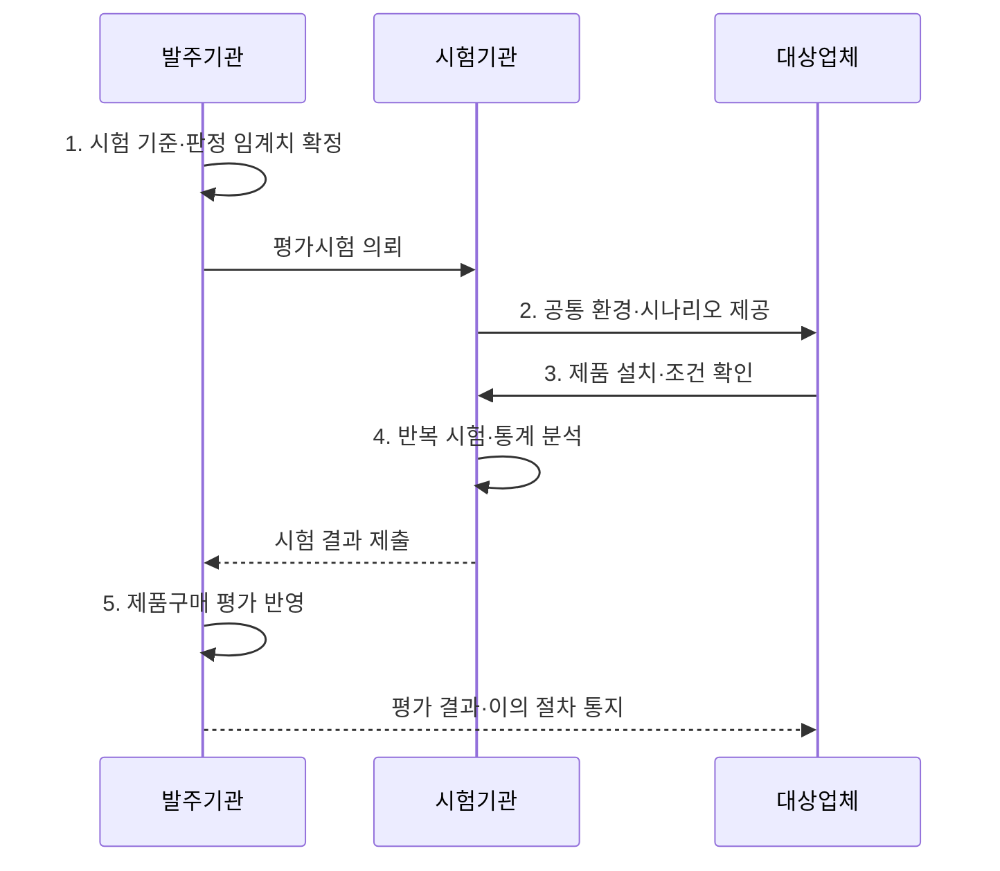

---
sidebar:
  order: 20
  label: "020. 정보화 사업 BMT 수행 (Benchmark Test)"
  badge:
    text: "기출 · 50%"
    variant: note
title: "정보화 사업 BMT 수행 (Benchmark Test)"
date: "2026-08-02T12:00:00+09:00"
tags:
  - "notes-law_policy"
weight: 20
extra:
  question_no: "020"
  source_status: "기출"
  source_history: "123회, 129회"
  priority: 50
  priority_note: "반복 기출, 공공 BMT 수행·판정 절차"
---

## Ⅰ. 개요

핵심 용어

- **벤치마크 테스트(Benchmark Test, BMT)**: 동일한 시험 환경·데이터·부하에서 후보 제품의 기능과 성능을 수치로 비교하는 평가시험이다.

- 정의/개념: 동일 조건에서 후보 제품의 **기능·성능을 비교하는 평가시험**
- 배경/필요성: 명목 수치만으로는 **실제 업무 성능 검증 곤란**

#### 한줄 요약

- 여러 업체의 소프트웨어나 장비를 똑같은 환경에 두고 동일한 작업을 시켜서 어느 제품의 성능이 더 우수한지 직접 눈으로 확인하고 채점하는 시험이다.

## Ⅱ. 특징

핵심 용어

- **재현 가능성**: 재현 가능성은 시험 절차·환경·원자료·반복 횟수·판정 기준을 기록해 같은 결과를 다시 검증하게 한다.
- **초당 트랜잭션 처리 건수(Transactions Per Second, TPS)**: 1초 동안 성공적으로 완료한 업무 거래 수를 나타내는 처리량 지표이다.
- **95백분위 응답시간(p95)**: 전체 요청의 95%가 이 값 이하에서 완료되는 꼬리 지연 지표이다.
- **중앙처리장치(Central Processing Unit, CPU) 사용률**: 시험 부하를 처리하는 동안 연산 자원이 사용된 비율이다.

- **조건 동등성**: 후보별 하드웨어·소프트웨어·데이터·부하·준비 시간을 동일하게 통제
- **TPS·p95**: 처리량·꼬리 응답시간·오류율·CPU 사용률을 동일 방법으로 산출
- **재현 가능성**: 시험 절차·환경 구성·원자료·반복 횟수·판정 기준을 기록하여 결과 검증 지원

#### 한줄 요약

- 모든 조건을 동일하게 통제하여 업체의 광고지가 아닌 실제 구동 성능을 객관적으로 비교할 수 있다.

## Ⅲ. 구조 및 구성요소

핵심 용어

- **공통 테스트베드**: 공통 테스트베드는 모든 후보 제품에 같은 하드웨어·소프트웨어·네트워크 조건을 제공한다.
- **초당 트랜잭션 처리 건수(Transactions Per Second, TPS)**: 공통 부하에서 제품이 1초에 완료한 업무 거래 수이다.
- **95백분위 응답시간(p95)**: 느린 요청을 포함해 전체 요청의 95%가 완료되는 시간의 상한값이다.
- **중앙처리장치(Central Processing Unit, CPU) 사용률**: 처리량과 지연을 낼 때 소비한 연산 자원의 비율이다.
- **업무 시나리오·부하 모델**: 실제 데이터 분포와 동시 사용자·처리량·증가 패턴을 후보 제품에 동일하게 적용하는 시험 입력이다.
- **원자료·판정 보고서**: 도구 설정·로그·측정값·오류와 합격 기준 적용 결과를 재현 가능하게 보존한 시험 증거이다.

| 구성요소 | 책임 |
|:---|:---|
| 시험 요구사항 | 업무 목표·**성능 임계치·가중치** 정의 |
| 공통 테스트베드 | 동일 하드웨어·소프트웨어·**망 조건** 제공 |
| 업무 시나리오·부하 | 이용 비율·데이터·**급증 부하** 재현 |
| 측정 지표·도구 | TPS·p95·오류율·**CPU 사용률** 수집 |
| 원자료·판정 보고서 | 반복값·예외·**합격 여부** 기록 |

#### 한줄 요약

- 테스트에 필요한 시나리오와 똑같은 하드웨어 환경을 갖추고 측정 지표를 통해 정량적인 수치를 도출해 낸다.

## Ⅳ. 흐름도

핵심 용어

- **판정 임계치**: 제품의 합격·탈락이나 점수를 결정하도록 시험 전에 고정한 지표별 기준값이다.
- **반복 시험**: 정상·최대·장시간 부하를 여러 번 수행해 우연한 변동과 이상값을 구분하는 시험 방식이다.
- **변경 이력**: 후보 제품의 설정·최적화 조건이 언제 어떻게 바뀌었는지 남긴 기록이다.

**동작 원리**

1. **시험 기준·판정 임계치 확정**: **시나리오·지표·반복 횟수·합격선** 고정
2. **공통 환경·시나리오 제공**: **테스트베드·데이터·부하 조건** 동일 구성
3. **제품 설치·조건 확인**: **최적화 허용 범위·제품 설정** 공동 확인
4. **반복 시험·통계 분석**: **정상·최대·장시간 부하** 반복과 이상값 근거 기록
5. **제품구매 평가 반영**: **품질성능 시험 점수** 를 조달 평가에 반영

#### 한줄 요약

- 테스트 기준을 잡은 뒤 똑같은 성능 시험장을 마련하고 부하를 여러 번 주어 측정 결과를 조달에 반영한다.

## Ⅴ. 종류 및 비교

핵심 용어

- **벤치마크 테스트(Benchmark Test, BMT)**: 여러 제품의 성능 우열을 같은 환경·부하와 정량 지표로 비교하는 시험이다.
- **개념검증(Proof of Concept, PoC)**: 신기술이 핵심 요구와 환경에 적용 가능한지 제한된 범위로 구현해 확인하는 검증이다.

| 판단 기준 | BMT | PoC |
|:---|:---|:---|
| 적용 기준 | 동일 조건의 **성능 비교** 필요 시 | 신기술 **적용성·타당성 검증** 시 |
| 핵심 특징 | 동일 부하의 **BMT 정량 비교** | 시제품의 **PoC 적용성 검증** |
| 한계 | 시험 환경과 **실제 운영 차이** | 성능 우열·**확장성 판단 부족** |

#### 한줄 요약

- 여러 대안 제품의 성능 우위를 가리는 BMT와, 새로운 기술의 적용 가능성 자체를 연구하고 검토하는 PoC를 대조한다.

## Ⅵ. 실무 고려사항 및 대책

핵심 용어

- **최적화 조건 불공정**: 최적화 조건 불공정은 후보마다 허용 설정과 준비 시간이 달라 제품 자체가 아닌 시험 조건이 결과를 좌우하는 문제다.
- **95백분위 응답시간(p95)**: 평균이 숨기는 느린 요청을 확인하기 위해 전체 요청의 95%가 완료되는 시간을 나타낸 지표이다.
- **급증 부하**: 짧은 시간에 요청량이 평상시보다 크게 늘어나는 운영 상황을 재현한 부하이다.

| 문제 | 대책 | 효과 |
|:---|:---|:---|
| 시험 환경과 **실제 운영 부하 차이** | 운영 로그의 업무 비율·데이터·**급증 부하** 반영 | 도입 후 **성능 예측 정확도** 향상 |
| 후보별 설정·**최적화 조건 불공정** | 허용 설정·준비 시간 공개와 **변경 이력** 기록 | 시험 조건 동등성·**분쟁 예방** |
| 평균값으로 **지연·불안정 은폐** | **p95·오류율** 과 장시간 안정성 평가 | 꼬리 지연·**장애 위험 탐지** |

#### 한줄 요약

- 실제 운영처럼 부하에 따라 자원이 늘어나는 격리 환경에서 성능을 측정해야 제안 제품의 처리 능력을 정확히 비교할 수 있다.

## Ⅶ. 결론

핵심 용어

- **벤치마크 테스트(Benchmark Test, BMT)**: 실제 업무 부하를 동일 조건에서 적용해 후보 제품의 성능을 비교하는 시험이다.
- **95백분위 응답시간(p95)**: 전체 요청의 95%가 완료되는 시간을 나타내 평균이 숨기는 꼬리 지연을 드러내는 지표이다.
- **장시간 안정성**: 지속 부하에서 성능 저하·오류·자원 누수가 누적되지 않고 서비스를 유지하는 능력이다.

- **업무 부하·p95** 를 기준으로 BMT 우수 제품 선정

#### 한줄 요약

- 도입 뒤 성능 위험을 줄이려면 동일 조건과 판정 기준을 사전에 고정하고 필요하면 지정 시험기관을 활용해야 합니다.
