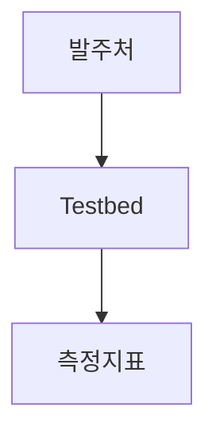
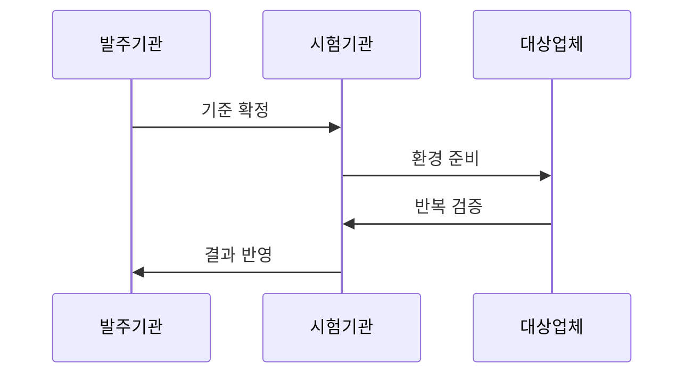

---
sidebar:
  order: 20
  label: "020. 정보화 사업 BMT 수행 (Benchmark Test)"
  badge:
    text: "기출 · 50%"
    variant: note
title: "정보화 사업 BMT 수행 (Benchmark Test)"
date: "2026-07-27T23:59:59+09:00"
tags:
  - "notes-law_policy"
weight: 20
extra:
  question_no: "020"
  source_status: "기출"
  source_history: "123회, 129회"
  priority: 50
  priority_note: "반복 기출, 공공 BMT 수행·판정 절차"
---

## 미리 알고가기

- **벤치마크 테스트(Benchmark Test, BMT)**: ‘비엠티’로
  읽는 머리글자 표기다. 동일 조건에서 후보 성능을 비교한다.
- **시험 환경(Testbed)**: ‘테스트베드’로 읽으며 시험 기반을
  뜻하는 합성어다. 후보 제품에 같은 검증 조건을 제공한다.
- **초당 트랜잭션 수(Transactions Per Second, TPS)**:
  ‘티피에스’로 읽는 머리글자 표기다. 초당 처리량을 잰다.
- **중앙처리장치(Central Processing Unit, CPU)**: ‘시피유’로
  읽는 머리글자 표기다. 연산 자원의 부하를 측정한다.
- **개념검증(Proof of Concept, PoC)**: ‘피오시’로 읽으며
  개념의 실현 가능성을 줄인 표기다. 기술 적용성을 검증한다.
- **서비스형 소프트웨어(Software as a Service, SaaS)**:
  ‘사스’로 읽는 축약 표기다. 구독형 소프트웨어를 뜻한다.
- **95백분위 응답시간(95th Percentile Latency, p95)**:
  ‘피구십오’로 읽으며 요청의 95%가 완료되는 지연값이다.
- **자동 확장(Auto Scaling)**: 부하에 맞춰 자원을 자동으로
  늘리거나 줄이는 기능이다. 급증 부하 대응을 검증한다.

## Ⅰ. 개요

- **정의/개념**: 후보 제품을 동일 조건에서 시험해 성능 비교
- **기존 한계**: 제안서 수치만으로 실제 업무 성능 비교 곤란
- **배경/필요성**: 동일 조건의 재현 가능한 선정 증거 확보

### 쉽게 이해하기 (학습용)

- 여러 업체의 소프트웨어나 장비를 똑같은 환경에 두고 동일한 작업을 시켜서 어느 제품의 성능이 더 우수한지 직접 눈으로 확인하고 채점하는 시험이다.

## Ⅱ. 특징

- 동일 환경·데이터·부하로 후보별 시험 조건을 통제한다.
- 처리량·지연·자원 사용량을 같은 측정법으로 비교한다.
- 시험 절차·원자료·판정 기준을 남겨 재현성을 확보한다.

### 쉽게 이해하기 (학습용)

- 모든 조건을 동일하게 통제하여 업체의 광고지가 아닌 실제 구동 성능을 객관적으로 비교할 수 있다.

## Ⅲ. 아키텍처 및 구성요소

| 설계 요소 | 설명 |
|:---|:---|
| 발주처 | 검증 항목 및 시나리오 정의 |
| Testbed | 제품을 검증하는 동일 물리 환경 |
| 측정지표 | TPS, CPU 사용률 등 평가 항목 |

### 쉽게 이해하기 (학습용)

- 테스트에 필요한 시나리오와 똑같은 하드웨어 환경을 갖추고 측정 지표를 통해 정량적인 수치를 도출해 낸다.

## Ⅳ. 원리 및 절차 흐름도

| 절차 | 설명 |
|:---|:---|
| 기준 확정 | 테스트 항목 및 합격 임계치 설정 |
| 환경 준비 | 테스트베드 환경 및 네트워크 통제 |
| 반복 검증 | 다양한 부하 하에 반복 테스트 수행 |
| 결과 반영 | 통계 분석 보고서 작성 및 조달 반영 |

### 쉽게 이해하기 (학습용)

- 테스트 기준을 잡은 뒤 똑같은 성능 시험장을 마련하고 부하를 여러 번 주어 측정 결과를 조달에 반영한다.

## Ⅴ. 종류 및 비교

| 판단 기준 | BMT | PoC |
|:---|:---|:---|
| 적용 기준 | 동일 조건 하에 성능 비교 필요 시 | 신기술 적용성 및 타당성 검증 시 |
| 핵심 특징 | 동일 부하의 정량 성능 비교 | 시제품으로 적용 가능성 검증 |
| 한계 | 시험 환경과 실제 운영의 차이 | 성능 우열·확장성 판단 부족 |

> 요약: 성능 평가와 타당성 검증의 용도 구분

### 쉽게 이해하기 (학습용)

- 여러 대안 제품의 성능 우위를 가리는 BMT와, 새로운 기술의 적용 가능성 자체를 연구하고 검토하는 PoC를 대조한다.

## Ⅵ. 실무 사례

1. 평균 속도와 p95 응답 지연 시간을 함께 측정
2. 오토스케일링 및 격리 환경을 반영한 클라우드 BMT 수행

### 쉽게 이해하기 (학습용)

- 평균값뿐 아니라 가장 느린 요청 구간의 경계를 보여 주는 p95 응답시간도 함께 확인합니다.
- 가상화 자원이 갑자기 늘어나는 부하 상황에서도 서비스가 안정적으로 격리되고 작동하는지 테스트한다.

## Ⅶ. 결론

- 같은 부하의 측정값으로 제품을 선정한다

### 쉽게 이해하기 (학습용)

- 도입 뒤 성능 위험을 줄이려면 동일 조건과 판정 기준을 사전에 고정하고 필요하면 지정 시험기관을 활용해야 합니다.
